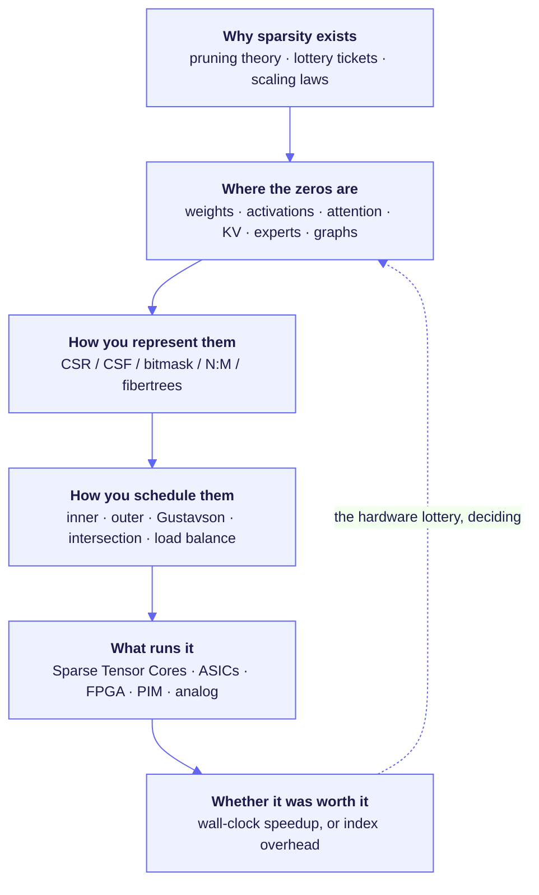

<div align="center">

# Awesome Sparse Acceleration [](https://awesome.re)

**Why sparsity works, and the silicon that cashes it in.**

A curated reading list on sparsity in deep learning: pruning theory, sparse attention,
N:M and structured sparsity, LLM and KV-cache sparsity, mixture-of-experts, sparse
matrix accelerators, SpMM and SpGEMM dataflows, GNN hardware, sparse GPU kernels,
processing-in-memory, and the compilers and models that tie them together.
590 papers, organized by mechanism instead of by year.

Maintained by **Amir Ghazizadeh** — Ph.D. candidate in Computer Engineering,
University of Central Florida. I build sparse accelerators, CUDA graph kernels,
and efficient GNN/LLM systems.

**[→ amir-ghz.github.io](https://amir-ghz.github.io)** &nbsp;·&nbsp;
[Google Scholar](https://scholar.google.com/citations?user=t_zFY7AAAAAJ&hl=en) &nbsp;·&nbsp;
[GitHub](https://github.com/amir-ghz)

[](#contributing)
[](#license)


</div>

---

## Why this list exists

I make sparse and irregular AI workloads run fast, across efficient model design,
accelerator microarchitecture, and the GPU kernels underneath. That work sits between
two literatures that are each catalogued well and almost never indexed together. On one
side, model efficiency: sparse attention, mixture-of-experts routing, KV-cache
selection, quantization, distillation, pruning. On the other, the machines: accelerator
microarchitecture, GPU and NPU design, dataflow taxonomies, tensor compilers. The space
between them is where sparsity is won or lost, and nobody had catalogued it.

The mismatch is structural. A model-efficiency paper reports the fraction of a tensor it
removed. An architecture paper reports wall-clock time on real silicon. Those are
different quantities, and for most of the last decade they were close to uncorrelated,
because the cost of finding a zero can exceed the cost of multiplying by it. Index
metadata competes with the values it describes. Gather and scatter destroy the reuse
that dense tiling depends on. A dense MAC array has no mechanism to skip a zero, so it
does not. Sparsity ratio is a property of a tensor; time is a property of a machine, and
the function between them is the subject of this list. That function is made of formats,
dataflows, intersection units, load balancing, and sparsity predictors, and it is
scattered across ISCA, MICRO, HPCA, ASPLOS, NeurIPS, ICLR, MLSys and arXiv with no
organizing principle beyond publication date.

### Establishing terms

"Sparsity" names a dozen different things, and most arguments in this area turn out to
be arguments about which one is meant. Weight sparsity, the kind pruning produces, is
the oldest and the least deployed. The forms carrying real production traffic are newer.
Attention maps go overwhelmingly zero at long context. KV caches hold far more past
tokens than any given query attends to. Mixture-of-experts routing touches a small share
of the parameters per token, which makes coarse dynamic sparsity the default
architecture of frontier models rather than an efficiency trick applied afterward. Graph
networks inherit adjacency structure that is sparse by nature and irregular by
distribution. Recommender embeddings are almost entirely untouched on any given lookup.

Those forms differ in the two ways that decide everything downstream: **where the zeros
are**, and **when you find out about them**. Static weight sparsity is known before the
kernel launches, so its cost is paid offline. Attention and expert sparsity are
discovered at runtime, so somebody has to predict them cheaply enough to still profit,
and the predictor's cost comes straight out of the win. [A taxonomy of
sparsity](#a-taxonomy-of-sparsity) lays all of it out in one table before the papers
start.

### Two lotteries

Machine learning has produced two lottery arguments, seven years apart, and nobody has
put them in the same room. One is a claim about what a trained network contains. The
other is a claim about what the hardware of the day will let you collect on. Putting
them together is the thesis of this list.

The first is Frankle and Carbin's [Lottery Ticket Hypothesis](https://arxiv.org/abs/1803.03635)
(ICLR'19): "dense, randomly-initialized, feed-forward networks contain subnetworks
('winning tickets') that — when trained in isolation — reach test accuracy comparable to
the original network in a similar number of iterations." Read narrowly, it is a claim
about initialization. Read broadly, it is the sharpest version of the observation this
whole area rests on: most of a trained network is surplus, and the sparse network was
already inside the dense one. Sparsity is not a compromise you accept. It is a
description of what the network was all along.

The second is Sara Hooker's [The Hardware Lottery](https://arxiv.org/abs/2009.06489)
(CACM'21), which explains why none of that helps you. Hooker coins the term "to describe
when a research idea wins because it is suited to the available software and hardware
and not because the idea is superior to alternative research directions," and notes
that such lotteries "can delay research progress by casting successful ideas as
failures." Her warning lands squarely on us: "these lessons are particularly salient
given the advent of domain specialized hardware which make it increasingly costly to
stray off of the beaten path of research ideas."

Set the two side by side. Fine-grained unstructured sparsity won the initialization
lottery and then lost the hardware lottery for about a decade. The winning ticket was
real and it was worthless, because no shipping datapath could collect on it. GPUs got
very good at dense matmul, dense matmul got very cheap, and a sparse layer ran at the
speed of a dense one because that is what the machine does with zeros it cannot see.
That is not a failure of the algorithms. It is Hooker's mechanism working as advertised.

What changed is that people stopped waiting to win the hardware lottery and started
rigging the draw. N:M is the cleanest case. Two-of-every-four is not a natural property
of trained networks; it exists because a fixed-width mux in front of a MAC array can
decode it at line rate. NVIDIA built the Sparse Tensor Core, and the algorithm side was
told to hit the pattern. That inverts the usual order of things, and it worked. The same
inversion now runs through the whole field: pick the structure your datapath can
exploit, then constrain the algorithm to produce it. DeepSeek's native sparse attention
is the same move at a different granularity: an "arithmetic intensity-balanced algorithm
design" with the sparsity trained in rather than applied to a finished model. Formats, dataflows and intersection units are the vocabulary of that
negotiation, which is why they organize this list rather than publication year.

The timing is not an accident either. Sparsity is back because scaling made it
load-bearing. Inference moved from compute-bound to memory-bound, so bytes moved per
token became the thing you pay for, and moving fewer bytes is the one saving sparsity
was always reliably good at. Context windows grew until the quadratic term dominated.
KV caches outgrew the weights they serve. Every one of those is a sparsity problem the
hardware lottery now rewards instead of punishing. The next generation of accelerators
is being designed around that fact.

Hence the organization. Read down a column and you get a design space rather than a
chronology: where the zeros are, when you find out, and what it costs to act on them.



<div align="center"><sub><i>The feedback edge is the whole story of the field.</i></sub></div>

---


## Contents

- [A taxonomy of sparsity](#a-taxonomy-of-sparsity)
  - [Where the zeros are](#where-the-zeros-are)
  - [When you find out](#when-you-find-out)
  - [The three claims, ranked by how well they hold up](#the-three-claims-ranked-by-how-well-they-hold-up)
- [Why Sparsity Works](#why-sparsity-works)
  - [Origins: classical pruning theory](#origins-classical-pruning-theory)
  - [The lottery-ticket line](#the-lottery-ticket-line)
  - [Pruning at initialization and sparse-to-sparse training](#pruning-at-initialization-and-sparse-to-sparse-training)
  - [Theory, scaling laws, and the economics of sparsity](#theory-scaling-laws-and-the-economics-of-sparsity)
  - [Emergent sparsity: activations, outliers, and heavy tails](#emergent-sparsity-activations-outliers-and-heavy-tails)
  - [Sparsity as architecture: conditional computation and MoE](#sparsity-as-architecture-conditional-computation-and-moe)
- [Sparse DNN and Sparse Tensor Accelerator Architectures](#sparse-dnn-and-sparse-tensor-accelerator-architectures)
  - [Foundations: zero-skipping DNN accelerators](#foundations-zero-skipping-dnn-accelerators)
  - [Sparse DNN training accelerators](#sparse-dnn-training-accelerators)
  - [Inner-product and outer-product dataflows](#inner-product-and-outer-product-dataflows)
  - [Row-wise / Gustavson dataflow](#row-wise--gustavson-dataflow)
  - [Hierarchical, intersection-based, and format-flexible engines](#hierarchical-intersection-based-and-format-flexible-engines)
  - [Dual-sided sparsity and sparsity-degree versatility](#dual-sided-sparsity-and-sparsity-degree-versatility)
  - [The 2024-2026 frontier](#the-2024-2026-frontier)
- [Structured and Semi-Structured Sparsity](#structured-and-semi-structured-sparsity)
  - [N:M fine-grained structured sparsity — algorithms](#nm-fine-grained-structured-sparsity--algorithms)
  - [N:M and structured-sparsity hardware](#nm-and-structured-sparsity-hardware)
  - [Block sparsity and coarse structure](#block-sparsity-and-coarse-structure)
  - [Structured pruning: channel, filter, head, layer](#structured-pruning-channel-filter-head-layer)
  - [Unstructured-on-structured: bridging work](#unstructured-on-structured-bridging-work)
- [Sparsity in Large Language Models](#sparsity-in-large-language-models)
  - [One-shot / post-training weight pruning](#one-shot--post-training-weight-pruning)
  - [Activation and contextual sparsity](#activation-and-contextual-sparsity)
  - [Sparse LLM inference systems and serving](#sparse-llm-inference-systems-and-serving)
  - [KV-cache sparsity and eviction](#kv-cache-sparsity-and-eviction)
  - [Mixture-of-Experts as structured dynamic sparsity](#mixture-of-experts-as-structured-dynamic-sparsity)
  - [Sparse plus quantization co-design](#sparse-plus-quantization-co-design)
- [Sparse Attention](#sparse-attention)
  - [Fixed / static sparse attention patterns](#fixed--static-sparse-attention-patterns)
  - [Learned / content-based sparse attention (the 2019-2021 wave)](#learned--content-based-sparse-attention-the-2019-2021-wave)
  - [IO-aware and kernel-level attention](#io-aware-and-kernel-level-attention)
  - [Long-context inference-time sparsity](#long-context-inference-time-sparsity)
  - [Native / trainable sparse attention (the 2025-26 wave)](#native--trainable-sparse-attention-the-2025-26-wave)
  - [Benchmarks and negative results](#benchmarks-and-negative-results)
  - [Sparsity in vision and multimodal transformers](#sparsity-in-vision-and-multimodal-transformers)
- [Transformer, Attention, and LLM Hardware](#transformer-attention-and-llm-hardware)
  - [Dynamic sparse attention datapaths](#dynamic-sparse-attention-datapaths)
  - [Token, head, and layer pruning in silicon](#token-head-and-layer-pruning-in-silicon)
  - [LLM inference accelerators exploiting sparsity](#llm-inference-accelerators-exploiting-sparsity)
  - [MoE and expert-level sparsity in hardware](#moe-and-expert-level-sparsity-in-hardware)
  - [KV-cache-aware and memory-centric hardware](#kv-cache-aware-and-memory-centric-hardware)
  - [Sparse ViT, diffusion, and multimodal hardware](#sparse-vit-diffusion-and-multimodal-hardware)
- [Graph Neural Networks and Graph Processing](#graph-neural-networks-and-graph-processing)
  - [GNN accelerator architectures](#gnn-accelerator-architectures)
  - [FPGA, near-memory and in-storage GNN accelerators](#fpga-near-memory-and-in-storage-gnn-accelerators)
  - [GNN systems and software](#gnn-systems-and-software)
  - [Graph sparsification and algorithmic sparsity](#graph-sparsification-and-algorithmic-sparsity)
  - [Classical graph-processing accelerators](#classical-graph-processing-accelerators)
- [Sparse Kernels and Systems on Commodity GPUs and CPUs](#sparse-kernels-and-systems-on-commodity-gpus-and-cpus)
  - [Sparse GEMM kernels on GPUs](#sparse-gemm-kernels-on-gpus)
  - [SpMV and SpMM: the classical HPC kernels](#spmv-and-spmm-the-classical-hpc-kernels)
  - [Framework, compiler, and vendor-library support](#framework-compiler-and-vendor-library-support)
  - [Sparse convolution for 3D and point clouds](#sparse-convolution-for-3d-and-point-clouds)
  - [Load balancing, scheduling, and irregularity](#load-balancing-scheduling-and-irregularity)
- [Modeling, Simulation, and Compilers for Sparse Computation](#modeling-simulation-and-compilers-for-sparse-computation)
  - [Accelerator modeling, design-space exploration, and generation](#accelerator-modeling-design-space-exploration-and-generation)
  - [Sparse tensor compilers & intermediate representations](#sparse-tensor-compilers--intermediate-representations)
  - [Scheduling, autotuning & distributed sparse compilation](#scheduling-autotuning--distributed-sparse-compilation)
  - [Sparse formats & the representation abstraction](#sparse-formats--the-representation-abstraction)
  - [Simulators, benchmarks & datasets](#simulators-benchmarks--datasets)
- [Sparsity beyond the von Neumann datapath](#sparsity-beyond-the-von-neumann-datapath)
  - [Processing-in-memory and near-memory for sparse workloads](#processing-in-memory-and-near-memory-for-sparse-workloads)
  - [ReRAM and analog compute-in-memory under sparsity](#reram-and-analog-compute-in-memory-under-sparsity)
  - [FPGA sparse accelerators](#fpga-sparse-accelerators)
  - [Neuromorphic and spiking: sparsity as the native encoding](#neuromorphic-and-spiking-sparsity-as-the-native-encoding)
  - [Industrial silicon that ships sparsity support](#industrial-silicon-that-ships-sparsity-support)
  - [Embedding tables and recommender sparsity](#embedding-tables-and-recommender-sparsity)
- [Entry Points and Learning Resources](#entry-points-and-learning-resources)
  - [Surveys and books — start here](#surveys-and-books--start-here)
  - [Surveys for the LLM, attention, and graph frontier](#surveys-for-the-llm-attention-and-graph-frontier)
  - [Courses and lecture series](#courses-and-lecture-series)
  - [Tutorials, talks, and posts worth the time](#tutorials-talks-and-posts-worth-the-time)
  - [Open-source toolchains and libraries](#open-source-toolchains-and-libraries)
  - [Benchmarks and datasets](#benchmarks-and-datasets)
  - [Related awesome-lists and paper collections](#related-awesome-lists-and-paper-collections)
- [Contributing](#contributing)
- [Maintainer](#maintainer)
- [Citing](#citing)
- [License](#license)

---


## A taxonomy of sparsity

*Read this first. Every paper below is a point in the space these three tables span,
and most disagreements in the field are really disagreements about which row someone
is standing on.*

### Where the zeros are

The single most useful question about any sparsity paper is which tensor it is
emptying, because that determines whether the saving is bandwidth, capacity, or
arithmetic — and those are not interchangeable.

| Sparsity | Zeros live in | Typical density | Known at | What it actually saves | Hardware consequence |
|---|---|---|---|---|---|
| **Unstructured weight** | Weight matrices, arbitrary positions | 1–20% | Compile time | Model capacity, DRAM traffic | Needs indices; gather/scatter and intersection logic. Historically the worst speedup-per-unit-sparsity. |
| **N:M semi-structured** | Weights, N of every M | 50% (2:4) | Compile time | Bandwidth and MACs, jointly | Fits a fixed-width mux in front of a MAC array. The only unstructured-ish form with mainstream silicon support. |
| **Block / tile** | Weights, contiguous tiles | 10–50% | Compile time | Bandwidth, with dense inner kernels | Reuses dense GEMM machinery; index cost amortized over a tile. |
| **Structured (channel / head / layer)** | Whole rows, filters, heads | 30–80% | Compile time | Everything, uniformly | Needs no hardware at all. The model just gets smaller. |
| **Activation (ReLU-induced)** | Feature maps, data-dependent | 20–60% | Runtime | MACs and on-chip traffic | Detected on the fly; requires zero-gating or a compaction stage in the datapath. |
| **Attention map** | The QKᵀ score matrix | 1–10% at long context | Runtime | Quadratic compute and HBM traffic | Must be *predicted* before it is computed, or you have already paid for it. |
| **KV cache** | Past keys/values, per query | 5–30% retained | Runtime | HBM capacity and bandwidth | Eviction/selection policy; the dominant memory cost in deployed LLM serving. |
| **Expert routing (MoE)** | Whole FFN blocks | 1–25% of experts active | Runtime | Parameters touched per token | Coarse enough that it is a scheduling and placement problem, not a datapath problem. |
| **Gradient** | Backward-pass tensors | 0.1–10% | Runtime | Interconnect traffic | A distributed-training problem (gradient compression), not an accelerator one. |
| **Embedding lookup** | Enormous tables, few rows touched | <0.001% | Runtime | Memory capacity, not compute | Pure irregular-gather. The largest-volume sparse workload in production. |
| **Graph adjacency** | Structural, given by the data | 0.01–1% | Compile time (fixed graph) | Nothing optional — it *is* the workload | Extreme, irregular, power-law skewed. Breaks every reuse assumption CNN accelerators were built on. |
| **Input data** | Point clouds, event cameras | 0.1–10% | Runtime | Everything downstream | Sparsity is the input format; dense processing is not even an option at scale. |

### When you find out

| | **Static** — known before the kernel launches | **Dynamic** — discovered during it |
|---|---|---|
| **Fine-grained** | Unstructured and N:M weight pruning. Offline format conversion, offline load balancing, no prediction overhead. | Activation sparsity, attention sparsity. Needs a cheap runtime predictor; the predictor's cost is subtracted from the win. |
| **Coarse-grained** | Structured/channel pruning, static block patterns. Free — it is just a smaller dense problem. | MoE routing, token pruning, early exit. A scheduling and load-balancing problem across a whole chip or cluster. |

The diagonal matters. Static-coarse sparsity needs no hardware support and is
therefore uninteresting to architects and extremely popular in practice.
Dynamic-fine sparsity needs the most hardware support and produces the most
papers. Most of this list lives in the two off-diagonal cells.

### The three claims, ranked by how well they hold up

Papers advocate sparsity for three different reasons, and conflating them is the
most common error in the literature.

| Claim | Mechanism | Evidence | Verdict |
|---|---|---|---|
| **Sparsity saves memory and bandwidth** | Fewer bytes to store and move; compressed formats shrink the working set | Overwhelming, and it converts to wall-clock time on essentially any hardware | **Solid.** This is why sparsity ships. |
| **Sparsity saves compute** | Skip the multiply-accumulates whose operand is zero | Real in principle; in practice gated by index overhead, load imbalance, and the cost of finding the zeros | **Conditional.** True only above a density threshold, and only with hardware or kernels built for it. |
| **Sparsity improves generalization** | Pruning as regularization; sparse subnetworks generalize better | Weak and contested. Pruned models usually match, rarely beat, the dense baseline at equal training cost | **Mostly folklore.** Believe it only with a matched-compute control. |

> **How to read the rest of this list.** Sections are ordered from *why* to *how* to
> *on what*. If you are an architect, start at [Sparse accelerator
> architectures](#sparse-dnn-and-sparse-tensor-accelerator-architectures) and read backwards. If you came
> from the ML side, start at [Why sparsity works](#why-sparsity-works) and read
> forwards until the tables stop making sense, then go read the two survey papers in
> [Resources](#entry-points-and-learning-resources).

---

## Why Sparsity Works

*The ML science underneath the hardware: why trained networks contain removable parameters, what the theory actually proves, and where sparsity shows up whether you ask for it or not.*

Three separate arguments get bundled under the word "sparsity", and they are not equally strong. (i) **Memory and bandwidth reduction**: fewer stored parameters, fewer bytes moved per layer. This one is real, measurable, and the reason sparsity survives in production. (ii) **FLOP reduction**: fewer multiply-accumulates in principle. This one is true on paper and routinely fails to appear on a wall clock, because a dense systolic array or tensor core does not get faster when you feed it zeros. (iii) **Regularization and generalization**: the claim that pruning improves the model. The evidence here is thin and often confounded with extra training epochs; treat it as a nice-to-have, never as a justification. An architect should read the tables below with that ranking in mind: the results that transfer to silicon are almost always the ones that shrink the working set.

### Origins: classical pruning theory

*Second-order saliency came first, magnitude thresholding won, and the deployment story only arrived in 2015.*

| Paper | Venue | Contribution | Code |
|---|---|---|---|
| [Skeletonization: A Technique for Trimming the Fat from a Network via Relevance Assessment](https://proceedings.neurips.cc/paper_files/paper/1988/hash/07e1cd7dca89a1678042477183b7ac3f-Abstract.html) | NeurIPS'88 | Attaches a differentiable gating coefficient to each unit and deletes the units whose relevance derivative is smallest. | — |
| [OBD: Optimal Brain Damage](https://proceedings.neurips.cc/paper_files/paper/1989/hash/6c9882bbac1c7093bd25041881277658-Abstract.html) | NeurIPS'89 | Ranks weights by a second-order saliency from a diagonal Hessian approximation, deletes the lowest, then retrains. | — |
| [OBS: Second Order Derivatives for Network Pruning: Optimal Brain Surgeon](https://proceedings.neurips.cc/paper_files/paper/1992/hash/303ed4c69846ab36c2904d3ba8573050-Abstract.html) | NeurIPS'92 | Uses the full inverse Hessian to pick a weight and analytically compensate the survivors, removing the retrain step. | — |
| [Learning both Weights and Connections for Efficient Neural Networks](https://arxiv.org/abs/1506.02626) | NeurIPS'15 | Train, threshold by weight magnitude, retrain, iterate; the loop that made unstructured pruning the default baseline. | — |
| [Deep Compression: Compressing Deep Neural Networks with Pruning, Trained Quantization and Huffman Coding](https://arxiv.org/abs/1510.00149) | ICLR'16 | Chains magnitude pruning, k-means weight sharing and Huffman coding into a compressed sparse storage format for inference. | [code](https://github.com/songhan/Deep-Compression-AlexNet) |
| [To prune, or not to prune: exploring the efficacy of pruning for model compression](https://arxiv.org/abs/1710.01878) | arXiv'17 | Gradual magnitude pruning on a cubic sparsity schedule during training, benchmarked against smaller dense models at equal size. | — |
| [Learning Sparse Neural Networks through L0 Regularization](https://arxiv.org/abs/1712.01312) | ICLR'18 | Hard-concrete stochastic gates give a differentiable surrogate for the L0 penalty, so sparsity is learned jointly with weights. | [code](https://github.com/AMLab-Amsterdam/L0_regularization) |

### The lottery-ticket line

*Whether the mask or the weights carry the information, argued out over six years.*

| Paper | Venue | Contribution | Code |
|---|---|---|---|
| [Rethinking the Value of Network Pruning](https://arxiv.org/abs/1810.05270) | ICLR'19 | Shows pruned architectures retrained from scratch match inherited weights, recasting structured pruning as architecture search. | [code](https://github.com/Eric-mingjie/rethinking-network-pruning) |
| [LTH: The Lottery Ticket Hypothesis: Finding Sparse, Trainable Neural Networks](https://arxiv.org/abs/1803.03635) | ICLR'19 | Iterative magnitude pruning with weight rewinding to initialization isolates subnetworks that train to full accuracy alone. | [code](https://github.com/google-research/lottery-ticket-hypothesis) |
| [Deconstructing Lottery Tickets: Zeros, Signs, and the Supermask](https://arxiv.org/abs/1905.01067) | NeurIPS'19 | Ablates the mask criterion and shows the sign pattern, not the magnitudes, carries most of the ticket's information. | [code](https://github.com/uber-research/deconstructing-lottery-tickets) |
| [What's Hidden in a Randomly Weighted Neural Network?](https://arxiv.org/abs/1911.13299) | CVPR'20 | edge-popup learns a mask over a frozen random initialization, finding accurate subnetworks without training any weight. | [code](https://github.com/allenai/hidden-networks) |
| [Linear Mode Connectivity and the Lottery Ticket Hypothesis](https://arxiv.org/abs/1912.05671) | ICML'20 | Ties ticket existence to SGD noise stability, replacing rewind-to-init with rewinding to an early training iterate. | [code](https://github.com/facebookresearch/open_lth) |
| [The Lottery Ticket Hypothesis for Pre-trained BERT Networks](https://arxiv.org/abs/2007.12223) | NeurIPS'20 | Finds matching subnetworks in pre-trained BERT at the masked-LM task that transfer across downstream tasks. | [code](https://github.com/VITA-Group/BERT-Tickets) |
| [Pruning Neural Networks at Initialization: Why are We Missing the Mark?](https://arxiv.org/abs/2009.08576) | ICLR'21 | Shows pruning-at-init scores survive random shuffling within layers, so only the per-layer sparsity ratio matters. | [code](https://github.com/facebookresearch/open_lth) |
| [Multi-Prize Lottery Ticket Hypothesis: Finding Accurate Binary Neural Networks by Pruning A Randomly Weighted Network](https://arxiv.org/abs/2103.09377) | ICLR'21 | Masks a randomly weighted binary network to recover accuracy without weight training or a separate quantization step. | [code](https://github.com/chrundle/biprop) |

### Pruning at initialization and sparse-to-sparse training

*If you never materialize the dense model, sparsity becomes a training-memory argument, which is the one hardware actually rewards.*

| Paper | Venue | Contribution | Code |
|---|---|---|---|
| [SET: Scalable Training of Artificial Neural Networks with Adaptive Sparse Connectivity inspired by Network Science](https://arxiv.org/abs/1707.04780) | Nat. Comm.'18 | Prune-and-regrow at fixed sparsity: drop smallest weights each epoch, add random connections back. | [code](https://github.com/dcmocanu/sparse-evolutionary-artificial-neural-networks) |
| [SNIP: Single-shot Network Pruning based on Connection Sensitivity](https://arxiv.org/abs/1810.02340) | ICLR'19 | Scores connections by loss sensitivity from a single minibatch gradient and prunes once, before any training. | [code](https://github.com/namhoonlee/snip-public) |
| [DSR: Parameter Efficient Training of Deep Convolutional Neural Networks by Dynamic Sparse Reparameterization](https://arxiv.org/abs/1902.05967) | ICML'19 | Reallocates the sparsity budget across layers during training using an adaptive global magnitude threshold. | — |
| [SNFS: Sparse Networks from Scratch: Faster Training without Losing Performance](https://arxiv.org/abs/1907.04840) | arXiv'19 | Redistributes weights across layers by exponentially smoothed momentum magnitude, growing where gradients accumulate fastest. | [code](https://github.com/TimDettmers/sparse_learning) |
| [GraSP: Picking Winning Tickets Before Training by Preserving Gradient Flow](https://arxiv.org/abs/2002.07376) | ICLR'20 | Prunes at initialization using a Hessian-gradient product criterion that preserves gradient flow rather than loss. | [code](https://github.com/alecwangcq/GraSP) |
| [SynFlow: Pruning neural networks without any data by iteratively conserving synaptic flow](https://arxiv.org/abs/2006.05467) | NeurIPS'20 | Data-free iterative path-norm score, constructed to provably avoid layer collapse at extreme sparsity. | [code](https://github.com/ganguli-lab/Synaptic-Flow) |
| [RigL: Rigging the Lottery: Making All Tickets Winners](https://arxiv.org/abs/1911.11134) | ICML'20 | Dynamic sparse training that drops by weight magnitude and regrows by dense-gradient magnitude at a fixed parameter budget. | [code](https://github.com/google-research/rigl) |
| [Top-KAST: Top-K Always Sparse Training](https://arxiv.org/abs/2106.03517) | NeurIPS'20 | Keeps a top-K forward set and a slightly larger backward set, so neither pass ever touches a dense tensor. | — |
| [ITOP: Do We Actually Need Dense Over-Parameterization? In-Time Over-Parameterization in Sparse Training](https://arxiv.org/abs/2102.02887) | ICML'21 | Argues dynamic sparse training wins by covering many distinct parameters over time, not by any instantaneous mask. | [code](https://github.com/Shiweiliuiiiiiii/In-Time-Over-Parameterization) |
| [MEST: Accurate and Fast Memory-Economic Sparse Training Framework on the Edge](https://arxiv.org/abs/2110.14032) | NeurIPS'21 | Sparse training with a soft memory bound, removing dense gradient storage so the whole run fits an edge memory budget. | — |
| [The Unreasonable Effectiveness of Random Pruning: Return of the Most Naive Baseline for Sparse Training](https://arxiv.org/abs/2202.02643) | ICLR'22 | Random masks with well-chosen layerwise ratios train competitively, isolating layer budget as the load-bearing variable. | [code](https://github.com/VITA-Group/Random_Pruning) |
| [Dynamic Sparse Training with Structured Sparsity](https://arxiv.org/abs/2305.02299) | ICLR'24 | Constrains prune-and-grow to N:M and constant-fan-in patterns so the resulting model condenses into dense kernels. | [code](https://github.com/calgaryml/condensed-sparsity) |

### Theory, scaling laws, and the economics of sparsity

*The literature that tells you when sparsity is worth paying for instead of just training a smaller dense model.*

*The general surveys and books, including the JMLR'21 sparsity survey, live in [Entry Points and Learning Resources](#entry-points-and-learning-resources).*

| Paper | Venue | Contribution | Code |
|---|---|---|---|
| [Non-Vacuous Generalization Bounds at the ImageNet Scale: A PAC-Bayesian Compression Approach](https://arxiv.org/abs/1804.05862) | ICLR'19 | Derives non-vacuous generalization bounds from how far a trained network can be compressed, linking sparsity to capacity. | — |
| [The State of Sparsity in Deep Neural Networks](https://arxiv.org/abs/1902.09574) | arXiv'19 | Re-benchmarks variational dropout, L0 and magnitude pruning on Transformer and ResNet under matched budgets and tuning. | [code](https://github.com/google-research/google-research/tree/master/state_of_sparsity) |
| [A Signal Propagation Perspective for Pruning Neural Networks at Initialization](https://arxiv.org/abs/1906.06307) | ICLR'20 | Explains single-shot pruning through layerwise dynamical isometry, showing the score depends on the initialization scheme. | [code](https://github.com/namhoonlee/spp-public) |
| [Proving the Lottery Ticket Hypothesis: Pruning is All You Need](https://arxiv.org/abs/2002.00585) | ICML'20 | Proves a sufficiently overparameterized random network contains a subnetwork approximating any smaller target, with no weight training. | — |
| [Sparse Double Descent: Where Network Pruning Aggravates Overfitting](https://arxiv.org/abs/2206.08684) | ICML'22 | Documents a test-error curve that rises then falls again as sparsity increases, mirroring model-size double descent. | — |
| [Why Random Pruning Is All We Need to Start Sparse](https://arxiv.org/abs/2210.02412) | ICML'23 | Proves randomly pruned networks of modest extra width contain subnetworks matching any smaller dense target. | — |
| [Scaling Laws for Sparsely-Connected Foundation Models](https://arxiv.org/abs/2309.08520) | ICLR'24 | Fits a joint law over sparsity, parameters and tokens; optimal sparsity rises as training compute grows past the dense-equivalent point. | — |
| [Parameters vs FLOPs: Scaling Laws for Optimal Sparsity for Mixture-of-Experts Language Models](https://arxiv.org/abs/2501.12370) | arXiv'25 | Separates total parameters from active FLOPs and locates the compute-optimal expert sparsity for a given budget. | — |

### Emergent sparsity: activations, outliers, and heavy tails

*Nobody imposed this sparsity. It appears in trained models on its own, which makes it the most defensible thing to build hardware for.*

*The methods that turn this phenomenon into a speedup (Deja Vu, ProSparse, TEAL) live in [Sparsity in Large Language Models](#sparsity-in-large-language-models).*

| Paper | Venue | Contribution | Code |
|---|---|---|---|
| [The Lazy Neuron Phenomenon: On Emergence of Activation Sparsity in Transformers](https://arxiv.org/abs/2210.06313) | ICLR'23 | Measures that trained MLP activations are overwhelmingly zero and that the fraction of zeros grows with model size. | — |
| [Massive Activations in Large Language Models](https://arxiv.org/abs/2402.17762) | COLM'24 | Isolates a handful of near-constant, very large activation entries that function as implicit attention bias terms. | [code](https://github.com/locuslab/massive-activations) |
| [Sparsing Law: Towards Large Language Models with Greater Activation Sparsity](https://arxiv.org/abs/2411.02335) | arXiv'24 | Fits activation sparsity as a function of training data volume, width-to-depth ratio and activation function choice. | [code](https://github.com/thunlp/SparsingLaw) |
| [Universal Properties of Activation Sparsity in Modern Large Language Models](https://arxiv.org/abs/2509.00454) | ICLR'26 | Cross-family study of where activation sparsity appears, its layerwise profile, and how stable it is across architectures. | — |

### Sparsity as architecture: conditional computation and MoE

*Coarse-grained dynamic sparsity, chosen at the block level so the dense kernels underneath stay dense. This is the version hardware has never objected to.*

*The MoE models and the MoE serving systems live in [Sparsity in Large Language Models](#sparsity-in-large-language-models).*

| Paper | Venue | Contribution | Code |
|---|---|---|---|
| [Sparsely-Gated MoE: Outrageously Large Neural Networks: The Sparsely-Gated Mixture-of-Experts Layer](https://arxiv.org/abs/1701.06538) | ICLR'17 | Top-k gated expert layer with a load-balancing loss, making per-example conditional computation trainable at scale. | — |
| [Switch Transformer: Scaling to Trillion Parameter Models with Simple and Efficient Sparsity](https://arxiv.org/abs/2101.03961) | JMLR'22 | Routes each token to exactly one expert, cutting router compute and all-to-all traffic relative to top-2 gating. | — |
| [Mixture-of-Experts with Expert Choice Routing](https://arxiv.org/abs/2202.09368) | NeurIPS'22 | Inverts the assignment so each expert selects its top tokens, giving exact load balance without an auxiliary balancing loss. | — |
| [PEER: Mixture of A Million Experts](https://arxiv.org/abs/2407.04153) | arXiv'24 | Product-key retrieval over a very large pool of single-neuron experts, decoupling total parameter count from active FLOPs. | — |
| [OLMoE: Open Mixture-of-Experts Language Models](https://arxiv.org/abs/2409.02060) | ICLR'25 | Fully open MoE with released data, checkpoints and routing traces, enabling analysis of expert specialization over training. | [code](https://github.com/allenai/OLMoE) |

> **Design-space note.** Unstructured sparsity's FLOP savings historically evaporated for three compounding reasons: the index metadata often cost more bytes than the pruned weights saved, gather/scatter destroyed the coalesced access and reuse that dense tiling depends on, and the dense MAC array itself has no mechanism to skip a zero, so at 90% sparsity a tensor core still runs at 100% of its dense latency. What changed was not better sparse kernels but a change of target: (a) hardware-enforced *structure* (2:4 on Ampere and later, N:M and block patterns generally) that keeps the inner loop dense and pays only a small metadata tax, and (b) a shift in what is scarce, from FLOPs to memory bandwidth, so that memory-bound decode workloads finally convert parameter sparsity into wall-clock time. The corollary for accelerator design is blunt: pick the sparsity pattern your datapath can decode at line rate, then ask the algorithm people to hit it, not the other way round.

## Sparse DNN and Sparse Tensor Accelerator Architectures

*Custom silicon that exploits zeros, organized by the dataflow and intersection mechanism it commits to rather than by year, because the dataflow is what determines reuse, merge cost, and on-chip storage.*

### Foundations: zero-skipping DNN accelerators

| Paper | Venue | Contribution | Code |
|---|---|---|---|
| [Minerva: Enabling Low-Power, Highly-Accurate Deep Neural Network Accelerators](https://doi.org/10.1109/ISCA.2016.32) | ISCA'16 | Operand-level predication gates MACs whose activations fall under a learned threshold, layered on per-layer datatype quantization. | — |
| [Cnvlutin: Ineffectual-Neuron-Free Deep Neural Network Computing](https://doi.org/10.1109/ISCA.2016.11) | ISCA'16 | Zero-free activation format with decoupled per-lane brick indexing so lanes skip ineffectual neurons independently. | — |
| [EIE: Efficient Inference Engine on Compressed Deep Neural Network](https://arxiv.org/abs/1602.01528) | ISCA'16 | CSC-stored pruned weights in SRAM, broadcast activation queue, leading-nonzero detection, per-PE relative-index accumulation. | — |
| [Cambricon-X: An Accelerator for Sparse Neural Networks](https://doi.org/10.1109/MICRO.2016.7783723) | MICRO'16 | Central indexing module compacts nonzero weights and gathers the matching activations into PE-private buffers. | — |
| [Eyeriss: An Energy-Efficient Reconfigurable Accelerator for Deep Convolutional Neural Networks](https://doi.org/10.1109/JSSC.2016.2616357) | JSSC'17 | Row-stationary dataflow with run-length-compressed feature maps and datapath gating on zero operands. | — |
| [CirCNN: Accelerating and Compressing Deep Neural Networks Using Block-Circulant Weight Matrices](https://arxiv.org/abs/1708.08917) | MICRO'17 | Block-circulant weight blocks reduce GEMM to FFT-based convolution, trading irregular sparsity for structured redundancy. | — |
| [SCNN: An Accelerator for Compressed-sparse Convolutional Neural Networks](https://arxiv.org/abs/1708.04485) | ISCA'17 | Cartesian-product dataflow over compressed weights and activations with a scatter crossbar routing partial sums to accumulator banks. | — |
| [ZeNA: Zero-Aware Neural Network Accelerator](https://doi.org/10.1109/MDAT.2017.2741463) | D&T'18 | Skips zero weights and zero activations together, with inter-PE work stealing to recover the resulting load imbalance. | — |
| [UCNN: Exploiting Computational Reuse in Deep Neural Networks via Weight Repetition](https://arxiv.org/abs/1804.06508) | ISCA'18 | Factorizes dot products by grouping repeated weights, turning multiplies into indirection-table lookups over shared partial sums. | — |
| [Cambricon-S: Addressing Irregularity in Sparse Neural Networks through A Cooperative Software/Hardware Approach](https://doi.org/10.1109/MICRO.2018.00011) | MICRO'18 | Coarse-grained pruning forces local weight convergence so a single shared index module drives all PEs. | — |
| [NullHop: A Flexible Convolutional Neural Network Accelerator Based on Sparse Representations of Feature Maps](https://arxiv.org/abs/1706.01406) | TNNLS'19 | Sparsity-map plus nonzero-value feature-map encoding, decoded on the fly to skip zero-activation convolutions. | — |
| [Bit-Tactical: A Software/Hardware Approach to Exploiting Value and Bit Sparsity in Neural Networks](https://doi.org/10.1145/3297858.3304041) | ASPLOS'19 | Static weight scheduling into lane slots plus per-lane lookahead/lookaside multiplexers over a bit-serial activation datapath. | — |
| [Laconic Deep Learning Inference Acceleration](https://doi.org/10.1145/3307650.3322255) | ISCA'19 | Decomposes both operands into signed powers-of-two terms so work scales with essential bit count, not operand count. | — |
| [SparTen: A Sparse Tensor Accelerator for Convolutional Neural Networks](https://doi.org/10.1145/3352460.3358291) | MICRO'19 | Bitmask AND plus prefix-sum priority encoder inner-joins sparse vectors, with greedy offline balancing of per-PE work. | — |
| [Eyeriss v2: A Flexible Accelerator for Emerging Deep Neural Networks on Mobile Devices](https://arxiv.org/abs/1807.07928) | JETCAS'19 | Hierarchical mesh NoC switching between multicast, unicast, and broadcast, with PEs computing directly on CSC data. | — |
| [SNAP: An Efficient Sparse Neural Acceleration Processor for Unstructured Sparse Deep Neural Network Inference](https://doi.org/10.1109/JSSC.2020.3043870) | JSSC'21 | Associative index matching feeds a channel-first dataflow; two-level partial-sum reduction avoids a full scatter crossbar. | — |

### Sparse DNN training accelerators

| Paper | Venue | Contribution | Code |
|---|---|---|---|
| [Eager Pruning: Algorithm and Architecture Support for Fast Training of Deep Neural Networks](https://doi.org/10.1145/3307650.3322263) | ISCA'19 | Prunes weights mid-training once magnitudes stabilize, with hardware mask support so the surviving GEMM shrinks during training. | — |
| [SAVE: Sparsity-Aware Vector Engine for Accelerating DNN Training and Inference on CPUs](https://doi.org/10.1109/MICRO50266.2020.00070) | MICRO'20 | Vector-lane compaction elides zero-operand FMA slots inside a CPU SIMD pipeline without ISA changes. | — |
| [TensorDash: Exploiting Sparsity to Accelerate Deep Neural Network Training](https://doi.org/10.1109/MICRO50266.2020.00069) | MICRO'20 | Low-cost sparse operand interconnect with bounded lookahead/lookaside shuffling to pack nonzeros for all three training GEMMs. | — |
| [Procrustes: A Dataflow and Accelerator for Sparse Deep Neural Network Training](https://arxiv.org/abs/2009.10976) | MICRO'20 | Co-designs dropback pruning with a dense-block dataflow so the emerging sparsity pattern stays balanced across PEs. | — |

### Inner-product and outer-product dataflows

| Paper | Venue | Contribution | Code |
|---|---|---|---|
| [OuterSPACE: An Outer Product Based Sparse Matrix Multiplication Accelerator](https://doi.org/10.1109/HPCA.2018.00067) | HPCA'18 | Decouples the multiply and merge phases and reconfigures the memory hierarchy between shared and private modes per phase. | — |
| [SIGMA: A Sparse and Irregular GEMM Accelerator with Flexible Interconnects for DNN Training](https://doi.org/10.1109/HPCA47549.2020.00015) | HPCA'20 | Benes-style distribution network feeds a forwarding adder network that reduces variable-length dot products without idling multipliers. | — |
| [SpArch: Efficient Architecture for Sparse Matrix Multiplication](https://arxiv.org/abs/2002.08947) | HPCA'20 | Matrix condensing plus a pipelined multi-way merger and Huffman-tree scheduler to cut partial-matrix DRAM traffic. | — |
| [InnerSP: A Memory Efficient Sparse Matrix Multiplication Accelerator with Locality-Aware Inner Product Processing](https://doi.org/10.1109/PACT52795.2021.00016) | PACT'21 | Locality-aware tiling keeps the output hash table resident on chip and re-tiles adaptively when overflow is predicted. | — |
| [MOSCON: Modified Outer Product based Sparse Matrix-Matrix Multiplication Accelerator with Configurable Tiles](https://doi.org/10.1109/VLSID57277.2023.00061) | VLSID'23 | Modified outer product with configurable tile geometry to rebalance per-PE work, mapped onto FPGA. | — |
| [IOPS: An Unified SpMM Accelerator Based on Inner-Outer-Hybrid Product](https://arxiv.org/abs/2312.12766) | arXiv'23 | Inner product across PEs for input reuse, outer product inside each PE to drop zero work, plus sparsity-driven tiling. | — |
| [SPASM: A Hardware-Software Design Framework for SpMV Acceleration with Flexible Access Pattern Portfolio](https://doi.org/10.1109/HPCA61900.2025.00068) | HPCA'25 | Encodes each tile against a portfolio of extracted template access patterns; reconfigurable vector PEs switch template per tile. | — |

### Row-wise / Gustavson dataflow

| Paper | Venue | Contribution | Code |
|---|---|---|---|
| [MatRaptor: A Sparse-Sparse Matrix Multiplication Accelerator Based on Row-Wise Product](https://doi.org/10.1109/MICRO50266.2020.00068) | MICRO'20 | Row-wise product over the C2SR channel-cyclic format, with per-PE sorted merge queues streaming partial rows. | — |
| [Gamma: Leveraging Gustavson's Algorithm to Accelerate Sparse Matrix Multiplication](https://doi.org/10.1145/3445814.3446702) | ASPLOS'21 | Gustavson dataflow on high-radix mergers backed by FiberCache, an explicitly managed cache that streams and reuses B fibers. | — |
| [GROW: A Row-Stationary Sparse-Dense GEMM Accelerator for Memory-Efficient Graph Convolutional Neural Networks](https://arxiv.org/abs/2203.00158) | HPCA'23 | Row-stationary Gustavson dataflow co-designed with graph reordering to raise row reuse in GCN aggregation. | — |
| [NeuraChip: Accelerating GNN Computations with a Hash-based Decoupled Spatial Accelerator](https://arxiv.org/abs/2404.15510) | ISCA'24 | Decouples multiply from accumulate and replaces prefetch buffers with hash-based mapping plus rolling eviction. | [code](https://github.com/NeuraChip/neurachip) |
| [Aquila: Rethinking Tiling and Dataflow for SpMM Acceleration: A Graph Transformation Framework](https://doi.org/10.1145/3725843.3756128) | MICRO'25 | Recasts SpMM tiling and dataflow selection as graph transformation rather than loop transformation, relaxing rigid coordinate alignment. | — |
| [GustavSNN: Unleashing the Power of Gustavson's Algorithm on SNN Acceleration with Column-Parallel Tick-Batch Dataflow](https://doi.org/10.1109/HPCA68181.2026.11408587) | HPCA'26 | Gustavson dataflow over spike matrices with column-parallel tick batching, membrane state in local registers, nonzero-row-vector format. | — |

### Hierarchical, intersection-based, and format-flexible engines

| Paper | Venue | Contribution | Code |
|---|---|---|---|
| [ExTensor: An Accelerator for Sparse Tensor Algebra](https://doi.org/10.1145/3352460.3358275) | MICRO'19 | Hierarchical intersection: coordinate-space intersection units at every buffer level discard whole tiles before they are fetched. | — |
| [Tensaurus: A Versatile Accelerator for Mixed Sparse-Dense Tensor Computations](https://doi.org/10.1109/HPCA47549.2020.00062) | HPCA'20 | Compressed interleaved sparse slice format plus a shared multiply-accumulate tree serving SpMM, MTTKRP, and TTMc. | — |
| [Sparse-TPU: Adapting Systolic Arrays for Sparse Matrices](https://doi.org/10.1145/3392717.3392751) | ICS'20 | Packs and merges disjoint sparse columns onto shared systolic array columns, preserving the dense array's static schedule. | — |
| [Spada: Accelerating Sparse Matrix Multiplication with Adaptive Dataflow](https://doi.org/10.1145/3575693.3575706) | ASPLOS'23 | Window-based dataflow whose window size interpolates between inner, outer, and row-wise product per input pair. | — |
| [SPADE: A Flexible and Scalable Accelerator for SpMM and SDDMM](https://doi.org/10.1145/3579371.3589054) | ISCA'23 | Couples programmable cores to many SpMM/SDDMM tiles sharing the cache hierarchy, avoiding a hard-wired dataflow choice. | — |
| [Flexagon: A Multi-dataflow Sparse-Sparse Matrix Multiplication Accelerator for Efficient DNN Processing](https://arxiv.org/abs/2301.10852) | ASPLOS'23 | Merger-reduction network unifies merging and reduction in one substrate so a single fabric runs inner, outer, or Gustavson. | [code](https://github.com/stonne-simulator/stonne) |
| [Tailors: Accelerating Sparse Tensor Algebra by Overbooking Buffer Capacity](https://arxiv.org/abs/2310.00192) | MICRO'23 | Overbooks buffer capacity and drops-then-refetches on overflow; Swiftiles sizes tiles from a fast density estimate. | — |
| [Symphony: Orchestrating Sparse and Dense Tensors with Hierarchical Heterogeneous Processing](https://doi.org/10.1145/3630007) | TOCS'23 | Decoupled hierarchical orchestration separating sparse coordinate handling from dense compute across heterogeneous tiles. | — |
| [FEASTA: A Flexible and Efficient Accelerator for Sparse Tensor Algebra in Machine Learning](https://doi.org/10.1145/3620666.3651336) | ASPLOS'24 | Models sparse Einsums over a fiber tree, reduces them to fiber join and merge, and exposes that as a sparse-tensor-algebra ISA. | — |
| [Onyx: A Programmable Accelerator for Sparse Tensor Algebra](https://doi.org/10.1109/HCS61935.2024.10665150) | HotChips'24 | Taped-out CGRA with composable memory primitives for compressed any-order tensors and compute primitives that drop ineffectual work. | [code](https://github.com/StanfordAHA/garnet) |

### Dual-sided sparsity and sparsity-degree versatility

| Paper | Venue | Contribution | Code |
|---|---|---|---|
| [GoSPA: An Energy-efficient High-performance Globally Optimized SParse Convolutional Neural Network Accelerator](https://doi.org/10.1109/ISCA52012.2021.00090) | ISCA'21 | On-the-fly activation/weight intersection with a stationary-activation dataflow that computes only after both operands are known nonzero. | — |
| [DSTC: Dual-side Sparse Tensor Core](https://doi.org/10.1109/ISCA52012.2021.00088) | ISCA'21 | Extends the tensor core with outer-product execution and bitmap-guided operand selection so both operands may be unstructured-sparse. | — |
| [Trapezoid: A Versatile Accelerator for Dense and Sparse Matrix Multiplications](https://doi.org/10.1109/ISCA59077.2024.00072) | ISCA'24 | 2D spatial array plus a multi-fiber intersection unit for mild sparsity and Gustavson dataflows reusing the same hardware for extreme sparsity. | — |
| [DynaX: Sparse Attention Acceleration with Dynamic X:M Fine-Grained Structured Pruning](https://doi.org/10.1145/3676641.3715991) | ASPLOS'25 | Generalizes N:M to a per-group variable X via two-step pruning, then packs score blocks to exactly fill the PE array. | — |

### The 2024-2026 frontier

| Paper | Venue | Contribution | Code |
|---|---|---|---|
| [HotTiles: Accelerating SpMM with Heterogeneous Accelerator Architectures](https://doi.org/10.1109/HPCA57654.2024.00081) | HPCA'24 | Partitions the sparse matrix into tiles and dispatches each to whichever heterogeneous engine suits its local density. | — |
| [ACES: Accelerating Sparse Matrix Multiplication with Adaptive Execution Flow and Concurrency-Aware Cache Optimizations](https://doi.org/10.1145/3620666.3651381) | ASPLOS'24 | Switches execution flow at runtime to trade parallelism against reuse, paired with concurrency-aware global-cache replacement. | — |
| [Azul: An Accelerator for Sparse Iterative Solvers Leveraging Distributed On-Chip Memory](https://doi.org/10.1109/MICRO61859.2024.00054) | MICRO'24 | Grid of small SRAM-plus-PE tiles holding the whole sparse system on chip, raising arithmetic intensity past the DRAM bound. | — |
| [LoAS: Fully Temporal-Parallel Dataflow for Dual-Sparse Spiking Neural Networks](https://arxiv.org/abs/2407.14073) | MICRO'24 | Collapses the SNN timestep loop into one fully temporal-parallel dual-sparse pass instead of repeating the intersection per timestep. | [code](https://github.com/RuokaiYin/LoAS) |
| [Prosperity: Accelerating Spiking Neural Networks via Product Sparsity](https://doi.org/10.1109/HPCA61900.2025.00066) | HPCA'25 | Product sparsity: mines repeated spike sub-patterns and reuses their partial products instead of re-intersecting operands. | [code](https://github.com/dubcyfor3/Prosperity) |
| [Avalanche: Optimizing Cache Utilization via Matrix Reordering for Sparse Matrix Multiplication Accelerator](https://doi.org/10.1145/3695053.3730990) | ISCA'25 | Matrix reordering, dead-partial-product early eviction, and reuse-distance-aware caching of both the streamed and the output matrix. | — |
| [HYTE: Flexible Tiling for Sparse Accelerators via Hybrid Static-Dynamic Approaches](https://doi.org/10.1145/3695053.3731044) | ISCA'25 | Offline sampling picks a near-optimal tiling that hardware then adjusts at runtime, with explicit tiling-metadata management. | — |
| [RTSpMSpM: Harnessing Ray Tracing for Efficient Sparse Matrix Computations](https://doi.org/10.1145/3695053.3731072) | ISCA'25 | Recasts sparse coordinate matching as BVH ray/primitive intersection so ray-tracing cores serve as the intersection unit. | — |
| [Quartz: A Reconfigurable, Distributed-Memory Accelerator for Sparse Applications](https://doi.org/10.1145/3725843.3756035) | MICRO'25 | Distributed-SRAM tile array running short reconfigurable dataflow tasks, recovering programmability without general-purpose PE overhead. | — |
| [Chasoň: Supporting Cross HBM Channel Data Migration to Enable Efficient Sparse Algebraic Acceleration](https://doi.org/10.1145/3725843.3756086) | MICRO'25 | Cross-channel out-of-order scheduling migrates nonzeros between HBM channels to fix fixed-channel-assignment imbalance in streaming SpMV. | — |
| [Uni-STC: Unified Sparse Tensor Core](https://doi.org/10.1109/HPCA68181.2026.11408500) | HPCA'26 | One tensor core spanning SpMV, SpMSpV, SpMM and SpGEMM through a unified block format, fine-grained task partitioning, and a dynamic interconnect. | — |
| [SLAWS: Spatial Locality Analysis and Workload Orchestration for Sparse Matrix Multiplication](https://doi.org/10.1145/3779212.3790222) | ASPLOS'26 | Analyzes spatial locality in the nonzero distribution and orchestrates workload assignment instead of hardwiring one dataflow. | — |
| [SegFold: Accelerating Sparse GEMM with a Fine-Grained Dynamic Dataflow](https://arxiv.org/abs/2606.26701) | ISCA'26 | Segment dataflow: dynamic work assignment over a local reuse window plus a merge network that remaps partially completed work. | — |
| [TensorPrism: Rethinking Sparse High-order Tensor Acceleration via Co-occurrence Graph](https://www.iscaconf.org/isca2026/program/) | ISCA'26 | Recasts sparse high-order tensor acceleration around a co-occurrence graph representation; clause from the title, paper not yet released. | — |

> **Design-space note.** The three SpGEMM dataflows differ mainly in what each is forced to keep on chip. Inner product computes every output exactly once, so it needs no merge network and no partial-matrix storage, but below roughly 1% density almost every fiber intersection misses and the multipliers idle. Outer product never performs a useless multiply and gets perfect input reuse, but it emits O(nnz) partial matrices whose merge dominates DRAM traffic the moment they spill. Gustavson (row-wise) product is the compromise that won: it also skips all zero work, yet it confines merging to one output row, so the merge state is bounded by a row rather than a matrix and fits in a scratchpad, which is exactly what Gamma's FiberCache, MatRaptor's queues, and NeuraChip's hash tables are. What remains is that a row's working set is data-dependent, which is why the 2023-2026 line of work is about adaptivity rather than a new product form: Spada's variable window, Flexagon's merger-reduction network, Trapezoid's density-driven switch between inner-product and Gustavson, HYTE's hybrid tiling, and SegFold's fully dynamic per-segment scheduling. Analytical models (Sparseloop, TeAAL) exist because enumerating those choices is now cheaper than taping out each point.

## Structured and Semi-Structured Sparsity

*Sparsity shaped to fit a datapath instead of a graph. Contribution clauses are tagged by what they need to run: `[STC]` executes on NVIDIA Sparse Tensor Cores as shipped, `[HW]` needs custom silicon or an ISA extension, `[none]` needs no sparsity hardware at all.*

### N:M fine-grained structured sparsity — algorithms

| Paper | Venue | Contribution | Code |
|---|---|---|---|
| [ASP: Accelerating Sparse Deep Neural Networks](https://arxiv.org/abs/2104.08378) | arXiv'21 | Prune dense weights to 2:4 then retrain with the original recipe; defines the ASP workflow for Ampere. `[STC]` | [code](https://github.com/NVIDIA/apex/tree/master/apex/contrib/sparsity) |
| [SR-STE: Learning N:M Fine-grained Structured Sparse Neural Networks From Scratch](https://arxiv.org/abs/2102.04010) | ICLR'21 | Sparse-refined straight-through estimator regularizes masked weights during training, so N:M masks are learned from scratch. `[STC]` | [code](https://github.com/NM-sparsity/NM-sparsity) |
| [Accelerated Sparse Neural Training: A Provable and Efficient Method to Find N:M Transposable Masks](https://arxiv.org/abs/2102.08124) | NeurIPS'21 | Masks that remain N:M after transposition, found by min-cost-flow relaxation, so backward GEMMs are sparse too. `[STC]` | [code](https://github.com/papers-submission/structured_transposable_masks) |
| [Channel Permutations for N:M Sparsity](https://proceedings.neurips.cc/paper/2021/hash/6e8404c3b93a9527c8db241a1846599a-Abstract.html) | NeurIPS'21 | Permutes input channels before masking so large weights land in distinct M-groups; permutation folded into neighbouring layers. `[STC]` | [code](https://github.com/NVIDIA/apex/tree/master/apex/contrib/sparsity) |
| [DominoSearch: Find layer-wise fine-grained N:M sparse schemes from dense neural networks](https://proceedings.neurips.cc/paper/2021/hash/ad68473a64305626a27c32a5408552d7-Abstract.html) | NeurIPS'21 | Searches per-layer mixed N:M schemes under a global complexity budget instead of one uniform ratio everywhere. `[STC]` | [code](https://github.com/aojunzz/DominoSearch) |
| [Spartan: Differentiable Sparsity via Regularized Transportation](https://arxiv.org/abs/2205.14107) | NeurIPS'22 | Mask selection relaxed to a regularized optimal-transport problem, annealed toward hard top-k inside each group. `[STC]` | [code](https://github.com/facebookresearch/spartan) |
| [LBC: Learning Best Combination for Efficient N:M Sparsity](https://arxiv.org/abs/2206.06662) | NeurIPS'22 | Casts per-group mask choice as a combinatorial bandit problem, learning which N-of-M weight combination survives. `[STC]` | [code](https://github.com/zyxxmu/LBC) |
| [Training Recipe for N:M Structured Sparsity with Decaying Pruning Mask](https://arxiv.org/abs/2209.07617) | arXiv'22 | Systematizes mask-decay and mask-update schedules that gradually tighten the N:M constraint over the training run. `[STC]` | — |
| [STEP: Learning N:M Structured Sparsity Masks from Scratch with Precondition](https://arxiv.org/abs/2302.01172) | ICML'23 | Shows Adam's variance estimate is corrupted by mask churn; freezes the preconditioner while masks settle. `[STC]` | — |
| [Bi-Mask: Bi-directional Masks for Efficient N:M Sparse Training](https://arxiv.org/abs/2302.06058) | ICML'23 | Separate forward and backward masks plus a weight-row permutation, so backward propagation is sparse rather than dense. `[STC]` | [code](https://github.com/zyxxmu/Bi-Mask) |
| [SpRe: Spatial Re-parameterization for N:M Sparsity](https://arxiv.org/abs/2306.05612) | arXiv'23 | Adds parallel spatial branches during training to widen the mask search space, folded back into one kernel at inference. `[STC]` | — |
| [MaxQ: Multi-Axis Query for N:M Sparsity Network](https://arxiv.org/abs/2312.07061) | CVPR'24 | Multi-axis query builds soft per-weight importance and ramps the N:M constraint in progressively over training. `[STC]` | [code](https://github.com/JingyangXiang/MaxQ) |
| [Progressive Gradient Flow for Robust N:M Sparsity Training in Transformers](https://arxiv.org/abs/2402.04744) | arXiv'24 | Attributes high-ratio N:M accuracy loss to gradient-flow collapse; a decaying mask schedule keeps gradients alive. `[STC]` | [code](https://github.com/abhibambhaniya/progressive_gradient_flow_nm_sparsity) |
| [MaskLLM: Learnable Semi-Structured Sparsity for Large Language Models](https://arxiv.org/abs/2409.17481) | NeurIPS'24 | Gumbel-softmax over the discrete set of valid 2:4 masks, trained end-to-end on LLM corpora rather than one-shot. `[STC]` | [code](https://github.com/NVlabs/MaskLLM) |
| [TSENOR: Highly-Efficient Algorithm for Finding Transposable N:M Sparse Masks](https://arxiv.org/abs/2505.23949) | NeurIPS'25 | Tensor-formulated optimal-transport solver for transposable masks, scaling the two-sided constraint to LLM-size weight matrices. `[STC]` | — |

### N:M and structured-sparsity hardware

| Paper | Venue | Contribution | Code |
|---|---|---|---|
| [Sparse Tensor Core: Algorithm and Hardware Co-Design for Vector-wise Sparse Neural Networks on Modern GPUs](https://dl.acm.org/doi/10.1145/3352460.3358269) | MICRO'19 | Vector-wise pruning paired with Tensor Core instruction and operand-path extensions that decode short nonzero vectors in hardware. `[HW]` | — |
| [STA: Systolic Tensor Array — An Efficient Structured-Sparse GEMM Accelerator for Mobile CNN Inference](https://arxiv.org/abs/2005.08098) | CAL'20 | Systolic array of tensor PEs over density-bound blocks, fixing the nonzero count per block to keep routing static. `[HW]` | — |
| [S2TA: Exploiting Structured Sparsity for Energy-Efficient Mobile CNN Acceleration](https://arxiv.org/abs/2107.07983) | HPCA'22 | Density-bound-block sparsity applied jointly to weights and activations, with channel permutation to recover accuracy. `[HW]` | — |
| [VEGETA: Vertically-Integrated Extensions for Sparse/Dense GEMM Tile Acceleration on CPUs](https://arxiv.org/abs/2302.08687) | HPCA'23 | ISA and matrix-engine extensions letting one dense systolic tile run flexible N:M ratios and unstructured operands. `[HW]` | — |
| [TSTC: Two-Level Sparsity Tensor Core Enabling both Algorithm Flexibility and Hardware Efficiency](https://ieeexplore.ieee.org/document/10323775) | ICCAD'23 | Keeps coarse blocks unstructured and fine elements N:M, so the datapath stays regular while the mask stays free. `[HW]` | — |
| [HighLight: Efficient and Flexible DNN Acceleration with Hierarchical Structured Sparsity](https://arxiv.org/abs/2305.12718) | MICRO'23 | Nests N:M constraints across granularity levels and decodes the composed hierarchy in one metadata pipeline. `[HW]` | — |
| [VENOM: A Vectorized N:M Format for Unleashing the Power of Sparse Tensor Cores](https://arxiv.org/abs/2310.02065) | SC'23 | V:N:M format packs arbitrary N:M ratios into the 2:4 substrate, so unmodified Ampere Sparse Tensor Cores execute them. `[STC]` | [code](https://github.com/UDC-GAC/venom) |
| [Jigsaw: Accelerating SpMM with Vector Sparsity on Sparse Tensor Core](https://dl.acm.org/doi/10.1145/3673038.3673108) | ICPP'24 | Multi-granularity reorder plus a reorder-aware storage format that reshapes vector-sparse matrices into the pattern SpTC accepts. `[STC]` | — |
| [TB-STC: Transposable Block-wise N:M Structured Sparse Tensor Core](https://ieeexplore.ieee.org/document/10946293) | HPCA'25 | Block-wise N:M applied along both reduction and independent dimensions, with matching metadata decoder and PE array. `[HW]` | — |
| [Coruscant: Co-Designing GPU Kernel and Sparse Tensor Core to Advocate Unstructured Sparsity in Efficient LLM Inference](https://dl.acm.org/doi/10.1145/3725843.3756065) | MICRO'25 | Bitmap-compressed tiles decompressed on-chip, plus a Sparse Tensor Core bitmap decoder that consumes the compressed operand directly. `[HW]` | [code](https://github.com/dhjoo98/coruscant) |

### Block sparsity and coarse structure

| Paper | Venue | Contribution | Code |
|---|---|---|---|
| [Exploring the Regularity of Sparse Structure in Convolutional Neural Networks](https://arxiv.org/abs/1705.08922) | arXiv'17 | First systematic sweep of pruning granularity from element to kernel to filter, mapping regularity against accuracy and storage. `[none]` | — |
| [GPU Kernels for Block-Sparse Weights](https://cdn.openai.com/blocksparse/blocksparsepaper.pdf) | TR'17 | Hand-written CUDA kernels that skip entire zero blocks of the weight matrix at configurable block size. `[none]` | [code](https://github.com/openai/blocksparse) |
| [Balanced Sparsity for Efficient DNN Inference on GPU](https://arxiv.org/abs/1811.00206) | AAAI'19 | Splits each row into equal groups and prunes an equal count per group, so GPU thread blocks stay load-balanced. `[none]` | — |
| [Efficient and Effective Sparse LSTM on FPGA with Bank-Balanced Sparsity](https://dl.acm.org/doi/10.1145/3289602.3293898) | FPGA'19 | Row partitioned into banks aligned to BRAM banks, fine-grained pruning inside each bank for conflict-free parallel reads. `[HW]` | — |
| [Tile-Wise Sparsity: Accelerating Sparse DNN Models without Hardware-Support](https://arxiv.org/abs/2008.13006) | SC'20 | Prunes at the GEMM tiling granularity so pruned tiles simply shrink dense kernels instead of requiring sparse ones. `[none]` | [code](https://github.com/clevercool/TileSparsity) |
| [Block Pruning For Faster Transformers](https://arxiv.org/abs/2109.04838) | EMNLP'21 | Movement pruning generalized to arbitrary rectangular blocks, which collapses to head and FFN-dimension removal in practice. `[none]` | [code](https://github.com/huggingface/nn_pruning) |
| [Shfl-BW: Accelerating DNN Inference with Tensor-Core Aware Weight Pruning](https://arxiv.org/abs/2203.05016) | DAC'22 | Block-wise pruning over a shuffled weight layout so surviving blocks align with Tensor Core fragment shapes. `[none]` | — |
| [1xN Pattern for Pruning Convolutional Neural Networks](https://arxiv.org/abs/2105.14713) | TPAMI'23 | Prunes contiguous 1xN strips of output channels, giving vectorized CPU inference without per-element index decode. `[none]` | [code](https://github.com/lmbxmu/1xN) |
| [SUBP: Soft Uniform Block Pruning for 1xN Sparse CNNs Multithreading Acceleration](https://arxiv.org/abs/2310.06218) | NeurIPS'23 | Soft block selection with a uniform per-filter block budget, so 1xN blocks stay balanced across CPU threads. `[none]` | — |

### Structured pruning: channel, filter, head, layer

| Paper | Venue | Contribution | Code |
|---|---|---|---|
| [SSL: Learning Structured Sparsity in Deep Neural Networks](https://arxiv.org/abs/1608.03665) | NeurIPS'16 | Group Lasso over filters, channels, filter shapes and depth, so removal leaves a smaller dense tensor. `[none]` | — |
| [Pruning Filters for Efficient ConvNets](https://arxiv.org/abs/1608.08710) | ICLR'17 | Ranks filters by L1 norm, deletes the smallest, retrains; the baseline every later structured method is measured against. `[none]` | — |
| [Pruning Convolutional Neural Networks for Resource Efficient Inference](https://arxiv.org/abs/1611.06440) | ICLR'17 | First-order Taylor expansion of the loss gives a per-filter importance score computed from activations and gradients. `[none]` | — |
| [Network Slimming: Learning Efficient Convolutional Networks through Network Slimming](https://arxiv.org/abs/1708.06519) | ICCV'17 | L1 penalty on BatchNorm scale factors makes removable channels identify themselves during ordinary training. `[none]` | [code](https://github.com/liuzhuang13/slimming) |
| [ThiNet: A Filter Level Pruning Method for Deep Neural Network Compression](https://arxiv.org/abs/1707.06342) | ICCV'17 | Selects filters by greedy subset selection that minimizes reconstruction error of the *next* layer's input. `[none]` | — |
| [Are Sixteen Heads Really Better than One?](https://arxiv.org/abs/1905.10650) | NeurIPS'19 | Iteratively ablates attention heads by gradient-based sensitivity, showing most heads can be dropped at inference. `[none]` | [code](https://github.com/pmichel31415/are-16-heads-really-better-than-1) |
| [HRank: Filter Pruning using High-Rank Feature Map](https://arxiv.org/abs/2002.10179) | CVPR'20 | Ranks filters by the average matrix rank of their output feature maps, a criterion stable across input batches. `[none]` | [code](https://github.com/lmbxmu/HRank) |
| [CoFi: Structured Pruning Learns Compact and Accurate Models](https://arxiv.org/abs/2204.00408) | ACL'22 | Jointly learns coarse masks over layers and fine masks over heads and FFN dims, with layerwise distillation. `[none]` | [code](https://github.com/princeton-nlp/CoFiPruning) |
| [SAViT: Structure-Aware Vision Transformer Pruning via Collaborative Optimization](https://proceedings.neurips.cc/paper_files/paper/2022/hash/3b11c5cc84b6da2838db348b37dbd1a2-Abstract-Conference.html) | NeurIPS'22 | Second-order importance with explicit interaction terms between heads, channels and blocks, pruned as one joint problem. `[none]` | [code](https://github.com/hikvision-research/SAViT) |
| [NViT: Global Vision Transformer Pruning with Hessian-Aware Saliency](https://arxiv.org/abs/2110.04869) | CVPR'23 | Global Hessian saliency across heads, MLP widths and embedding dims, redistributing ViT parameters instead of uniform width. `[none]` | [code](https://github.com/NVlabs/NViT) |
| [DepGraph: Towards Any Structural Pruning](https://arxiv.org/abs/2301.12900) | CVPR'23 | Builds a layer dependency graph so coupled parameters are grouped and removed together in any architecture; basis of Torch-Pruning. `[none]` | [code](https://github.com/VainF/Torch-Pruning) |
| [ZipLM: Inference-Aware Structured Pruning of Language Models](https://arxiv.org/abs/2302.04089) | NeurIPS'23 | Removes heads and FFN dimensions guided by measured per-structure latency on the target runtime, not FLOP counts. `[none]` | [code](https://github.com/IST-DASLab/ZipLM) |
| [LLM-Pruner: On the Structural Pruning of Large Language Models](https://arxiv.org/abs/2305.11627) | NeurIPS'23 | Dependency-grouped structural pruning of LLMs with gradient-based group importance and a short LoRA recovery stage. `[none]` | [code](https://github.com/horseee/LLM-Pruner) |
| [FLAP: Fluctuation-based Adaptive Structured Pruning for Large Language Models](https://arxiv.org/abs/2312.11983) | AAAI'24 | Scores channels by the fluctuation of their activations across calibration samples and adds bias compensation, no retraining. `[none]` | [code](https://github.com/CASIA-IVA-Lab/FLAP) |
| [Sheared LLaMA: Accelerating Language Model Pre-training via Structured Pruning](https://arxiv.org/abs/2310.06694) | ICLR'24 | Targeted structured pruning to a chosen smaller architecture, plus dynamic domain-level batching during continued pretraining. `[none]` | [code](https://github.com/princeton-nlp/LLM-Shearing) |
| [SliceGPT: Compress Large Language Models by Deleting Rows and Columns](https://arxiv.org/abs/2401.15024) | ICLR'24 | Exploits computational invariance to rotate activations, then deletes whole rows and columns, leaving a smaller dense model. `[none]` | [code](https://github.com/microsoft/TransformerCompression) |
| [ShortGPT: Layers in Large Language Models are More Redundant Than You Expect](https://arxiv.org/abs/2403.03853) | arXiv'24 | Scores each block by cosine similarity between its input and output hidden states, then deletes the most redundant layers. `[none]` | — |
| [Isomorphic Pruning for Vision Models](https://arxiv.org/abs/2407.04616) | ECCV'24 | Compares importance only within topologically isomorphic substructures, so heterogeneous ViT and ConvNeXt blocks stay comparable. `[none]` | [code](https://github.com/VainF/Isomorphic-Pruning) |
| [Minitron: Compact Language Models via Pruning and Knowledge Distillation](https://arxiv.org/abs/2407.14679) | NeurIPS'24 | Combined depth, width, attention and MLP pruning of a pretrained LLM, recovered by distillation on a small token budget. `[none]` | [code](https://github.com/NVlabs/Minitron) |
| [The Unreasonable Ineffectiveness of the Deeper Layers](https://arxiv.org/abs/2403.17887) | ICLR'25 | Drops contiguous spans of deep layers chosen by representation distance, healing the seam with a brief QLoRA finetune. `[none]` | — |

### Unstructured-on-structured: bridging work

*Unstructured LLM pruning itself (SparseGPT, Wanda) lives in [Sparsity in Large Language Models](#sparsity-in-large-language-models).*

| Paper | Venue | Contribution | Code |
|---|---|---|---|
| [TASD/TASDER: Enabling Unstructured Sparse Acceleration on Structured Sparse Accelerators](https://arxiv.org/abs/2403.07953) | MLSys'25 | Decomposes an unstructured sparse tensor into a sum of structured sparse tensors that existing N:M datapaths already run. `[STC]` | — |
| [Samoyeds: Accelerating MoE Models with Structured Sparsity Leveraging Sparse Tensor Cores](https://arxiv.org/abs/2503.10725) | EuroSys'25 | Dual-side structured sparse format and sparse-sparse kernel applying N:M to both MoE activations and expert weights. `[STC]` | [code](https://github.com/guqiqi/Samoyeds) |
| [Accelerating GNNs on GPU Sparse Tensor Cores through N:M Sparsity-Oriented Graph Reordering](https://dl.acm.org/doi/10.1145/3710848.3710881) | PPoPP'25 | Reorders adjacency rows so GNN aggregation blocks satisfy the 2:4 constraint the Sparse Tensor Core requires. `[STC]` | — |
| [SparStencil: Retargeting Sparse Tensor Cores to Scientific Stencil Computations via Structured Sparsity Transformation](https://arxiv.org/abs/2506.22969) | SC'25 | Rewrites irregular stencil access patterns into structured sparse GEMM so stencil codes land on Sparse Tensor Cores. `[STC]` | — |

> **Design-space note.** The bargain of N:M is that hardware never has to arbitrate: fixing the nonzero budget to N per M-element group makes the operand selector a fixed-width mux, makes metadata a constant 2 bits per weight, and makes every PE finish its group in the same cycle, so no load-balancing logic is needed. The cost is an accuracy floor set by the worst group rather than the average, since any group whose top-N weights are all small still keeps N of them and any group holding M large weights still discards M-N, which is why channel permutation and mixed per-layer schemes exist at all. 2:4 won not because 50% is the accuracy sweet spot but because it is the largest constraint that a 2-bit index and a 4-to-2 mux fit into a Tensor Core operand collector without lengthening the critical path, and because 50% weight sparsity is roughly where post-training methods stop needing full retraining. Everything beyond 2:4 either buys flexibility with silicon (VEGETA, TSTC, HighLight, TB-STC) or fakes it in software by packing a coarser pattern into the 2:4 substrate (VENOM, TASD, graph reordering).

## Sparsity in Large Language Models

*Where sparsity stopped being an accelerator-paper hypothetical and became a deployment reality: one-shot weight pruning, input-dependent activation sparsity, KV-cache eviction, and the routed sparsity of MoE.*

### One-shot / post-training weight pruning

*Structured LLM pruning (LLM-Pruner, SliceGPT, Sheared LLaMA) and learned N:M masks live in [Structured and Semi-Structured Sparsity](#structured-and-semi-structured-sparsity).*

| Paper | Venue | Contribution | Code |
|---|---|---|---|
| [SparseGPT: Massive Language Models Can Be Accurately Pruned in One-Shot](https://arxiv.org/abs/2301.00774) | ICML'23 | Layer-wise mask selection plus closed-form weight update from a shared inverse-Hessian, column-block sequential reconstruction. | [code](https://github.com/IST-DASLab/sparsegpt) |
| [Wanda: A Simple and Effective Pruning Approach for Large Language Models](https://arxiv.org/abs/2306.11695) | ICLR'24 | Prunes on weight magnitude scaled by input activation norm, per output row, with no weight update at all. | [code](https://github.com/locuslab/wanda) |
| [OWL: Outlier Weighed Layerwise Sparsity](https://arxiv.org/abs/2310.05175) | ICML'24 | Allocates non-uniform per-layer sparsity ratios in proportion to each layer's outlier-activation count. | [code](https://github.com/luuyin/OWL) |
| [DSnoT: Dynamic Sparse No Training](https://arxiv.org/abs/2310.08915) | ICLR'24 | Iterative prune-and-grow swaps inside a fixed layer budget, driven by reconstruction-error change with no backprop. | [code](https://github.com/zyxxmu/DSnoT) |
| [BESA: Blockwise Parameter-Efficient Sparsity Allocation](https://arxiv.org/abs/2402.16880) | ICLR'24 | Learns a differentiable per-layer sparsity ratio by minimizing transformer-block output error rather than per-linear error. | [code](https://github.com/OpenGVLab/LLMPrune-BESA) |
| [Pruner-Zero: Evolving Symbolic Pruning Metric from Scratch](https://arxiv.org/abs/2406.02924) | ICML'24 | Genetic programming over expression trees of weight/gradient statistics to discover the saliency metric itself. | [code](https://github.com/pprp/Pruner-Zero) |
| [ALPS: Improved Optimization for Highly Sparse One-Shot Pruning](https://arxiv.org/abs/2406.07831) | NeurIPS'24 | Solves the L0-constrained layer reconstruction with operator splitting (ADMM) instead of greedy column-wise elimination. | [code](https://github.com/mazumder-lab/ALPS) |
| [DarwinLM: Evolutionary Structured Pruning of Large Language Models](https://arxiv.org/abs/2502.07780) | arXiv'25 | Evolutionary search over per-layer structured sparsity levels with training-aware fitness from short distillation runs. | [code](https://github.com/IST-DASLab/DarwinLM) |
| [Wanda++: Pruning Large Language Models via Regional Gradients](https://arxiv.org/abs/2503.04992) | arXiv'25 | Adds decoder-block-local gradients to the Wanda score and a lightweight regional optimizer to repair the mask. | — |
| [Thanos: A Block-wise Pruning Algorithm for Efficient LLM Compression](https://arxiv.org/abs/2504.05346) | arXiv'25 | Block-wise adaptive mask selection with per-block Hessian-based weight correction, supporting structured and n:m outputs. | — |

### Activation and contextual sparsity

| Paper | Venue | Contribution | Code |
|---|---|---|---|
| [Deja Vu: Contextual Sparsity for Efficient LLMs at Inference Time](https://arxiv.org/abs/2310.17157) | ICML'23 | Small per-layer MLP predictors forecast the active neuron and head sets one layer ahead, overlapping prediction with compute. | [code](https://github.com/FMInference/DejaVu) |
| [ReLU Strikes Back: Exploiting Activation Sparsity in Large Language Models](https://arxiv.org/abs/2310.04564) | ICLR'24 | Replaces GELU/SiLU with ReLU and continues pretraining to restore hard zeros, plus aggregated sparsity across decode steps. | — |
| [ProSparse: Introducing and Enhancing Intrinsic Activation Sparsity](https://arxiv.org/abs/2402.13516) | arXiv'24 | ReLUfication with progressive L1 regularization on FFN intermediates and a threshold-shifted ReLU to push sparsity higher. | — |
| [GRIFFIN: Prompt-prompted Adaptive Structured Pruning for Efficient LLM Generation](https://arxiv.org/abs/2404.01365) | arXiv'24 | Selects an FFN neuron subset once from the prompt's aggregated activations and reuses it for the whole generation. | [code](https://github.com/hdong920/GRIFFIN) |
| [CATS: Contextually-Aware Thresholding for Sparsity](https://arxiv.org/abs/2404.08763) | arXiv'24 | Applies a per-layer quantile threshold to gate-projection outputs, giving training-free FFN sparsity and a fused gather kernel. | [code](https://github.com/ScalingIntelligence/CATS) |
| [Turbo Sparse: Achieving LLM SOTA Performance with Minimal Activated Parameters](https://arxiv.org/abs/2406.05955) | arXiv'24 | dReLU activation plus short recovery training pushes FFN sparsity high enough for CPU/GPU hybrid offload engines. | — |
| [Q-Sparse: All Large Language Models can be Fully Sparsely-Activated](https://arxiv.org/abs/2407.10969) | arXiv'24 | Top-K activation sparsification with a straight-through estimator, trained from scratch and composable with 1.58-bit weights. | — |
| [TEAL: Training-Free Activation Sparsity in Large Language Models](https://arxiv.org/abs/2408.14690) | arXiv'24 | Magnitude thresholding on the zero-centred activation distribution of every projection, with per-layer budget calibration. | [code](https://github.com/FasterDecoding/TEAL) |
| [R-Sparse: Rank-Aware Activation Sparsity for Efficient LLM Inference](https://arxiv.org/abs/2504.19449) | arXiv'25 | Splits each linear into a low-rank component kept dense and a sparse residual, sparsifying inputs rather than neurons. | [code](https://github.com/VITA-Group/R-Sparse) |

### Sparse LLM inference systems and serving

| Paper | Venue | Contribution | Code |
|---|---|---|---|
| [FlexGen: High-Throughput Generative Inference of LLMs with a Single GPU](https://arxiv.org/abs/2303.06865) | ICML'23 | Linear-programming search over a GPU/CPU/disk tensor placement and block schedule for throughput-oriented batched decode. | [code](https://github.com/FMInference/FlexLLMGen) |
| [Sparse Fine-tuning for Inference Acceleration of Large Language Models](https://arxiv.org/abs/2310.06927) | arXiv'23 | Sparse fine-tuning with per-layer distillation loss, paired with a sparse-weight CPU inference engine using unstructured masks. | — |
| [LLM in a flash: Efficient Large Language Model Inference with Limited Memory](https://arxiv.org/abs/2312.11514) | ACL'24 | Windowing plus row-column bundling turns predicted-active FFN neurons into large contiguous NAND reads with a DRAM working set. | — |
| [PowerInfer: Fast Large Language Model Serving with a Consumer-grade GPU](https://arxiv.org/abs/2312.12456) | SOSP'24 | Static hot/cold neuron partition from offline activation frequency, hot neurons pinned on GPU and cold ones executed on CPU. | [code](https://github.com/SJTU-IPADS/PowerInfer) |
| [Sparse Llama: Enabling High-Sparsity Foundational Llama Models](https://arxiv.org/abs/2405.03594) | arXiv'24 | SparseGPT-initialized 50-70% sparse pretraining plus sparse-quantized kernels, targeting both CPU and GPU serving backends. | — |
| [PowerInfer-2: Fast Large Language Model Inference on a Smartphone](https://arxiv.org/abs/2406.06282) | arXiv'24 | Neuron-cluster granularity matched to big/little NPU cores, with a cache-aware pipeline hiding UFS I/O behind compute. | — |

### KV-cache sparsity and eviction

*Methods that skip attention computation rather than change what is stored (Quest, MInference, NSA) live in [Sparse Attention](#sparse-attention).*

| Paper | Venue | Contribution | Code |
|---|---|---|---|
| [Scissorhands: Exploiting the Persistence of Importance Hypothesis](https://arxiv.org/abs/2305.17118) | NeurIPS'23 | Keeps a fixed-size budget of pivotal tokens identified by persistent high attention across recent decode steps. | — |
| [H2O: Heavy-Hitter Oracle for Efficient Generative Inference](https://arxiv.org/abs/2306.14048) | NeurIPS'23 | Greedy eviction on accumulated attention score, retaining a heavy-hitter set plus a recent window. | [code](https://github.com/FMInference/H2O) |
| [StreamingLLM: Efficient Streaming Language Models with Attention Sinks](https://arxiv.org/abs/2309.17453) | ICLR'24 | Retains the first few tokens as attention sinks alongside a sliding window, preserving softmax mass under rolling eviction. | [code](https://github.com/mit-han-lab/streaming-llm) |
| [FastGen: Model Tells You What to Discard](https://arxiv.org/abs/2310.01801) | ICLR'24 | Profiles each head at prefill and assigns it one of several eviction policies (special-token, punctuation, local, heavy-hitter). | — |
| [Keyformer: KV Cache Reduction through Key Tokens Selection](https://arxiv.org/abs/2403.09054) | MLSys'24 | Gumbel-perturbed score regularization corrects the distribution shift that discarding tokens induces in the retained scores. | [code](https://github.com/d-matrix-ai/keyformer-llm) |
| [ALISA: Accelerating LLM Inference via Sparsity-Aware KV Caching](https://arxiv.org/abs/2403.17312) | ISCA'24 | Sparse-window attention paired with a three-phase token-level scheduler that trades KV recomputation against PCIe transfer. | — |
| [SnapKV: LLM Knows What You are Looking for Before Generation](https://arxiv.org/abs/2404.14469) | NeurIPS'24 | Selects per-head KV clusters using attention from an observation window at the end of the prompt, then pools for contiguity. | [code](https://github.com/FasterDecoding/SnapKV) |
| [Loki: Low-Rank Keys for Efficient Sparse Attention](https://arxiv.org/abs/2406.02542) | arXiv'24 | Scores tokens in a PCA subspace of the key vectors, so top-k selection reads only a few leading dimensions per key. | [code](https://github.com/hpcgroup/loki) |
| [InfiniGen: Efficient Generative Inference with Dynamic KV Cache Management](https://arxiv.org/abs/2406.19707) | OSDI'24 | Speculates critical KV entries one layer ahead using a partial-weight rehearsal, prefetching them from host memory. | [code](https://github.com/snu-comparch/InfiniGen) |
| [Ada-KV: Optimizing KV Cache Eviction by Adaptive Budget Allocation](https://arxiv.org/abs/2407.11550) | NeurIPS'25 | Redistributes a fixed cache budget across heads to minimize an L1 bound on the attention-output perturbation. | [code](https://github.com/FFY0/AdaKV) |
| [ShadowKV: KV Cache in Shadows for High-Throughput Long-Context Inference](https://arxiv.org/abs/2410.21465) | arXiv'24 | Keeps a low-rank pre-RoPE key cache on GPU and offloads values to CPU, reconstructing selected chunks on demand. | [code](https://github.com/ByteDance-Seed/ShadowKV) |
| [RocketKV: Two-Stage KV Cache Compression for Long-Context Inference](https://arxiv.org/abs/2502.14051) | ICML'25 | Coarse permanent eviction at prefill followed by per-decode-step hybrid sparse attention over the surviving pages. | [code](https://github.com/NVlabs/RocketKV) |

### Mixture-of-Experts as structured dynamic sparsity

*The two conceptual MoE origin papers sit in [Why Sparsity Works](#why-sparsity-works); MoE silicon and near-memory expert engines sit in [Transformer, Attention, and LLM Hardware](#transformer-attention-and-llm-hardware).*

| Paper | Venue | Contribution | Code |
|---|---|---|---|
| [GShard: Scaling Giant Models with Conditional Computation and Automatic Sharding](https://arxiv.org/abs/2006.16668) | ICLR'21 | Top-2 gating with per-expert capacity factors and annotation-driven SPMD sharding of the all-to-all dispatch. | — |
| [Tutel: Adaptive Mixture-of-Experts at Scale](https://arxiv.org/abs/2206.03382) | MLSys'23 | Switches parallelism strategy and capacity factor per iteration at zero cost, with a two-dimensional hierarchical all-to-all. | [code](https://github.com/microsoft/tutel) |
| [DeepSeekMoE: Towards Ultimate Expert Specialization](https://arxiv.org/abs/2401.06066) | ACL'24 | Fine-grained expert segmentation plus always-on shared experts, isolating common knowledge from routed specialization. | [code](https://github.com/deepseek-ai/DeepSeek-MoE) |
| [Mixtral of Experts](https://arxiv.org/abs/2401.04088) | arXiv'24 | Open-weight 8x7B top-2 SMoE with per-layer per-token routing, the release that made sparse experts a default serving target. | — |
| [Fiddler: CPU-GPU Orchestration for Fast Inference of MoE Models](https://arxiv.org/abs/2402.07033) | arXiv'24 | Executes cold experts on the CPU where their weights already live instead of copying weights across PCIe. | [code](https://github.com/efeslab/fiddler) |
| [MoE-Lightning: High-Throughput MoE Inference on Memory-constrained GPUs](https://arxiv.org/abs/2411.11217) | ASPLOS'25 | CPU-GPU-I/O pipelined weight and activation schedule derived from a hierarchical roofline model of the offload path. | — |
| [DeepSeek-V3 Technical Report](https://arxiv.org/abs/2412.19437) | arXiv'24 | 671B/37B-active MoE with auxiliary-loss-free load balancing via per-expert bias, plus node-limited routing to bound all-to-all traffic. | [code](https://github.com/deepseek-ai/DeepSeek-V3) |
| [MegaScale-Infer: Serving MoE at Scale with Disaggregated Expert Parallelism](https://arxiv.org/abs/2504.02263) | arXiv'25 | Disaggregates attention and FFN onto separate replicas with ping-pong pipeline parallelism to keep expert GEMMs batched. | — |

### Sparse plus quantization co-design

| Paper | Venue | Contribution | Code |
|---|---|---|---|
| [SpQR: A Sparse-Quantized Representation for Near-Lossless LLM Weight Compression](https://arxiv.org/abs/2306.03078) | ICLR'24 | Isolates outlier weights into a sparse fp16 side matrix and quantizes the rest to 3-4 bits with grouped bilevel scales. | [code](https://github.com/Vahe1994/SpQR) |
| [SqueezeLLM: Dense-and-Sparse Quantization](https://arxiv.org/abs/2306.07629) | ICML'24 | Sensitivity-weighted non-uniform k-means codebooks plus a CSR sparse residual for outliers and sensitive weights. | [code](https://github.com/SqueezeAILab/SqueezeLLM) |
| [QUIK: Towards End-to-End 4-Bit Inference on Generative LLMs](https://arxiv.org/abs/2310.09259) | arXiv'23 | Keeps a small set of outlier rows and columns at high precision and runs the remainder as INT4 GEMM in fused kernels. | [code](https://github.com/IST-DASLab/QUIK) |
| [SLiM: One-shot Quantization and Sparsity with Low-rank Approximation](https://arxiv.org/abs/2410.09615) | arXiv'24 | Adds a saliency-weighted low-rank adapter that absorbs the joint 2:4-plus-4-bit compression error in one shot. | [code](https://github.com/Mohammad-Mozaffari/slim) |

> **Design-space note.** Weight pruning is the form of LLM sparsity with the most papers and the least deployment. The reason is arithmetic intensity: at batch-1 decode a dense LLM is already memory-bound, so an unstructured 50% mask buys nothing unless the format compresses the bytes you actually fetch, and the only widely supported compressed format is 2:4, which caps you at 2x and usually costs accuracy at LLM scale. KV-cache sparsity and MoE won instead because both cut *bytes moved per token* at a granularity the memory system likes: KV eviction and page selection shrink a working set that grows linearly with context and batch, and MoE routing skips whole expert matrices, which is coarse, predictable one step ahead, and therefore prefetchable. For hardware the implication is that the interesting sparse unit in an LLM accelerator is a KV page or an expert tile rather than a scalar, so the parts worth building are a gather engine, a predictor, and a memory hierarchy that prefetches on a routing decision, not a sparse dot-product datapath; the one remaining case for fine-grained sparsity is FFN activation sparsity, which stays genuinely dynamic and genuinely large.

## Sparse Attention

*Making the n-by-n attention matrix cheaper, along three distinct axes: patterns baked in at training time, selectors learned jointly with the model, and masks applied post hoc to a dense-trained checkpoint.*

### Fixed / static sparse attention patterns

*Sparsity as a modeling choice: the mask is a hyperparameter of the architecture and the model is trained under it.*

| Paper | Venue | Contribution | Code |
|---|---|---|---|
| [Star-Transformer](https://arxiv.org/abs/1902.09113) | NAACL'19 | Replaces the fully connected attention graph with a ring of local edges plus one shared relay node. | — |
| [Sparse Transformer: Generating Long Sequences with Sparse Transformers](https://arxiv.org/abs/1904.10509) | arXiv'19 | Factorized strided and fixed attention masks let each position attend to O(sqrt n) others during training. | [code](https://github.com/openai/sparse_attention) |
| [BlockBERT: Blockwise Self-Attention for Long Document Understanding](https://arxiv.org/abs/1911.02972) | EMNLP'20 | Partitions the attention matrix into blocks under a fixed permutation-defined block mask, applied during pretraining. | [code](https://github.com/xptree/BlockBERT) |
| [Sparse Sinkhorn Attention](https://arxiv.org/abs/2002.11296) | ICML'20 | Learns a differentiable block permutation by Sinkhorn normalization, then attends only within the reordered local blocks. | — |
| [Longformer: The Long-Document Transformer](https://arxiv.org/abs/2004.05150) | arXiv'20 | Sliding-window and dilated local attention plus a few task-specified global tokens, with a custom banded matmul kernel. | [code](https://github.com/allenai/longformer) |
| [ETC: Encoding Long and Structured Inputs in Transformers](https://arxiv.org/abs/2004.08483) | EMNLP'20 | Splits input into a long sequence and a compact global memory, with local-to-global and global-to-global attention. | [code](https://github.com/google-research/google-research/tree/master/etcmodel) |
| [BigBird: Transformers for Longer Sequences](https://arxiv.org/abs/2007.14062) | NeurIPS'20 | Window, global and random edges; proves the resulting sparse graph is a universal approximator and Turing complete. | [code](https://github.com/google-research/bigbird) |
| [LongT5: Efficient Text-To-Text Transformer for Long Sequences](https://arxiv.org/abs/2112.07916) | NAACL'22 | Transient global tokens pooled from blocks at every layer, combined with local window attention in an encoder-decoder. | [code](https://github.com/google-research/longt5) |

### Learned / content-based sparse attention (the 2019-2021 wave)

| Paper | Venue | Contribution | Code |
|---|---|---|---|
| [Adaptively Sparse Transformers](https://arxiv.org/abs/1909.00015) | EMNLP'19 | Replaces softmax with per-head learned alpha-entmax, so attention weights go exactly to zero and sparsity is trained. | [code](https://github.com/deep-spin/entmax) |
| [Reformer: The Efficient Transformer](https://arxiv.org/abs/2001.04451) | ICLR'20 | Buckets queries and keys by LSH of a shared projection and attends within buckets; reversible layers cut activation memory. | [code](https://github.com/google/trax) |
| [Clustered Attention: Fast Transformers with Clustered Attention](https://arxiv.org/abs/2007.04825) | NeurIPS'20 | K-means clusters the queries, computes attention once per centroid, then refines with the top keys per cluster. | [code](https://github.com/idiap/fast-transformers) |
| [Routing Transformer: Efficient Content-Based Sparse Attention with Routing Transformers](https://arxiv.org/abs/2003.05997) | TACL'21 | Online k-means over projected queries and keys routes each query to its cluster's keys, learned jointly with the model. | [code](https://github.com/google-research/google-research/tree/master/routing_transformer) |
| [SparseBERT: Rethinking the Importance Analysis in Self-attention](https://arxiv.org/abs/2102.12871) | ICML'21 | Differentiable mask over attention positions measures which entries matter, yielding a learned static pattern for pretraining. | — |
| [Combiner: Full Attention Transformer with Sparse Computation Cost](https://arxiv.org/abs/2107.05768) | NeurIPS'21 | Factorizes attention into local terms times attention over compressed sub-sequence summaries, keeping a full receptive field. | [code](https://github.com/google-research/google-research/tree/master/combiner) |

### IO-aware and kernel-level attention

*Dense, exact, and the bar any sparse method must clear: these kernels removed the memory-bandwidth argument for approximation, so sparsity now has to win on FLOPs alone.*

| Paper | Venue | Contribution | Code |
|---|---|---|---|
| [Self-attention Does Not Need O(n^2) Memory](https://arxiv.org/abs/2112.05682) | arXiv'21 | Chunked online softmax computes exact attention with constant extra memory, the algorithmic precondition for fused kernels. | [code](https://github.com/google-research/google-research/tree/master/memory_efficient_attention) |
| [FlashAttention: Fast and Memory-Efficient Exact Attention with IO-Awareness](https://arxiv.org/abs/2205.14135) | NeurIPS'22 | Tiled online-softmax attention held in SRAM, never materializing the score matrix; includes a block-sparse variant. | [code](https://github.com/Dao-AILab/flash-attention) |
| [PagedAttention: Efficient Memory Management for LLM Serving with PagedAttention](https://arxiv.org/abs/2309.06180) | SOSP'23 | Non-contiguous paged KV cache with block tables, removing fragmentation and allowing cache sharing across sequences. | [code](https://github.com/vllm-project/vllm) |
| [Ring Attention with Blockwise Transformers for Near-Infinite Context](https://arxiv.org/abs/2310.01889) | ICLR'24 | Shards the sequence across devices and overlaps blockwise attention compute with ring-topology KV communication. | [code](https://github.com/lhao499/llm_large_context) |
| [FlashAttention-2: Faster Attention with Better Parallelism and Work Partitioning](https://arxiv.org/abs/2307.08691) | ICLR'24 | Reorders the loop nest, cuts non-matmul FLOPs, and parallelizes over sequence length for higher occupancy. | [code](https://github.com/Dao-AILab/flash-attention) |
| [FlashAttention-3: Fast and Accurate Attention with Asynchrony and Low-precision](https://arxiv.org/abs/2407.08608) | NeurIPS'24 | Hopper warp-specialized producer-consumer pipelining with TMA and FP8, overlapping softmax with tensor-core GEMMs. | [code](https://github.com/Dao-AILab/flash-attention) |
| [FlexAttention: A Programming Model for Generating Optimized Attention Kernels](https://arxiv.org/abs/2412.05496) | MLSys'25 | Compiler-level score-mod and mask-mod abstraction that fuses arbitrary masks, including block sparsity, into generated kernels. | [code](https://github.com/pytorch-labs/attention-gym) |

### Long-context inference-time sparsity

*Sparsity applied post hoc to a dense-trained checkpoint. This is about skipping attention **computation**; KV-cache eviction (which changes what is stored) belongs in the LLM sparsity section.*

| Paper | Venue | Contribution | Code |
|---|---|---|---|
| [InfLLM: Training-Free Long-Context Extrapolation for LLMs with an Efficient Context Memory](https://arxiv.org/abs/2402.04617) | NeurIPS'24 | Block-level context memory with representative-key lookup, streaming distant blocks back into the attention window on demand. | [code](https://github.com/thunlp/InfLLM) |
| [Quest: Query-Aware Sparsity for Efficient Long-Context LLM Inference](https://arxiv.org/abs/2406.10774) | ICML'24 | Per-page min/max key bounds give an upper bound on attention score; only top-scoring pages are loaded at decode. | [code](https://github.com/mit-han-lab/Quest) |
| [MoA: Mixture of Attention Spans: Optimizing LLM Inference Efficiency with Heterogeneous Sliding-Window Lengths](https://arxiv.org/abs/2406.14909) | CoLM'25 | Profiles per-head sensitivity offline, then searches heterogeneous sliding-window lengths per head and layer under a latency budget. | [code](https://github.com/thu-nics/MoA) |
| [SampleAttention: Near-Lossless Acceleration of Long Context LLM Inference with Adaptive Structured Sparse Attention](https://arxiv.org/abs/2406.15486) | arXiv'24 | Samples a subset of queries at runtime to fit the column-stripe and local pattern, then attends under a recall target. | — |
| [MInference: Accelerating Pre-filling for Long-Context LLMs via Dynamic Sparse Attention](https://arxiv.org/abs/2407.02490) | NeurIPS'24 | Offline assigns each head one of A-shape, vertical-slash or block-sparse, then builds that head's mask online during prefill. | [code](https://github.com/microsoft/MInference) |
| [RetrievalAttention: Accelerating Long-Context LLM Inference via Vector Retrieval](https://arxiv.org/abs/2409.10516) | arXiv'24 | Builds an approximate nearest-neighbour index over KV vectors on CPU, retrieving only the keys a query needs. | [code](https://github.com/microsoft/RetrievalAttention) |
| [DuoAttention: Efficient Long-Context LLM Inference with Retrieval and Streaming Heads](https://arxiv.org/abs/2410.10819) | ICLR'25 | Optimization over head-level gates separates retrieval heads, which keep full context, from streaming heads, which keep a window. | [code](https://github.com/mit-han-lab/duo-attention) |
| [MagicPIG: LSH Sampling for Efficient LLM Generation](https://arxiv.org/abs/2410.16179) | ICLR'25 | LSH sampling instead of top-k gives an unbiased attention estimate, with hash tables and lookup offloaded to CPU. | [code](https://github.com/Infini-AI-Lab/MagicPIG) |
| [Star Attention: Efficient LLM Inference over Long Sequences](https://arxiv.org/abs/2411.17116) | ICML'25 | Two-phase scheme: blockwise local attention over context shards with anchor blocks, then global attention only for query tokens. | [code](https://github.com/NVIDIA/Star-Attention) |
| [HashAttention: Semantic Sparsity for Faster Inference](https://arxiv.org/abs/2412.14468) | ICML'25 | Casts pivotal-token identification as maximum inner product search and learns a Hamming-space encoding of queries and keys. | — |
| [Twilight: Adaptive Attention Sparsity with Hierarchical Top-p Pruning](https://arxiv.org/abs/2502.02770) | NeurIPS'25 | Hierarchical top-p pruning yields per-query adaptive budgets, layered on top of any existing fixed-budget sparse attention method. | [code](https://github.com/tsinghua-ideal/Twilight) |
| [LServe: Efficient Long-sequence LLM Serving with Unified Sparse Attention](https://arxiv.org/abs/2502.14866) | MLSys'25 | One block-sparse kernel applies static streaming-head sparsity in prefill and query-aware page selection in decode. | [code](https://github.com/mit-han-lab/omniserve) |
| [SpargeAttn: Accurate and Training-free Sparse Attention Accelerating Any Model Inference](https://arxiv.org/abs/2502.18137) | ICML'25 | Two-stage online filter, block selection from token similarity plus softmax-aware skipping, on top of a quantized attention kernel. | [code](https://github.com/thu-ml/SpargeAttn) |
| [FlexPrefill: A Context-Aware Sparse Attention Mechanism for Efficient Long-Sequence Inference](https://arxiv.org/abs/2502.20766) | ICLR'25 | Chooses each head's pattern online from a query sample by JS divergence, then sizes the budget by cumulative attention. | [code](https://github.com/bytedance/FlexPrefill) |
| [XAttention: Block Sparse Attention with Antidiagonal Scoring](https://arxiv.org/abs/2503.16428) | ICML'25 | Scores each block by the sum along its antidiagonals, a cheap proxy for block importance in block-sparse prefill. | [code](https://github.com/mit-han-lab/x-attention) |
| [MMInference: Accelerating Pre-filling for Long-Context VLMs via Modality-Aware Permutation Sparse Attention](https://arxiv.org/abs/2504.16083) | ICML'25 | Modality-aware permutation reorders tokens so grid and modality-boundary patterns in VLM prefill become contiguous block-sparse masks. | [code](https://github.com/microsoft/MInference) |

### Native / trainable sparse attention (the 2025-26 wave)

*Sparsity as a modeling choice again, but this time at block granularity chosen to match tensor-core tiles and GQA groups, and trained rather than fitted.*

| Paper | Venue | Contribution | Code |
|---|---|---|---|
| [SeerAttention: Learning Intrinsic Sparse Attention in Your LLMs](https://arxiv.org/abs/2410.13276) | arXiv'24 | Learnable gate distilled from the true block-level attention map predicts block sparsity, attached to a pretrained model. | [code](https://github.com/microsoft/SeerAttention) |
| [NSA: Native Sparse Attention: Hardware-Aligned and Natively Trainable Sparse Attention](https://arxiv.org/abs/2502.11089) | ACL'25 | Compressed, selected and sliding-window branches under a learned gate, with block granularity matched to GQA and tensor cores. | — |
| [MoBA: Mixture of Block Attention for Long-Context LLMs](https://arxiv.org/abs/2502.13189) | arXiv'25 | MoE-style top-k router assigns each query to key blocks, switching between full and block attention with no new parameters. | [code](https://github.com/MoonshotAI/MoBA) |
| [SeerAttention-R: Sparse Attention Adaptation for Long Reasoning](https://arxiv.org/abs/2506.08889) | ICLR'26 | Removes query pooling from the self-distilled gate so block sparsity can be predicted during autoregressive decoding, with a TileLang kernel. | [code](https://github.com/microsoft/SeerAttention) |
| [FSA: An Alternative Efficient Implementation of Native Sparse Attention Kernel](https://arxiv.org/abs/2508.18224) | arXiv'25 | Reorders the NSA kernel loop over KV blocks instead of query heads, restoring efficiency at small GQA group sizes. | [code](https://github.com/Relaxed-System-Lab/Flash-Sparse-Attention) |
| [InfLLM-V2: Dense-Sparse Switchable Attention for Seamless Short-to-Long Adaptation](https://arxiv.org/abs/2509.24663) | arXiv'25 | Reuses dense attention parameters under a parameter-free modification, so short-context pretraining transfers to long-context finetuning. | [code](https://github.com/OpenBMB/infllmv2_cuda_impl) |
| [VideoNSA: Native Sparse Attention Scales Video Understanding](https://arxiv.org/abs/2510.02295) | ICLR'26 | Trains NSA into a video-language model end to end, keeping dense attention for text tokens and sparse attention for video. | [code](https://github.com/Espere-1119-Song/VideoNSA) |
| [DSA: DeepSeek-V3.2: Pushing the Frontier of Open Large Language Models](https://arxiv.org/abs/2512.02556) | arXiv'25 | Lightning indexer scores tokens cheaply, then fine-grained top-k selection feeds MLA; installed by continued training from a dense checkpoint. | [code](https://github.com/deepseek-ai/DeepSeek-V3.2-Exp) |
| [A Preliminary Study on the Promises and Challenges of Native Top-k Sparse Attention](https://arxiv.org/abs/2512.03494) | arXiv'25 | Measures exact top-k decoding against full attention and reports where native top-k training helps and where it degrades. | — |
| [MSA: MiniMax Sparse Attention](https://arxiv.org/abs/2606.13392) | arXiv'26 | Lightweight index branch scores KV blocks per GQA group; a main branch runs exact block-sparse attention over the selected blocks. | — |
| [LSA: LongCat Sparse Attention: Taming the Lightning via Streaming-aware Hierarchical Cross-Layer Indexing](https://arxiv.org/abs/2608.01662) | arXiv'26 | Contiguous streaming-aware KV layout, cross-layer index reuse with distillation, and coarse-to-fine scoring to cheapen the DSA indexer. | — |

### Benchmarks and negative results

*The general surveys of efficient and sparse attention live in [Entry Points and Learning Resources](#entry-points-and-learning-resources).*

| Paper | Venue | Contribution | Code |
|---|---|---|---|
| [Long Range Arena: A Benchmark for Efficient Transformers](https://arxiv.org/abs/2011.04006) | ICLR'21 | Five long-sequence tasks under matched budgets, showing that accuracy and speed rankings of efficient attention disagree. | [code](https://github.com/google-research/long-range-arena) |
| [Do Transformer Modifications Transfer Across Implementations and Applications?](https://arxiv.org/abs/2102.11972) | EMNLP'21 | Reimplements dozens of architecture variants in one codebase and finds most reported gains do not reproduce. | — |
| [The Efficiency Misnomer](https://arxiv.org/abs/2110.12894) | ICLR'22 | Shows FLOPs, parameter count and throughput rank the same models differently, so single-metric efficiency claims mislead. | — |
| [RULER: What's the Real Context Size of Your Long-Context Language Models?](https://arxiv.org/abs/2404.06654) | COLM'24 | Synthetic retrieval, multi-hop tracing and aggregation tasks with controllable length, separating claimed context from effective context. | [code](https://github.com/hsiehjackson/RULER) |
| [SCBench: A KV Cache-Centric Analysis of Long-Context Methods](https://arxiv.org/abs/2412.10319) | ICLR'25 | Evaluates long-context methods across the whole KV-cache lifecycle, including multi-turn reuse where single-turn sparse results stop holding. | [code](https://github.com/microsoft/MInference) |
| [The Sparse Frontier: Sparse Attention Trade-offs in Transformer LLMs](https://arxiv.org/abs/2504.17768) | ACL'26 | Evaluates six training-free sparse methods to 128K under matched budgets; large-sparse beats small-dense, with task-dependent failure modes. | [code](https://github.com/PiotrNawrot/sparse-frontier) |

### Sparsity in vision and multimodal transformers

*Token pruning and merging is attention sparsity by another route: instead of zeroing entries of the score matrix, it shrinks n.*

| Paper | Venue | Contribution | Code |
|---|---|---|---|
| [DynamicViT: Efficient Vision Transformers with Dynamic Token Sparsification](https://arxiv.org/abs/2106.02034) | NeurIPS'21 | Gumbel-softmax prediction modules progressively drop uninformative tokens per stage, trained under a target keep ratio. | [code](https://github.com/raoyongming/DynamicViT) |
| [A-ViT: Adaptive Tokens for Efficient Vision Transformer](https://arxiv.org/abs/2112.07658) | CVPR'22 | Per-token halting score adapted from adaptive computation time stops tokens at different depths with no extra prediction head. | [code](https://github.com/NVlabs/A-ViT) |
| [EViT: Not All Patches are What You Need: Expediting Vision Transformers via Token Reorganizations](https://arxiv.org/abs/2202.07800) | ICLR'22 | Ranks tokens by class-token attention, keeps the top-k, and fuses the remainder into a single aggregate token. | [code](https://github.com/youweiliang/evit) |
| [ToMe: Token Merging: Your ViT But Faster](https://arxiv.org/abs/2210.09461) | ICLR'23 | Bipartite soft matching merges similar tokens between attention and MLP, applicable without retraining. | [code](https://github.com/facebookresearch/ToMe) |
| [SparseViT: Revisiting Activation Sparsity for Efficient High-Resolution Vision Transformer](https://arxiv.org/abs/2303.17605) | CVPR'23 | Prunes windows by activation magnitude at high resolution and searches per-layer sparsity ratios evolutionarily. | [code](https://github.com/mit-han-lab/sparsevit) |
| [FastV: An Image is Worth 1/2 Tokens After Layer 2](https://arxiv.org/abs/2403.06764) | ECCV'24 | Drops image tokens after an early decoder layer by attention received, exploiting the low attention visual tokens get in VLMs. | [code](https://github.com/pkunlp-icler/FastV) |
| [LLaVA-PruMerge: Adaptive Token Reduction for Efficient Large Multimodal Models](https://arxiv.org/abs/2403.15388) | ICCV'25 | Selects visual tokens from class-token attention outliers, then merges the discarded ones back into the survivors by key similarity. | [code](https://github.com/42Shawn/LLaVA-PruMerge) |
| [DiTFastAttn: Attention Compression for Diffusion Transformer Models](https://arxiv.org/abs/2406.08552) | NeurIPS'24 | Post-training window attention with residual sharing, plus attention output reuse across timesteps and across the guidance branches. | [code](https://github.com/thu-nics/DiTFastAttn) |
| [Sparse VideoGen: Accelerating Video Diffusion Transformers with Spatial-Temporal Sparsity](https://arxiv.org/abs/2502.01776) | ICML'25 | Classifies 3D attention heads online as spatial or temporal and applies the matching mask with a layout transformation. | [code](https://github.com/svg-project/Sparse-VideoGen) |
| [VSA: Faster Video Diffusion with Trainable Sparse Attention](https://arxiv.org/abs/2505.13389) | NeurIPS'25 | Coarse tile-pooling stage picks critical tiles and a fine stage attends inside them, as one differentiable kernel trained end to end. | [code](https://github.com/hao-ai-lab/FastVideo) |
| [SVG2: Sparse VideoGen2: Accelerate Video Generation with Sparse Attention via Semantic-Aware Permutation](https://arxiv.org/abs/2505.18875) | NeurIPS'25 | K-means clusters tokens by semantics and permutes them so critical tokens land contiguously, removing padding waste. | [code](https://github.com/svg-project/Sparse-VideoGen) |
| [Radial Attention: O(n log n) Sparse Attention with Energy Decay for Long Video Generation](https://arxiv.org/abs/2506.19852) | NeurIPS'25 | Static mask whose window shrinks exponentially with temporal distance, matching the measured spatiotemporal energy decay. | [code](https://github.com/mit-han-lab/radial-attention) |
| [SPADE: An Input-Adaptive Sparse Attention Engine for Fast Video Diffusion Models Inference](https://arxiv.org/abs/2608.03335) | DAC'26 | Generates input-adaptive 3D block masks per head from summarizer/estimator expressions, executed by a fused block-sparse kernel. | — |

> **Design-space note.** The 2020 efficient-transformer wave lost on arithmetic intensity, not on FLOPs: window, dilated and random masks turn a dense GEMM into a gather-heavy kernel at low occupancy, and once FlashAttention removed the HBM traffic from dense attention, a sparse method had to beat a kernel already near the compute roofline. Long Range Arena and the Efficiency Misnomer had already shown that FLOP savings did not translate into wall-clock wins, and Do Transformer Modifications Transfer showed most of the accuracy claims did not reproduce either. The 2025 native wave differs on three counts: the mask is chosen at a block granularity aligned to tensor-core tiles and GQA groups so the selected work is still a dense GEMM; the selector is trained jointly with the model instead of fitted post hoc to a dense checkpoint; and the same kernel runs in training and inference, so the model never has to imitate a teacher it was not trained to match. The open question the 2026 industry reports keep circling is the selector itself, whose scoring pass is quadratic unless it is amortized across layers or made hierarchical.

## Transformer, Attention, and LLM Hardware

*Silicon that exploits sparsity which does not exist until runtime: every design here must first guess where the attention mass is, cheaply, before it can skip anything.*

### Dynamic sparse attention datapaths

| Paper | Venue | Contribution | Code |
|---|---|---|---|
| [A^3: Accelerating Attention Mechanisms in Neural Networks with Approximation](https://arxiv.org/abs/2002.10941) | HPCA'20 | Approximate candidate selection over a pre-sorted key matrix, with cumulative-sum early termination pruning scores before softmax. | — |
| [ELSA: Hardware-Software Co-design for Efficient, Lightweight Self-Attention Mechanism in Neural Networks](https://doi.org/10.1109/ISCA52012.2021.00060) | ISCA'21 | Sign-random-projection hashing estimates query-key angular similarity; a dedicated estimation pipeline drops keys below a software-set threshold. | — |
| [Sanger: A Co-Design Framework for Enabling Sparse Attention using Reconfigurable Architecture](https://doi.org/10.1145/3466752.3480125) | MICRO'21 | Low-bit quantized prediction of the score matrix yields a dynamic mask, repacked into load-balanced blocks for a reconfigurable systolic array. | [code](https://github.com/pku-liang/Sanger) |
| [DOTA: Detect and Omit Weak Attentions for Scalable Transformer Acceleration](https://doi.org/10.1145/3503222.3507738) | ASPLOS'22 | Jointly trained low-rank detector estimates attention connections and omits weak ones; token-parallel reordering hides detector latency. | — |
| [SALO: An Efficient Spatial Accelerator Enabling Hybrid Sparse Attention Mechanisms for Long Sequences](https://arxiv.org/abs/2206.14550) | DAC'22 | Reconfigurable data scheduler maps static hybrid sliding-window, global, and random patterns onto one spatial PE array; no runtime predictor. | [code](https://github.com/sjtu-zhao-lab/SALO) |
| [SPRINT: Sparse Attention Acceleration with Synergistic In-Memory Pruning and On-Chip Recomputation](https://arxiv.org/abs/2209.00606) | MICRO'22 | ReRAM crossbars compute approximate scores with analog thresholding in memory; only surviving keys are fetched and recomputed digitally. | — |
| [Energon: Toward Efficient Acceleration of Transformers Using Dynamic Sparse Attention](https://arxiv.org/abs/2110.09310) | TCAD'23 | Multi-round mixed-precision filtering narrows candidate keys with successive low-bit passes before full-precision attention on survivors. | — |
| [FACT: FFN-Attention Co-optimized Transformer Architecture with Eager Correlation Prediction](https://doi.org/10.1145/3579371.3589057) | ISCA'23 | Eager correlation prediction estimates the attention matrix before QKV generation, so QKV and FFN work is pruned or demoted in precision. | — |
| [SOFA: A Compute-Memory Optimized Sparsity Accelerator via Cross-Stage Coordinated Tiling](https://arxiv.org/abs/2407.10416) | MICRO'24 | Cross-stage coordinated tiling couples the SDDMM and SpMM halves of sparse attention so intermediate sparse tiles never spill off chip. | — |
| [PADE: A Predictor-Free Sparse Attention Accelerator via Unified Execution and Stage Fusion](https://arxiv.org/abs/2512.14322) | HPCA'26 | Bit-serial stage fusion replaces the predictor: bit-wise uncertainty intervals discard trivial tokens mid-computation, with out-of-order issue for utilization. | — |

### Token, head, and layer pruning in silicon

| Paper | Venue | Contribution | Code |
|---|---|---|---|
| [SpAtten: Efficient Sparse Attention Architecture with Cascade Token and Head Pruning](https://arxiv.org/abs/2012.09852) | HPCA'21 | Cascade token and head pruning ranked by accumulated attention probability, served by a high-throughput top-k engine and progressive quantization. | [code](https://github.com/mit-han-lab/spatten) |
| [DTQAtten: Leveraging Dynamic Token-based Quantization for Efficient Attention Architecture](https://ieeexplore.ieee.org/document/9774692) | DATE'22 | Per-token bitwidth assigned at runtime from measured token noise tolerance, with a compression pipeline sized to the mixed precisions. | — |
| [LeOPArd: Accelerating Attention through Gradient-Based Learned Runtime Pruning](https://arxiv.org/abs/2204.03227) | ISCA'22 | Per-layer score thresholds learned by gradient descent, enforced by bit-serial dot products that terminate as soon as the threshold is unreachable. | — |
| [AccelTran: A Sparsity-Aware Accelerator for Dynamic Inference with Transformers](https://arxiv.org/abs/2302.14705) | TCAD'23 | DynaTran zeroes low-magnitude activations at a profiled runtime threshold; a monolithic tiled datapath consumes the resulting dynamic sparsity. | [code](https://github.com/JHA-Lab/acceltran) |
| [TF-MVP: Novel Sparsity-Aware Transformer Accelerator with Mixed-Length Vector Pruning](https://ieeexplore.ieee.org/document/10247799) | DAC'23 | Per-layer pruning direction and vector length chosen from measured direction strength, executed on PEs reconfigurable to the chosen vector shape. | — |
| [SpecEE: Accelerating Large Language Model Inference with Speculative Early Exiting](https://arxiv.org/abs/2504.08850) | ISCA'25 | Draft-model logits shrink the early-exit predictor's vocabulary search space; predictors are placed by layer-wise skipping and context-aware activation. | [code](https://github.com/infinigence/SpecEE) |
| [BitStopper: An Efficient Transformer Attention Accelerator via Stage-fusion and Early Termination](https://arxiv.org/abs/2512.06457) | ASP-DAC'26 | Stage-fused bit-serial attention halts score computation once high-order bits prove a token cannot enter the top-k set. | — |

### LLM inference accelerators exploiting sparsity

*FPGA LLM accelerators (FlightLLM, FAST-Prefill) live in [Sparsity beyond the von Neumann datapath](#sparsity-beyond-the-von-neumann-datapath).*

| Paper | Venue | Contribution | Code |
|---|---|---|---|
| [Tender: Accelerating Large Language Models via Tensor Decomposition and Runtime Requantization](https://arxiv.org/abs/2406.12930) | ISCA'24 | Activation rows split by outlier magnitude into subtensors whose scale factors differ by powers of two, removing explicit requantization on accumulate. | [code](https://github.com/snu-comparch/Tender) |
| [Cambricon-LLM: A Chiplet-Based Hybrid Architecture for On-Device Inference of 70B LLM](https://arxiv.org/abs/2409.15654) | MICRO'24 | NPU plus NAND-flash chiplet with in-flash on-die processing and ECC, tiled so decode-phase GEMV runs where the weights already sit. | — |
| [MCBP: A Memory-Compute Efficient LLM Inference Accelerator Leveraging Bit-Slice-enabled Sparsity and Repetitiveness](https://arxiv.org/abs/2509.10372) | MICRO'25 | Repetitive weight bit-slices reused across GEMM, high-order slice sparsity coded for compression, and bit-grained progressive prediction fetching only leading KV slices. | — |
| [SpeContext: Enabling Efficient Long-context Reasoning with Speculative Context Sparsity in LLMs](https://arxiv.org/abs/2512.00722) | ASPLOS'26 | A distilled model acts as the KV retrieval predictor through pruned head-level attention weights, with asynchronous prefetch overlapping retrieval and compute. | — |

### MoE and expert-level sparsity in hardware

| Paper | Venue | Contribution | Code |
|---|---|---|---|
| [M^3ViT: Mixture-of-Experts Vision Transformer for Efficient Multi-task Learning with Model-Accelerator Co-design](https://arxiv.org/abs/2210.14793) | NeurIPS'22 | Task-conditioned expert routing so only one expert per task is fetched and computed, with the accelerator sized to that activation pattern. | [code](https://github.com/VITA-Group/M3ViT) |
| [Edge-MoE: Memory-Efficient Multi-Task Vision Transformer Architecture with Task-level Sparsity via Mixture-of-Experts](https://arxiv.org/abs/2305.18691) | ICCAD'23 | Task-level expert sparsity on FPGA with attention reordering and expert-by-expert weight streaming to bound on-chip storage. | [code](https://github.com/sharc-lab/Edge-MoE) |
| [Pre-gated MoE: An Algorithm-System Co-Design for Fast and Scalable Mixture-of-Expert Inference](https://arxiv.org/abs/2308.12066) | ISCA'24 | Gate function moved one block earlier so the next layer's expert identity is known in time to prefetch its weights. | [code](https://github.com/ranggihwang/Pregated_MoE) |
| [MoNDE: Mixture of Near-Data Experts for Large-Scale Sparse Models](https://arxiv.org/abs/2405.18832) | DAC'24 | Near-data processing runs cold experts inside memory and migrates only hot activations, inverting the usual expert-weight movement. | — |
| [HD-MoE: Hybrid and Dynamic Parallelism for Mixture-of-Expert LLMs with 3D Near-Memory Processing](https://arxiv.org/abs/2509.09420) | ICCAD'25 | Offline hybrid tensor/expert parallel mapping onto near-memory tiles, plus an online scheduler rebalancing against measured routing skew. | — |
| [EARTH: An Efficient MoE Accelerator with Entropy-Aware Speculative Prefetch and Result Reuse](https://doi.org/10.1145/3779212.3790155) | ASPLOS'26 | Experts decomposed into entropy-coded base and delta parts; predicted bases are speculatively prefetched and reused under adaptive precision. | — |

### KV-cache-aware and memory-centric hardware

*PIM and near-memory attention designs (AttAcc, NeuPIMs, Duplex, LongSight) live in [Sparsity beyond the von Neumann datapath](#sparsity-beyond-the-von-neumann-datapath).*

| Paper | Venue | Contribution | Code |
|---|---|---|---|
| [TransPIM: A Memory-based Acceleration via Software-Hardware Co-Design for Transformer](https://ieeexplore.ieee.org/document/9773212) | HPCA'22 | Token-based dataflow with lightweight near-bank compute in HBM, eliminating inter-layer data movement for attention. | — |
| [X-Former: In-Memory Acceleration of Transformers](https://arxiv.org/abs/2303.07470) | TVLSI'23 | NVM crossbars hold static projection weights while a sequence-blocking dataflow streams the runtime-generated attention matrices through separate CMOS arrays. | — |
| [SpecPIM: Accelerating Speculative Inference on PIM-Enabled System via Architecture-Dataflow Co-Exploration](https://doi.org/10.1145/3620666.3651352) | ASPLOS'24 | Co-explores draft/target model resource split and dataflow across a heterogeneous PIM system, treating speculation as an architectural parameter. | — |
| [InstAttention: In-Storage Attention Offloading for Cost-Effective Long-Context LLM Inference](https://ieeexplore.ieee.org/document/10946721) | HPCA'25 | Decode-phase attention and its KV cache pushed into computational storage drives, computing near flash to avoid PCIe KV traffic. | [code](https://github.com/ChaseLab-PKU/InstAttention) |
| [CENT: PIM Is All You Need, A CXL-Enabled GPU-Free System for Large Language Model Inference](https://arxiv.org/abs/2502.07578) | ASPLOS'25 | GPU-free CXL-attached PIM pool running every transformer stage on memory-side compute, sized by KV capacity rather than FLOPs. | [code](https://github.com/Yufeng98/CENT) |
| [PIMphony: Overcoming Bandwidth and Capacity Inefficiency in PIM-based Long-Context LLM Inference System](https://arxiv.org/abs/2412.20166) | HPCA'26 | Token-centric KV partitioning for channel utilization, command scheduling that overlaps I/O with compute, and dynamic PIM allocation replacing static KV reservation. | — |
| [Salca: A Sparsity-Aware Hardware Accelerator for Efficient Long-Context Attention Decoding](https://arxiv.org/abs/2604.24820) | arXiv'26 | Ultra-low-precision quantized pre-pass plus feature sparsity predicts important KV entries; approximate top-k filter cuts selection to linear cost. | — |

### Sparse ViT, diffusion, and multimodal hardware

| Paper | Venue | Contribution | Code |
|---|---|---|---|
| [SPViT: Enabling Faster Vision Transformers via Latency-Aware Soft Token Pruning](https://arxiv.org/abs/2112.13890) | ECCV'22 | Learnable attention-based token selector under a latency lookup table, packaging uninformative tokens into one merged token instead of discarding them. | [code](https://github.com/PeiyanFlying/SPViT) |
| [ViTCoD: Vision Transformer Acceleration via Dedicated Algorithm and Accelerator Co-Design](https://arxiv.org/abs/2210.09573) | HPCA'23 | Attention maps polarized offline into denser and sparser fixed patterns, each with its own engine, plus an on-chip autoencoder cutting Q/K traffic. | [code](https://github.com/GATECH-EIC/ViTCoD) |
| [HeatViT: Hardware-Efficient Adaptive Token Pruning for Vision Transformers](https://arxiv.org/abs/2211.08110) | HPCA'23 | Attention-based multi-head token selector on FPGA classifies tokens as informative or prunable and consolidates the rest, with 8-bit quantization. | — |
| [ViTALiTy: Unifying Low-rank and Sparse Approximation for Vision Transformer Acceleration with a Linear Taylor Attention](https://arxiv.org/abs/2211.05109) | HPCA'23 | First-order Taylor attention supplies a linear low-rank global term, corrected by a sparse term for dominant entries, in one dataflow. | [code](https://github.com/GATECH-EIC/ViTALiTy) |
| [EXION: Exploiting Inter- and Intra-Iteration Output Sparsity for Diffusion Models](https://arxiv.org/abs/2501.05680) | HPCA'25 | FFN-Reuse skips FFN work repeated across denoising iterations; two-step leading-one detection predicts scores; ConMerge compacts the resulting sparse matrices. | — |
| [Ditto: Accelerating Diffusion Model via Temporal Value Similarity](https://arxiv.org/abs/2501.11211) | HPCA'25 | Quantized temporal differences between adjacent timesteps are mostly zero or narrow, so only changed bits are processed after the first step. | — |
| [S-DMA: Sparse Diffusion Models Acceleration via Spatiality-Aware Prediction and Dimension-Adaptive Dataflow](https://doi.org/10.1145/3725843.3756046) | MICRO'25 | One spatiality-aware predictor shared by convolution and GEMM sparsity patterns, with dimension-adaptive dataflow so prediction cost does not cancel the savings. | — |
| [V-Rex: Real-Time Streaming Video LLM Acceleration via Dynamic KV Cache Retrieval](https://arxiv.org/abs/2512.12284) | HPCA'26 | Training-free KV retrieval clusters tokens by temporal and spatial similarity across frames, executed by a bit-level early-exit retrieval engine. | — |
| [DSTAR: Accelerating Diffusion Transformers via Spatial and Temporal Redundancy Reduction](https://arxiv.org/abs/2607.15846) | arXiv'26 | Sparse attention reuse across denoising steps skips redundant attention work, paired with mixed-precision differential activations on a bit-sliced datapath. | — |

> **Design-space note.** Weight sparsity is known at compile time; attention sparsity is not, so every design in this file pays a predictor tax before it can skip anything. The taxonomy axis worth tracking is where the predictor sits relative to the datapath it feeds: separate low-cost estimator (ELSA's LSH, DOTA's low-rank detector, Sanger's quantized pre-pass), reuse of the main datapath at reduced precision (Energon, Salca, MCBP), or no separate predictor at all, with early termination folded into a bit-serial score computation (LeOPArd, BitStopper, PADE). The first family is easiest to reason about and the hardest to amortize, because the estimator's own bandwidth and area scale with sequence length exactly like the work it removes; that is why the field drifted toward the second and third. Judge any new proposal by two numbers its authors rarely put next to each other: predictor cost as a fraction of dense attention, and recall of the true top-k, since a predictor that is cheap but sloppy shifts the accuracy loss onto the model and quietly re-opens the retraining question.

## Graph Neural Networks and Graph Processing

*The canonical extreme-sparsity workload: adjacency matrices with density around 1e-4, a data-dependent access pattern known only at runtime, and two phases per layer with opposite hardware requirements.*

*General-purpose sparse-dense matrix multiplication silicon lives in [Sparse DNN and Sparse Tensor Accelerator Architectures](#sparse-dnn-and-sparse-tensor-accelerator-architectures), and general-purpose HBM FPGA sparse accelerators in [Sparsity beyond the von Neumann datapath](#sparsity-beyond-the-von-neumann-datapath); what stays here is GNN- and graph-specific.*

### GNN accelerator architectures

| Paper | Venue | Contribution | Code |
|---|---|---|---|
| [HyGCN: A GCN Accelerator with Hybrid Architecture](https://arxiv.org/abs/2001.02514) | HPCA'20 | Separate SIMD aggregation engine and systolic combination engine, joined by inter-engine pipelining, window sliding and sparsity elimination. | — |
| [AWB-GCN: A Graph Convolutional Network Accelerator with Runtime Workload Rebalancing](https://arxiv.org/abs/1908.10834) | MICRO'20 | SpMM array with runtime distribution smoothing, remote switching and row remapping to absorb power-law skew in aggregation. | — |
| [EnGN: A High-Throughput and Energy-Efficient Accelerator for Large Graph Neural Networks](https://arxiv.org/abs/1909.00155) | TC'21 | Unified neural-graph array with ring-edge-reduce dataflow, graph tiling and a degree-aware vertex cache for aggregation reuse. | — |
| [GCNAX: A Flexible and Energy-efficient Accelerator for Graph Convolutional Neural Networks](https://ieeexplore.ieee.org/document/9407104) | HPCA'21 | Reconfigures loop order and loop fusion across the chained sparse-dense products, with tile sizes fitted per dataset. | — |
| [I-GCN: A GCN Accelerator with Runtime Locality Enhancement through Islandization](https://arxiv.org/abs/2203.03606) | MICRO'21 | Online islandization pass reorders vertices into hubs and islands, raising aggregation locality before combination consumes the result. | — |
| [Rubik: A Hierarchical Architecture for Efficient Graph Neural Network Training](https://doi.org/10.1109/TCAD.2021.3079142) | TCAD'22 | Hierarchical array of lightweight cores behind a graph-reordering front end, caching feature vectors across overlapping neighborhoods. | — |
| [GCoD: Graph Convolutional Network Acceleration via Dedicated Algorithm and Accelerator Co-Design](https://arxiv.org/abs/2112.11594) | HPCA'22 | Training-time graph polarization into denser and sparser blocks, feeding a two-branch engine matched to each block type. | [code](https://github.com/GATECH-EIC/GCoD) |
| [SGCN: Exploiting Compressed-Sparse Features in Deep Graph Convolutional Network Accelerators](https://arxiv.org/abs/2301.10388) | HPCA'23 | Stores ReLU-induced zeros in intermediate features in compressed form, cutting aggregation traffic without touching graph structure. | — |
| [MEGA: A Memory-Efficient GNN Accelerator Exploiting Degree-Aware Mixed-Precision Quantization](https://arxiv.org/abs/2311.09775) | HPCA'24 | Degree-aware mixed precision: high-degree vertices quantized aggressively, low-degree vertices kept precise, with a condense-then-aggregate datapath. | — |
| [SCALE: A Structure-Centric Accelerator for Message Passing Graph Neural Networks](https://doi.org/10.1109/MICRO61859.2024.00050) | MICRO'24 | Structure-centric scheduling that shares common neighbor subsets across vertices to remove redundant aggregation arithmetic. | — |
| [BingoGCN: Towards Scalable and Efficient GNN Acceleration with Fine-Grained Partitioning and SLT](https://doi.org/10.1145/3695053.3731115) | ISCA'25 | Fine-grained partitioning with cross-partition message quantization; strong-lottery-ticket combination weights regenerated on-chip rather than fetched. | [code](https://github.com/LouiValley/BingoGCN) |
| [TAGT: An Efficient Graph Transformer Accelerator with Topology-aware Sparsification and Merging](https://doi.org/10.1109/ISCA66397.2026.00185) | ISCA'26 | Builds a topology-dependency subgraph that thins global attention to a sparse edge set, then streams it through a merging engine. | — |

### FPGA, near-memory and in-storage GNN accelerators

| Paper | Venue | Contribution | Code |
|---|---|---|---|
| [GraphACT: Accelerating GCN Training on CPU-FPGA Heterogeneous Platforms](https://arxiv.org/abs/2001.02498) | FPGA'20 | Host samples subgraphs and precomputes shared-neighbor merges so the FPGA aggregation array skips redundant edge work. | [code](https://github.com/GraphSAINT/GraphACT) |
| [BoostGCN: A Framework for Optimizing GCN Inference on FPGA](https://doi.org/10.1109/FCCM51124.2021.00012) | FCCM'21 | 3-D partition-centric feature aggregation with hardware-aware partitioning and a pipeline that overlaps the two heterogeneous phases. | — |
| [GNNear: Accelerating Full-Batch Training of Graph Neural Networks with Near-Memory Processing](https://arxiv.org/abs/2111.00680) | PACT'22 | DIMM-side near-memory engines perform aggregation reductions while a centralized accelerator retains the dense combination GEMMs. | — |
| [ReGNN: A ReRAM-Based Heterogeneous Architecture for General Graph Neural Networks](https://doi.org/10.1145/3489517.3530479) | DAC'22 | Analog ReRAM crossbars execute combination matrix-vector products; digital PIM units handle the non-MVM aggregation operators. | — |
| [FlowGNN: A Dataflow Architecture for Real-Time Workload-Agnostic GNN Inference](https://arxiv.org/abs/2204.13103) | HPCA'23 | Message-passing dataflow on FPGA with parallel node and edge engines and a multi-queue adapter; requires no graph preprocessing. | [code](https://github.com/sharc-lab/FlowGNN) |
| [GraNDe: Efficient Near-Data Processing Architecture for Graph Neural Networks](https://doi.org/10.1109/TC.2023.3283677) | TC'24 | Rank-level near-DRAM processing elements with adaptive matrix mapping, since reuse-free aggregation is pure main-memory traffic. | — |
| [FlashGNN: An In-SSD Accelerator for GNN Training](https://doi.org/10.1109/HPCA57654.2024.00035) | HPCA'24 | Runs sampling and neighbor aggregation inside the SSD controller so feature gathers never cross the host interface. | — |
| [Leda: Leveraging Tiling Dataflow to Accelerate SpMM on HBM-Equipped FPGAs for GNNs](https://doi.org/10.1145/3676536.3676773) | ICCAD'24 | Tiling dataflow for GNN SpMM on multi-channel HBM, sizing tiles against channel bandwidth rather than on-chip capacity alone. | — |
| [AutoGNN: End-to-End Hardware-Driven Graph Preprocessing for Enhanced GNN Performance](https://arxiv.org/abs/2602.00803) | HPCA'26 | FPGA engine for the preprocessing stage: unified processing elements plus adder-tree single-cycle reducers make the gather-reduce constant-time. | — |

### GNN systems and software

| Paper | Venue | Contribution | Code |
|---|---|---|---|
| [PyG: Fast Graph Representation Learning with PyTorch Geometric](https://arxiv.org/abs/1903.02428) | arXiv'19 | Message-passing interface lowered onto gather-scatter and sparse-tensor primitives; the de facto research frontend for GNNs. | [code](https://github.com/pyg-team/pytorch_geometric) |
| [Deep Graph Library: A Graph-Centric, Highly-Performant Package for Graph Neural Networks](https://arxiv.org/abs/1909.01315) | arXiv'19 | Framework-agnostic graph abstraction that lowers message passing into fused generalized SpMM and SDDMM kernels. | [code](https://github.com/dmlc/dgl) |
| [FeatGraph: A Flexible and Efficient Backend for Graph Neural Network Systems](https://arxiv.org/abs/2008.11359) | SC'20 | TVM-backed backend that co-schedules graph traversal order with feature-dimension tiling for SpMM and SDDMM. | [code](https://github.com/dglai/FeatGraph) |
| [DistDGL: Distributed Graph Neural Network Training for Billion-Scale Graphs](https://arxiv.org/abs/2010.05337) | IA3'20 | Min-edge-cut partitioning plus a distributed feature key-value store and co-located samplers for mini-batch training. | — |
| [GNNAdvisor: An Adaptive and Efficient Runtime System for GNN Acceleration on GPUs](https://arxiv.org/abs/2006.06608) | OSDI'21 | Profiles node degree and embedding width to pick neighbor grouping, dimension tiling and warp-to-work mapping per input graph. | [code](https://github.com/YukeWang96/GNNAdvisor_OSDI21) |
| [P3: Distributed Deep Graph Learning at Scale](https://www.usenix.org/conference/osdi21/presentation/gandhi) | OSDI'21 | Partitions the feature dimension rather than the graph for the first layer, replacing feature shuffling with push-pull model parallelism. | — |
| [Graphiler: Optimizing Graph Neural Networks with Message Passing Data Flow Graph](https://proceedings.mlsys.org/paper_files/paper/2022/hash/a1126573153ad7e9f44ba80e99316482-Abstract.html) | MLSys'22 | Compiles user-defined message functions into a message-passing dataflow graph, then rewrites it into fused built-in sparse kernels. | [code](https://github.com/xiezhq-hermann/graphiler) |
| [dgNN: Understanding GNN Computational Graph: A Coordinated Computation, IO, and Memory Perspective](https://arxiv.org/abs/2110.09524) | MLSys'22 | Propagation postponing, unified thread mapping for fusion, and intermediate-value recomputation applied to the GNN computational graph. | [code](https://github.com/dgSPARSE/dgNN) |
| [TC-GNN: Bridging Sparse GNN Computation and Dense Tensor Cores on GPUs](https://arxiv.org/abs/2112.02052) | ATC'23 | Condenses scattered neighbor columns into TCU-shaped dense tiles so the aggregation SpMM runs on tensor cores. | [code](https://github.com/YukeWang96/TCGNN-Pytorch) |
| [MGG: Accelerating GNNs with Fine-grained Intra-kernel Communication-Computation Pipelining on Multi-GPU Platforms](https://arxiv.org/abs/2209.06800) | OSDI'23 | Fuses remote neighbor fetch into the aggregation kernel over NVSHMEM, pipelining communication against local reduction at warp granularity. | [code](https://github.com/YukeWang96/MGG_OSDI23) |
| [MaxK-GNN: Extremely Fast GPU Kernel Design for Accelerating Graph Neural Networks Training](https://arxiv.org/abs/2312.08656) | ASPLOS'24 | A MaxK nonlinearity forces regular sparsity into the feature matrix, so the aggregation SpMM reads a compact, coalesced representation. | [code](https://github.com/xiexi51/MaxK-GNN) |
| [Voyager: Input-Adaptive Algebraic Transformations for High-Performance Graph Neural Networks](https://doi.org/10.1145/3676642.3736121) | ASPLOS'25 | Selects per-input algebraic reassociation of the aggregation and combination chain, since operand shapes decide which order is cheaper. | — |

### Graph sparsification and algorithmic sparsity

| Paper | Venue | Contribution | Code |
|---|---|---|---|
| [Graph Sparsification by Effective Resistances](https://arxiv.org/abs/0803.0929) | STOC'08 | Samples edges with probability proportional to effective resistance, giving a spectral sparsifier with nearly linear edge count. | — |
| [DropEdge: Towards Deep Graph Convolutional Networks on Node Classification](https://arxiv.org/abs/1907.10903) | ICLR'20 | Removes a random edge subset every epoch, acting as message-passing dropout and slowing over-smoothing in deep stacks. | [code](https://github.com/DropEdge/DropEdge) |
| [NeuralSparse: Robust Graph Representation Learning via Neural Sparsification](https://proceedings.mlr.press/v119/zheng20d.html) | ICML'20 | Learns a parameterized k-neighbor subgraph sampler trained end-to-end against the downstream task loss. | — |
| [Degree-Quant: Quantization-Aware Training for Graph Neural Networks](https://arxiv.org/abs/2008.05000) | ICLR'21 | Quantization-aware training that stochastically protects high-degree nodes at full precision during aggregation. | [code](https://github.com/camlsys/degree-quant) |
| [PTDNet: Learning to Drop: Robust Graph Neural Network via Topological Denoising](https://arxiv.org/abs/2011.07057) | WSDM'21 | Learns an edge mask regularized by a nuclear norm on the sparsified adjacency, penalizing topologically noisy connections. | [code](https://github.com/flyingdoog/PTDNet) |
| [UGS: A Unified Lottery Ticket Hypothesis for Graph Neural Networks](https://arxiv.org/abs/2102.06790) | ICML'21 | Iteratively co-prunes adjacency entries and weight matrices with rewinding, yielding tickets that are sparse in both graph and model. | [code](https://github.com/VITA-Group/Unified-LTH-GNN) |
| [PruneGNN: Algorithm-Architecture Pruning Framework for Graph Neural Network Acceleration](https://doi.org/10.1109/HPCA57654.2024.00019) | HPCA'24 | Prunes whole feature dimensions during training and supplies SIMD-friendly sparse kernels, keeping the combination GEMM regular. | [code](https://github.com/cag-uconn/PruneGNN) |

### Classical graph-processing accelerators

*PIM-based graph processing (Tesseract, GraphQ) lives in [Sparsity beyond the von Neumann datapath](#sparsity-beyond-the-von-neumann-datapath).*

| Paper | Venue | Contribution | Code |
|---|---|---|---|
| [Graphicionado: A High-Performance and Energy-Efficient Accelerator for Graph Analytics](https://doi.org/10.1109/MICRO.2016.7783759) | MICRO'16 | Pipelined vertex-programming datapath that streams edges sequentially and confines random vertex accesses to an on-chip scratchpad. | — |
| [GraphDynS: Alleviating Irregularity in Graph Analytics Acceleration: a Hardware/Software Co-Design Approach](https://doi.org/10.1145/3352460.3358318) | MICRO'19 | Decoupled datapath with runtime dependency extraction and data-aware dynamic scheduling to balance irregular per-vertex work. | — |
| [PolyGraph: Exposing the Value of Flexibility for Graph Processing Accelerators](https://doi.org/10.1109/ISCA52012.2021.00053) | ISCA'21 | Template architecture parameterized over an algorithm-variant taxonomy, so one substrate covers sync/async and push/pull variants. | — |
| [Piccolo: Large-Scale Graph Processing with Fine-Grained In-Memory Scatter-Gather](https://arxiv.org/abs/2503.05116) | HPCA'25 | In-memory scatter-gather at DRAM column granularity, so a random vertex update no longer drags a full cache line. | — |
| [CoGraf: Fully Accelerating Graph Applications with Fine-Grained PIM](https://doi.org/10.1145/3779212.3790142) | ASPLOS'26 | Fine-grained PIM covering both update and apply phases, with a tuple-based LLC that coalesces updates to match DRAM row parallelism. | — |

> **Design-space note.** A GCN layer is `A(XW)` or `(AX)W`, and the two orderings differ in arithmetic and traffic by orders of magnitude depending on graph density versus hidden width, which is why GCNAX made loop order and fusion a first-class knob. The deeper problem is that the two phases want opposite machines: combination is a dense GEMM with textbook operand reuse, while aggregation is a gather-reduce over a data-dependent access pattern where a feature vector is touched once per incident edge and the reuse distance is set by the graph, not the loop nest. CNN accelerators were provisioned against a reuse pattern known at compile time, so their scratchpad sizing, tiling and stationarity arguments simply do not transfer; on power-law graphs the load imbalance across rows is itself a first-order design constraint, which is why AWB-GCN, I-GCN and BingoGCN all spend hardware on runtime reordering or partitioning rather than on more MACs. Designs therefore separate into three families: two engines run in sequence or inter-phase pipelined (HyGCN, BoostGCN), one reconfigurable engine time-multiplexes both (GCNAX, Trapezoid), or the phases are physically split across the memory hierarchy with aggregation pushed near memory (GNNear, ReGNN, FlashGNN).

## Sparse Kernels and Systems on Commodity GPUs and CPUs

*The software layer that decides whether a pruned model is actually faster on hardware people already own: kernels, storage formats, and schedulers that turn a FLOP reduction into wall-clock time.*

### Sparse GEMM kernels on GPUs

| Paper | Venue | Contribution | Code |
|---|---|---|---|
| [Sputnik: Sparse GPU Kernels for Deep Learning](https://arxiv.org/abs/2006.10901) | SC'20 | 1-D tiling with row swizzle load balancing, reverse-offset memory alignment, and subwarp tiling for unstructured SpMM and SDDMM. | [code](https://github.com/google-research/sputnik) |
| [vectorSparse: Efficient Tensor Core-Based GPU Kernels for Structured Sparsity under Reduced Precision](https://doi.org/10.1145/3458817.3476182) | SC'21 | Column-vector sparse encoding whose vectors map exactly onto tensor-core MMA fragment shapes at half and integer precision. | [code](https://github.com/apuaaChen/vectorSparse) |
| [Magicube: Efficient Quantized Sparse Matrix Operations on Tensor Cores](https://arxiv.org/abs/2209.06979) | SC'22 | Block-wise quantized sparse format feeding INT8/INT4 tensor-core MMA, with independent sparse-weight and dense-activation bitwidths. | [code](https://github.com/Shigangli/Magicube) |
| [MegaBlocks: Efficient Sparse Training with Mixture-of-Experts](https://arxiv.org/abs/2211.15841) | MLSys'23 | Recasts MoE routing as one block-sparse GEMM over a blocked-CSR-transpose layout, removing token dropping and capacity padding. | [code](https://github.com/databricks/megablocks) |
| [nmSPARSE: Efficient GPU Kernels for N:M-Sparse Weights in Deep Learning](https://proceedings.mlsys.org/paper_files/paper/2023/hash/a10deb4d5227a8ea307ea8ff3cb712f4-Abstract-mlsys2023.html) | MLSys'23 | Generalizes N:M past hardware 2:4 into element-, vector-, and block-wise variants that keep global loads aligned and divergence-free. | [code](https://github.com/microsoft/SparTA/tree/nmsparse) |
| [Flash-LLM: Enabling Cost-Effective and Highly-Efficient Large Generative Model Inference with Unstructured Sparsity](https://arxiv.org/abs/2309.10285) | VLDB'24 | Load-as-sparse, compute-as-dense: tiled sparse weights expand in shared memory, then feed ordinary dense tensor-core MMA. | [code](https://github.com/AlibabaResearch/flash-llm) |
| [SMaT: High Performance Unstructured SpMM Computation Using Tensor Cores](https://arxiv.org/abs/2408.11551) | SC'24 | Block-sparse library over the low-level CUDA MMA API, with matrix permutation that minimizes the count of nonzero blocks. | [code](https://github.com/spcl/smat) |
| [Marlin: Mixed-Precision Auto-Regressive Parallel Inference on Large Language Models](https://arxiv.org/abs/2408.11743) | PPoPP'25 | FP16xINT4 GEMM with asynchronous global-to-shared loads, double-buffered dequantization, and striped partitioning to keep batched decode compute-bound. | [code](https://github.com/IST-DASLab/marlin) |
| [Sparse-Marlin: 2:4 sparsity in the Marlin kernel](https://doi.org/10.1145/3710848.3710871) | PPoPP'25 | Adds sparse tensor-core MMA to the Marlin pipeline, staging 2:4 metadata alongside quantized weights in shared memory. | [code](https://github.com/IST-DASLab/Sparse-Marlin) |
| [FlashSparse: Minimizing Computation Redundancy for Fast Sparse Matrix Multiplications on Tensor Cores](https://arxiv.org/abs/2412.11007) | PPoPP'25 | Swap-and-transpose MMA mapping halves the sparse granularity, cutting the padded zeros inside each tensor-core tile. | [code](https://github.com/ParCIS/FlashSparse) |
| [SpInfer: Leveraging Low-Level Sparsity for Efficient Large Language Model Inference on GPUs](https://doi.org/10.1145/3689031.3717481) | EuroSys'25 | Tensor-core-aware bitmap encoding removes index arrays; shared-memory bitmap decoding and an async pipeline make moderate sparsity profitable. | [code](https://github.com/xxyux/SpInfer) |

### SpMV and SpMM: the classical HPC kernels

| Paper | Venue | Contribution | Code |
|---|---|---|---|
| [Implementing Sparse Matrix-Vector Multiplication on Throughput-Oriented Processors](https://doi.org/10.1145/1654059.1654078) | SC'09 | Establishes the DIA/ELL/CSR/COO/HYB format taxonomy and the one-warp-per-row CSR-vector kernel that everything since compares against. | [code](https://github.com/cusplibrary/cusplibrary) |
| [yaSpMV: Yet Another SpMV Framework on GPUs](https://doi.org/10.1145/2555243.2555255) | PPoPP'14 | Blocked compressed common coordinate format with segmented sum and an auto-tuner over block/warp shapes, avoiding row-pointer divergence. | — |
| [CSR5: An Efficient Storage Format for Cross-Platform Sparse Matrix-Vector Multiplication](https://arxiv.org/abs/1503.05032) | ICS'15 | Fixed-size 2-D tiles with bit-flag and per-tile segmented sum, making throughput insensitive to row-length distribution. | [code](https://github.com/weifengliu-ssslab/Benchmark_SpMV_using_CSR5) |
| [Efficient Sparse-Matrix Multi-Vector Product on GPUs](https://doi.org/10.1145/3208040.3208062) | HPDC'18 | Separates SpMM from SpMV analytically, then introduces a row-panel representation that raises dense-operand reuse across many right-hand sides. | — |
| [Design Principles for Sparse Matrix Multiplication on the GPU](https://arxiv.org/abs/1803.08601) | Euro-Par'18 | Contrasts row-split against merge-based SpMM and shows coalesced access to the dense operand dominates the sparse-side cost. | [code](https://github.com/owensgroup/merge-spmm) |
| [ASpT: Adaptive Sparse Tiling for Sparse Matrix Multiplication](https://doi.org/10.1145/3293883.3295712) | PPoPP'19 | Splits each row panel's columns into heavy and light groups so heavy columns stay resident in shared memory, keeping standard CSR. | — |
| [GE-SpMM: General-Purpose Sparse Matrix-Matrix Multiplication on GPUs for Graph Neural Networks](https://arxiv.org/abs/2007.03179) | SC'20 | Coalesced row caching plus coarse-grained warp merging directly on CSR, so GNN frameworks need no format conversion. | [code](https://github.com/hgyhungry/ge-spmm) |
| [DASP: Specific Dense Matrix Multiply-Accumulate Units Accelerated General Sparse Matrix-Vector Multiplication](https://doi.org/10.1145/3581784.3607051) | SC'23 | Groups rows by nonzero count into long/medium/short classes and packs their inner products into dense MMA units. | — |

### Framework, compiler, and vendor-library support

*The compiler papers themselves (Triton, SparseTIR) are in [Modeling, Simulation, and Compilers for Sparse Computation](#modeling-simulation-and-compilers-for-sparse-computation), and the 2:4 prune-and-retrain recipe is in [Structured and Semi-Structured Sparsity](#structured-and-semi-structured-sparsity).*

| Paper | Venue | Contribution | Code |
|---|---|---|---|
| [cuSPARSE](https://docs.nvidia.com/cuda/cusparse/index.html) | NVIDIA | Closed-source vendor sparse BLAS (CSR/COO/BSR SpMV, SpMM, SpGEMM, format conversion) that serves as the field's default baseline. | — |
| [Inducing and Exploiting Activation Sparsity for Fast Inference on Deep Neural Networks](https://proceedings.mlr.press/v119/kurtz20a.html) | ICML'20 | Regularizes activations toward zero and pairs that with CPU kernels that skip zero activations depth-wise inside cache-resident tiles. | [code](https://github.com/neuralmagic/deepsparse) |
| [NNCF: Neural Network Compression Framework for Fast Model Inference](https://arxiv.org/abs/2002.08679) | arXiv'20 | Training-time PyTorch compression stack (magnitude and regularization-based sparsity, quantization) exported to OpenVINO runtime kernels. | [code](https://github.com/openvinotoolkit/nncf) |
| [cuSPARSELt](https://docs.nvidia.com/cuda/cusparselt/index.html) | NVIDIA | Structured-sparse GEMM library: 2:4 pruning, metadata compression, and autotuned sparse tensor-core kernels behind a dense-GEMM-shaped API. | — |
| [CUTLASS](https://github.com/NVIDIA/cutlass) | NVIDIA | Templated CUDA C++ GEMM collectives including sparse tensor-core (SpMMA) tiles, the substrate most custom sparse kernels are built on. | [code](https://github.com/NVIDIA/cutlass) |
| [The Optimal BERT Surgeon: Scalable and Accurate Second-Order Pruning for Large Language Models](https://doi.org/10.18653/v1/2022.emnlp-main.279) | EMNLP'22 | Block-diagonal Fisher pruner producing unstructured sparsity that the SparseML/DeepSparse CPU runtime turns into cache-blocked sparse kernels. | [code](https://github.com/neuralmagic/sparseml) |
| [DeepSpeed Sparse Attention](https://www.deepspeed.ai/tutorials/sparse-attention/) | Microsoft | Block-sparse attention kernels generated in Triton over configurable block patterns, so attention cost scales with the block mask. | [code](https://github.com/deepspeedai/DeepSpeed) |

### Sparse convolution for 3D and point clouds

| Paper | Venue | Contribution | Code |
|---|---|---|---|
| [3D Semantic Segmentation with Submanifold Sparse Convolutional Networks](https://arxiv.org/abs/1711.10275) | CVPR'18 | Restricts outputs to input-occupied sites through a precomputed rulebook, so active-site count does not dilate with network depth. | [code](https://github.com/facebookresearch/SparseConvNet) |
| [Minkowski Engine: 4D Spatio-Temporal ConvNets](https://arxiv.org/abs/1904.08755) | CVPR'19 | Generalized sparse convolution over coordinate hash maps and kernel maps, defined for arbitrary dimension including 4D spatio-temporal. | [code](https://github.com/NVIDIA/MinkowskiEngine) |
| [spconv: Spatially Sparse Convolution Library](https://github.com/traveller59/spconv) | repo | Hash-built rulebooks with both gather-GEMM-scatter and implicit-GEMM backends, the sparse-conv layer under most LiDAR detectors. | [code](https://github.com/traveller59/spconv) |
| [TorchSparse: Efficient Point Cloud Inference Engine](https://arxiv.org/abs/2204.10319) | MLSys'22 | Adaptive grouping of kernel-map matmuls trades padding against launch overhead; locality-aware reordering shortens gather/scatter traffic. | [code](https://github.com/mit-han-lab/torchsparse) |
| [PCEngine: Exploiting Hardware Utilization and Adaptive Dataflow for Efficient Sparse Convolution in 3D Point Clouds](https://proceedings.mlsys.org/paper_files/paper/2023/hash/8e3e27d07b3f663b7f85c819b9692163-Abstract-mlsys2023.html) | MLSys'23 | Coded-CSR kernel-map format without redundant entries, indicator-assisted segmented fused gather-GEMM-scatter, and heuristic per-input dataflow choice. | [code](https://github.com/hkeee21/PCEngine) |
| [TorchSparse++: Efficient Training and Inference Framework for Sparse Convolution on GPUs](https://arxiv.org/abs/2311.12862) | MICRO'23 | Sparse kernel generator emits both gather-GEMM-scatter and fused implicit-GEMM dataflows from dense templates, then autotunes the choice. | [code](https://github.com/mit-han-lab/torchsparse) |
| [Minuet: Accelerating 3D Sparse Convolutions on GPUs](https://arxiv.org/abs/2401.06145) | EuroSys'24 | Replaces map-step hash tables with segmented sorting and double-traversed binary search, and autotunes gather/scatter tile sizes per input. | [code](https://github.com/UofT-EcoSystem/Minuet) |

### Load balancing, scheduling, and irregularity

| Paper | Venue | Contribution | Code |
|---|---|---|---|
| [GPU Merge Path: A GPU Merging Algorithm](https://doi.org/10.1145/2304576.2304621) | ICS'12 | Partitions a merge along equal-work diagonals of the merge matrix, giving every block a bounded, statically balanced slice. | — |
| [bhSPARSE: An Efficient GPU General Sparse Matrix-Matrix Multiplication for Irregular Data](https://doi.org/10.1109/IPDPS.2014.47) | IPDPS'14 | Bins result rows by upper-bound nonzero count and selects per-bin allocation and merge strategy (heap, bitonic ESC) to bound irregularity. | [code](https://github.com/bhSPARSE/Benchmark_SpGEMM_using_CSR) |
| [CSR-Adaptive: Efficient Sparse Matrix-Vector Multiplication on GPUs Using the CSR Storage Format](https://doi.org/10.1109/SC.2014.68) | SC'14 | Dispatches per row block between a streaming kernel that stages CSR into local memory and a vector kernel for long rows. | — |
| [Merge-Based Parallel Sparse Matrix-Vector Multiplication](https://doi.org/10.1109/SC.2016.57) | SC'16 | Merge-path decomposition of row-offsets against the nonzero list gives each thread an equal work-item count regardless of row length. | [code](https://github.com/dumerrill/merge-spmv) |
| [Load-balancing Sparse Matrix Vector Product Kernels on GPUs](https://doi.org/10.1145/3380930) | TOPC'20 | Systematic study of the padding-versus-divergence tradeoff across ELL/SELL-P/CSR variants with balanced-nonzero thread assignment. | — |
| [RoDe: A Row Decomposition-based Approach for Sparse Matrix Multiplication on GPUs](https://doi.org/10.1145/3627535.3638470) | PPoPP'24 | Splits CSR rows into regular and residual parts handled by separate kernels, equalizing warp work without leaving standard CSR. | — |
| [Groot: Graph-Centric Row Reordering with Tree for Sparse Matrix Multiplications on Tensor Cores](https://doi.org/10.1145/3689031.3717460) | EuroSys'25 | Tree-structured graph-centric row reordering that clusters similar rows into denser tensor-core blocks before SpMM and SDDMM. | — |

> **Design-space note.** The breakeven sparsity for unstructured SpMM against dense cuBLAS is embarrassingly high, and the reason is hardware efficiency, not algorithmics. Sputnik-class CUDA-core kernels typically need roughly 70-90% zeros before they win, because dense GEMM enjoys perfect register blocking, no index traffic, and full vector-load width, while a sparse kernel pays metadata reads, ragged tiles, and a lower arithmetic intensity per byte. Once the dense baseline moves onto tensor cores the gap widens by roughly an order of magnitude in peak FLOP/s, which is why the recent wall-clock wins come from making sparsity *fit the MMA tile* rather than from skipping more work: 2:4 metadata decoded in hardware (cuSPARSELt, Sparse-Marlin), column vectors and blocks sized to fragment shapes (vectorSparse, nmSPARSE, SMaT), or load-sparse/compute-dense staging in shared memory (Flash-LLM, SpInfer). The corollary a PhD student should internalize: reported "90% sparse" models are often slower than dense unless the pruning pattern was chosen jointly with the kernel, and in memory-bound decode regimes the win comes from reduced weight traffic rather than from reduced arithmetic.

## Modeling, Simulation, and Compilers for Sparse Computation

*The tooling layer between a sparse algorithm and a sparse chip: cost models and mapspace search that tell you which design to build, format abstractions that give sparsity a vocabulary, and compilers that emit the kernels or the RTL.*

### Accelerator modeling, design-space exploration, and generation

Marked **[sparse]** where the model explicitly represents compressed formats, gating, or skipping; the rest assume dense tensors and are listed because the sparse tools inherit their mapspace machinery. The last group are generators: they emit an implementation rather than a cost estimate.

| Paper | Venue | Contribution | Code |
|---|---|---|---|
| [MAESTRO: Understanding Reuse, Performance, and Hardware Cost of DNN Dataflow](https://arxiv.org/abs/1805.02566) | MICRO'19 | Data-centric directives describing spatio-temporal reuse, from which an analytical model derives buffer sizing, bandwidth, and runtime. | [code](https://github.com/maestro-project/maestro) |
| [Timeloop: A Systematic Approach to DNN Accelerator Evaluation](https://doi.org/10.1109/ISPASS.2019.00042) | ISPASS'19 | Loop-nest mapspace enumeration over a described memory hierarchy, scoring each mapping by an analytical data-movement count. | [code](https://github.com/NVlabs/timeloop) |
| [Accelergy: An Architecture-Level Energy Estimation Methodology for Accelerator Designs](https://doi.org/10.1109/ICCAD45719.2019.8942149) | ICCAD'19 | Plug-in energy estimation from user-defined compound components and action counts, decoupling technology tables from architecture description. | [code](https://github.com/Accelergy-Project/accelergy) |
| [dMazeRunner: Executing Perfectly Nested Loops on Dataflow Accelerators](https://doi.org/10.1145/3358198) | TECS'19 | Explicitly-managed dataflow abstraction with pruning rules that cut the tiling and ordering mapspace before analytical evaluation. | [code](https://github.com/MPSLab-ASU/dMazeRunner) |
| [HeteroCL: A Multi-Paradigm Programming Infrastructure for Software-Defined Reconfigurable Computing](https://doi.org/10.1145/3289602.3293910) | FPGA'19 | Decouples algorithm from compute, data-type, and memory customization primitives, so one spec generates a family of HLS implementations. | [code](https://github.com/cornell-zhang/heterocl) |
| [Interstellar: Using Halide's Scheduling Language to Analyze DNN Accelerators](https://arxiv.org/abs/1809.04070) | ASPLOS'20 | Recasts accelerator dataflow as a Halide schedule, making blocking and reuse choices a compiler scheduling problem. | — |
| [ZigZag: Enlarging Joint Architecture-Mapping Design Space Exploration for DNN Accelerators](https://doi.org/10.1109/TC.2021.3059962) | TC'21 | Memory-centric DSE that searches uneven, non-fully-shared buffer hierarchies jointly with the temporal and spatial mapping. | [code](https://github.com/KULeuven-MICAS/zigzag) |
| [CoSA: Scheduling by Constrained Optimization for Spatial Accelerators](https://arxiv.org/abs/2105.01898) | ISCA'21 | Encodes the mapspace as a mixed-integer program so a solver returns a schedule instead of random or heuristic sampling. | [code](https://github.com/ucb-bar/cosa) |
| [Gemmini: Enabling Systematic Deep-Learning Architecture Evaluation via Full-Stack Integration](https://arxiv.org/abs/1911.09925) | DAC'21 | Parameterized systolic-array generator emitting RTL plus a RISC-V SoC and software stack, so mappings are measured on silicon-grade models. | [code](https://github.com/ucb-bar/gemmini) |
| [Sparseloop: An Analytical Approach to Sparse Tensor Accelerator Modeling](https://arxiv.org/abs/2205.05826) | MICRO'22 | **[sparse]** Decouples dataflow, sparse-format, and gating/skipping optimizations, then composes per-tensor density models statistically. | [code](https://github.com/Accelergy-Project/micro22-sparseloop-artifact) |
| [Ruby: Improving Hardware Efficiency for Tensor Algebra Accelerators Through Imperfect Factorization](https://doi.org/10.1109/ISPASS55109.2022.00039) | ISPASS'22 | Admits remainders into tile factorization, widening the mapspace past exact divisors of the tensor dimensions. | — |
| [TeAAL: A Declarative Framework for Modeling Sparse Tensor Accelerators](https://arxiv.org/abs/2304.07931) | MICRO'23 | **[sparse]** Einsum-plus-mapping specification lowered to a fibertree program that both simulates and defines accelerator behavior. | [code](https://github.com/FPSG-UIUC/teaal-compiler) |
| [TileFlow: A Framework for Modeling Fusion Dataflow via Tree-based Analysis](https://doi.org/10.1145/3613424.3623792) | MICRO'23 | Represents fused multi-operator dataflow as a tree rather than a perfect loop nest, analyzing traffic and resource use per node. | [code](https://github.com/pku-liang/TileFlow) |
| [DOSA: Differentiable Model-Based One-Loop Search for DNN Accelerators](https://doi.org/10.1145/3613424.3623797) | MICRO'23 | Differentiable analytical cost model enabling gradient descent over hardware parameters and mapping in a single optimization loop. | [code](https://github.com/ucb-bar/dosa) |
| [Orojenesis: Mind the Gap: Attainable Data Movement and Operational Intensity Bounds for Tensor Algorithms](https://doi.org/10.1109/ISCA59077.2024.00021) | ISCA'24 | Derives per-einsum lower bounds on off-chip traffic as a function of buffer capacity, independent of any specific mapping. | — |
| [CiMLoop: A Flexible, Accurate, and Fast Compute-In-Memory Modeling Tool](https://arxiv.org/abs/2405.07259) | ISPASS'24 | Extends the Timeloop/Accelergy stack with a data-value-dependent circuit model for analog and digital CiM macros. | [code](https://github.com/mit-emze/cimloop) |
| [Efficient SpMM Accelerator for Deep Learning: Sparkle and Its Automated Generator](https://doi.org/10.1145/3665896) | TRETS'24 | Pointer-bitmap compressed format with a template-parameterized SpMM circuit generator that retargets under resource constraints. | — |
| [Stream: Design Space Exploration of Layer-Fused DNNs on Heterogeneous Dataflow Accelerators](https://doi.org/10.1109/TC.2024.3477938) | TC'25 | Fine-grained layer fusion modeled as a scheduling problem over a heterogeneous multi-core graph with explicit inter-core dependencies. | [code](https://github.com/KULeuven-MICAS/stream) |
| [SparseMap: A Sparse Tensor Accelerator Framework Based on Evolution Strategy](https://arxiv.org/abs/2508.12906) | TCAD'26 | **[sparse]** Genetic encoding of mapping and per-tensor sparse-optimization choices, co-searched by evolution strategy over a Sparseloop-style model. | — |

### Sparse tensor compilers & intermediate representations

Marked **[dense]** where the framework is a general tensor compiler with only partial or bolt-on sparse support; included because the sparse stacks are built on or benchmarked against them.

| Paper | Venue | Contribution | Code |
|---|---|---|---|
| [CTF: Cyclops Tensor Framework: Reducing Communication and Eliminating Load Imbalance in Massively Parallel Contractions](https://doi.org/10.1109/IPDPS.2013.112) | IPDPS'13 | Distributed contraction engine with cyclic layouts exploiting tensor symmetry; later extended with sparse contraction kernels. | [code](https://github.com/cyclops-community/ctf) |
| [TACO: The Tensor Algebra Compiler](https://doi.org/10.1145/3133901) | OOPSLA'17 | Generates fused co-iteration loop nests for arbitrary sparse tensor index expressions from an iteration graph plus merge lattices. | [code](https://github.com/tensor-compiler/taco) |
| [TVM: An Automated End-to-End Optimizing Compiler for Deep Learning](https://www.usenix.org/conference/osdi18/presentation/chen) | OSDI'18 | **[dense]** Compute/schedule separation with learned autotuning over tiling and vectorization; the substrate SparseTIR later extends. | [code](https://github.com/apache/tvm) |
| [Triton: An Intermediate Language and Compiler for Tiled Neural Network Computations](https://doi.org/10.1145/3315508.3329973) | MAPL'19 | **[dense]** Block-level tile IR with automatic intra-tile scheduling; block sparsity is expressed by skipping tiles, not by co-iteration. | [code](https://github.com/triton-lang/triton) |
| [COMET: A Domain-Specific Compilation of High-Performance Computational Chemistry](https://arxiv.org/abs/2102.06827) | LCPC'20 | MLIR-based tensor-algebra DSL lowering contractions through progressive dialects with sparse storage selected per operand. | [code](https://github.com/pnnl/COMET) |
| [Compilation of Sparse Array Programming Models](https://doi.org/10.1145/3485505) | OOPSLA'21 | Extends sparse compilation past einsums to array operations with arbitrary fill values, broadcasting, and reductions over structured operands. | [code](https://github.com/tensor-compiler/array-programming-benchmarks) |
| [MLIR SparseTensor: Compiler Support for Sparse Tensor Computations in MLIR](https://arxiv.org/abs/2202.04305) | TACO'22 | Makes sparse tensor types first-class in MLIR, with an encoding attribute lowered progressively to loops over storage. | [code](https://github.com/llvm/llvm-project/tree/main/mlir/include/mlir/Dialect/SparseTensor) |
| [Compilation of Dynamic Sparse Tensor Algebra](https://doi.org/10.1145/3563338) | OOPSLA'22 | Adds insert/assemble semantics so generated kernels can grow sparse operands in place, covering formats with mutable index structures. | [code](https://github.com/tensor-compiler/taco) |
| [Looplets: A Language for Structured Coiteration](https://doi.org/10.1145/3579990.3580020) | CGO'23 | Symbolic loop-body algebra that fuses iterators over runs, sparse regions, and dense regions by structured case splitting. | — |
| [SparseTIR: Composable Abstractions for Sparse Compilation in Deep Learning](https://arxiv.org/abs/2207.04606) | ASPLOS'23 | Composable format and transformation abstractions in TVM's TIR, enabling hybrid-format decomposition and tensor-core lowering per partition. | [code](https://github.com/uwsampl/SparseTIR) |
| [SAM: The Sparse Abstract Machine](https://arxiv.org/abs/2208.14610) | ASPLOS'23 | Streaming dataflow abstract machine of fiber-level primitives (intersect, union, repeat, reduce) as a compiler target for sparse hardware. | [code](https://github.com/weiya711/sam) |
| [Mosaic: An Interoperable Compiler for Tensor Algebra](https://doi.org/10.1145/3591236) | PLDI'23 | Binds subexpressions of a sparse tensor expression to external hand-tuned kernels or accelerators via a declarative capability interface. | [code](https://github.com/tensor-compiler/mosaic) |
| [Finch: Sparse and Structured Tensor Programming with Control Flow](https://arxiv.org/abs/2404.16730) | OOPSLA'25 | Compiles imperative loops with conditionals over structured levels (sparse, run-length, banded, symmetric) by specializing on level algebra. | [code](https://github.com/finch-tensor/Finch.jl) |
| [Stardust: Compiling Sparse Tensor Algebra to a Reconfigurable Dataflow Architecture](https://arxiv.org/abs/2211.03251) | CGO'25 | Maps sparse einsums onto a vector RDA by scheduling fiber streams and memory tiles rather than emitting loop nests. | — |
| [FuseFlow: A Fusion-Centric Compilation Framework for Sparse Deep Learning on Streaming Dataflow](https://arxiv.org/abs/2511.04768) | ASPLOS'26 | Cross-expression fusion of sparse operator chains into one streaming dataflow graph, with parallelization and blocking as schedule knobs. | [code](https://github.com/lrubens/fuseflow-compiler) |

### Scheduling, autotuning & distributed sparse compilation

| Paper | Venue | Contribution | Code |
|---|---|---|---|
| [Tensor Algebra Compilation with Workspaces](https://doi.org/10.1109/CGO.2019.8661185) | CGO'19 | Introduces dense scratchpads into generated sparse code, turning merge-heavy SpGEMM inner loops into scatter-accumulate over a workspace. | [code](https://github.com/tensor-compiler/taco) |
| [A Sparse Iteration Space Transformation Framework for Sparse Tensor Algebra](https://doi.org/10.1145/3428226) | OOPSLA'20 | Scheduling language (split, reorder, precompute, parallelize) over sparse iteration spaces, separating algorithm from loop transformation. | [code](https://github.com/tensor-compiler/taco) |
| [Autoscheduling for Sparse Tensor Algebra with an Asymptotic Cost Model](https://doi.org/10.1145/3519939.3523442) | PLDI'22 | Picks loop order and temporaries using asymptotic complexity in nonzero counts rather than empirical measurement of every candidate. | — |
| [SpDISTAL: Compiling Distributed Sparse Tensor Computations](https://arxiv.org/abs/2207.13901) | SC'22 | Separates data distribution from computation distribution, generating distributed sparse kernels over user-declared partitions. | — |
| [Compilation of Modular and General Sparse Workspaces](https://arxiv.org/abs/2404.04541) | PLDI'24 | Generalizes workspaces into composable data-structure interfaces (hash maps, sorted lists) selectable per expression. | — |
| [Galley: Modern Query Optimization for Sparse Tensor Programs](https://arxiv.org/abs/2408.14706) | SIGMOD'25 | Cardinality-based cost estimation over sparse tensor expressions, applying database join-ordering to pick loop order and materialization. | [code](https://github.com/kylebd99/Galley) |
| [SparseZETA: Intelligent Auto-tuner for Designing High-Performance SpMV Programs](https://doi.org/10.1145/3808313) | PLDI'26 | Behavior cloning of expert format-and-kernel design decisions, synthesizing an SpMV program per matrix in one forward pass. | — |

### Sparse formats & the representation abstraction

*The fibertree tutorial and the Sze/Chen/Yang/Emer text are in [Entry Points and Learning Resources](#entry-points-and-learning-resources).*

| Paper | Venue | Contribution | Code |
|---|---|---|---|
| [DCSR: On the Representation and Multiplication of Hypersparse Matrices](https://doi.org/10.1109/IPDPS.2008.4536313) | IPDPS'08 | Doubly compressed sparse row: compresses the pointer array itself so storage scales with nonzeros, not with dimension. | — |
| [CSB: Parallel Sparse Matrix-Vector and Matrix-Transpose-Vector Multiplication Using Compressed Sparse Blocks](https://doi.org/10.1145/1583991.1584053) | SPAA'09 | Symmetric blocked layout with in-block relative indices, giving identical cost for the matrix and its transpose. | — |
| [CSF: Tensor-Matrix Products with a Compressed Sparse Tensor](https://doi.org/10.1145/2833179.2833183) | IA3'15 | Compressed sparse fiber: a hierarchical tree over mode indices, the direct ancestor of the fibertree accelerator abstraction. | — |
| [Format Abstraction for Sparse Tensor Algebra Compilers](https://arxiv.org/abs/1804.10112) | OOPSLA'18 | Decomposes any format into per-dimension level types with a coordinate-access interface, so one compiler covers CSR, DCSR, CSF, ELL, and hybrids. | [code](https://github.com/tensor-compiler/taco) |
| [SMASH: Co-designing Software Compression and Hardware-Accelerated Indexing for Efficient Sparse Matrix Operations](https://arxiv.org/abs/1910.10776) | MICRO'19 | Hierarchical bitmap encoding plus a bitmap management unit that walks the hierarchy in hardware to skip empty regions. | [code](https://github.com/CMU-SAFARI/SMASH) |
| [Automatic Generation of Efficient Sparse Tensor Format Conversion Routines](https://doi.org/10.1145/3385412.3385963) | PLDI'20 | Synthesizes conversion code between arbitrary level-based formats via coordinate remapping, removing hand-written converters from the stack. | [code](https://github.com/tensor-compiler/taco) |
| [ALTO: Adaptive Linearized Storage of Sparse Tensors](https://doi.org/10.1145/3447818.3461703) | ICS'21 | Mode-agnostic linearized index encoding that fits a single ordering for all modes, avoiding per-mode replicated tensor copies. | — |

### Simulators, benchmarks & datasets

| Paper | Venue | Contribution | Code |
|---|---|---|---|
| [SuiteSparse: The University of Florida Sparse Matrix Collection](https://doi.org/10.1145/2049662.2049663) | TOMS'11 | The standard corpus of real application matrices; the de facto input distribution for every sparse accelerator evaluation. | [data](https://sparse.tamu.edu/) |
| [FROSTT: The Formidable Repository of Open Sparse Tensors and Tools](http://frostt.io/) | Dataset'17 | Higher-order counterpart to SuiteSparse: real sparse tensors for MTTKRP, TTM, and factorization studies. | [data](http://frostt.io/) |
| [SCALE-Sim: Systolic CNN Accelerator Simulator](https://arxiv.org/abs/1811.02883) | arXiv'18 | Cycle-level systolic-array simulator emitting per-cycle SRAM and DRAM traces for arbitrary array size and stationarity. | [code](https://github.com/scalesim-project/scale-sim-v2) |
| [Sparse Deep Neural Network Graph Challenge](https://doi.org/10.1109/HPEC.2019.8916336) | HPEC'19 | Fixed sparse DNN inference benchmark with published reference data and correctness criteria, sized to stress irregular memory behavior. | [data](https://graphchallenge.mit.edu/challenges) |
| [SuiteSparse:GraphBLAS: Graph Algorithms in the Language of Sparse Linear Algebra](https://doi.org/10.1145/3322125) | TOMS'19 | Reference implementation of the GraphBLAS semiring API; the correctness and performance baseline for SpGEMM/SpMV hardware. | [code](https://github.com/DrTimothyAldenDavis/SuiteSparse) |
| [STONNE: Enabling Cycle-Level Microarchitectural Simulation for DNN Inference Accelerators](https://doi.org/10.1109/IISWC53511.2021.00028) | IISWC'21 | Cycle-level simulator of flexible reduction and distribution networks, later extended with sparse-sparse dataflow support. | [code](https://github.com/stonne-simulator/stonne) |
| [Pyxis: An Open-Source Performance Dataset of Sparse Accelerators](https://arxiv.org/abs/2110.04280) | ICASSP'22 | Measured runtime dataset over SuiteSparse matrices on real FPGA and GPU sparse designs, for training learned performance models. | [code](https://github.com/linghaosong/Pyxis) |

> **Design-space note.** Cycle-accurate simulation lost the sparse DSE problem on two counts. First, cost: a mapspace has millions of points and each sparse workload needs many representative matrices, so a simulator that takes minutes per point cannot close the loop. Second, and more damaging, a simulator only tells you the number for the operand tensor you fed it, while what an architect needs is a distribution over densities. Sparseloop's move was to treat sparsity statistically: model each tensor by a density distribution, compute expected occupancy and expected skipped work per format and per gating/skipping choice, and keep the dense mapspace machinery underneath unchanged. That is why the sparse model composes cleanly with Timeloop rather than replacing it. The format-abstraction layer is what makes this legal. Once a format is just a per-dimension stack of level types with a coordinate-access interface (Chou and Kjolstad), and once a tensor is a fibertree (Sze and Emer), the format choice becomes an orthogonal axis you can sweep instead of a hardcoded property of the datapath. The same decomposition also lets a compiler and a cost model share one specification, which is exactly what TeAAL exploits: one einsum-plus-mapping document that is simultaneously the model and the executable definition of the accelerator.

## Sparsity beyond the von Neumann datapath

*When the bottleneck is data movement rather than arithmetic, the interesting sparsity
question stops being "how do I skip a MAC" and becomes "where does the zero live and
who pays to move it", which is why PIM, analog crossbars, FPGAs and spiking silicon
each arrive at a different answer.*

### Processing-in-memory and near-memory for sparse workloads

| Paper | Venue | Contribution | Code |
|---|---|---|---|
| [Tesseract: A Scalable Processing-in-Memory Accelerator for Parallel Graph Processing](https://doi.org/10.1145/2749469.2750386) | ISCA'15 | In-cube compute cores under HMC vaults with message-passing prefetchers for pointer-chasing graph traversal. | — |
| [GraphP: Reducing Communication for PIM-Based Graph Processing with Efficient Data Partition](https://doi.org/10.1109/HPCA.2018.00053) | HPCA'18 | Source-cut graph partitioning that replicates vertices so inter-cube traffic collapses into a few large, predictable transfers. | — |
| [GraphQ: Scalable PIM-Based Graph Processing](https://doi.org/10.1145/3352460.3358256) | MICRO'19 | Batched, statically scheduled inter-cube communication so PIM graph traffic becomes regular bulk transfers instead of fine-grained messages. | — |
| [SpaceA: Sparse Matrix Vector Multiplication on Processing-in-Memory Accelerator](https://doi.org/10.1109/HPCA51647.2021.00055) | HPCA'21 | Per-bank SpMV units plus a vector-cache and row-remapping mapper to hide the irregular gather of the dense operand. | — |
| [HBM-PIM: Hardware Architecture and Software Stack for PIM Based on Commercial DRAM Technology](https://doi.org/10.1109/ISCA52012.2021.00013) | ISCA'21 | Shipped 20nm HBM2 with FP16 SIMD units per bank pair, driven through unmodified host memory commands. | — |
| [SparseP: Towards Efficient Sparse Matrix Vector Multiplication on Real Processing-In-Memory Architectures](https://doi.org/10.1145/3508041) | SIGMETRICS'22 | Systematic SpMV library and characterization on real UPMEM DPUs across compressed formats, partitioning schemes and balancing policies. | [code](https://github.com/CMU-SAFARI/SparseP) |
| [AttAcc! Unleashing the Power of PIM for Batched Transformer-based Generative Model Inference](https://doi.org/10.1145/3620665.3640422) | ASPLOS'24 | Bank-level PIM handles the bandwidth-bound attention layers while the host xPU keeps the compute-bound FC layers. | [code](https://github.com/scale-snu/attacc_simulator) |
| [NeuPIMs: NPU-PIM Heterogeneous Acceleration for Batched LLM Inferencing](https://arxiv.org/abs/2403.00579) | ASPLOS'24 | Dual row-buffer PIM plus sub-batch interleaving so NPU GEMM and PIM GEMV overlap instead of serializing. | [code](https://github.com/casys-kaist/NeuPIMs) |
| [IANUS: Integrated Accelerator based on NPU-PIM Unified Memory System](https://doi.org/10.1145/3620666.3651324) | ASPLOS'24 | Unified address space lets NPU and PIM share one memory pool, removing weight duplication between the two engines. | — |
| [Duplex: A Device for LLMs with Mixture of Experts, Grouped Query Attention, and Continuous Batching](https://doi.org/10.1109/MICRO61859.2024.00105) | MICRO'24 | Logic-die PIM sized for the 1-32 Op/B band that MoE routing and GQA decode land in, co-packaged with a high-intensity xPU. | — |
| [LongSight: Compute-Enabled Memory to Accelerate Large-Context LLMs via Sparse Attention](https://doi.org/10.1145/3725843.3756062) | MICRO'25 | Sliding-window dense attention stays on the GPU; the sparse long-context tail is offloaded to a compute-enabled CXL expander. | — |

### ReRAM and analog compute-in-memory under sparsity

| Paper | Venue | Contribution | Code |
|---|---|---|---|
| [ISAAC: A Convolutional Neural Network Accelerator with In-Situ Analog Arithmetic in Crossbars](https://doi.org/10.1109/ISCA.2016.12) | ISCA'16 | Pipelined crossbar tiles with bit-serial input encoding and shared ADCs; the reference point every later CIM design argues against. | — |
| [PRIME: A Novel Processing-in-Memory Architecture for Neural Network Computation in ReRAM-Based Main Memory](https://doi.org/10.1109/ISCA.2016.13) | ISCA'16 | Reconfigures ReRAM main-memory subarrays between storage and analog MVM, with dual crossbars for signed weights. | — |
| [PipeLayer: A Pipelined ReRAM-Based Accelerator for Deep Learning](https://doi.org/10.1109/HPCA.2017.55) | HPCA'17 | Intra-layer parallelism and inter-layer pipelining for in-situ training, removing ISAAC's dependence on a fixed inference pipeline. | — |
| [GraphR: Accelerating Graph Processing Using ReRAM](https://doi.org/10.1109/HPCA.2018.00052) | HPCA'18 | Streams sparse subgraph blocks into small crossbars in sparse-matrix-vector form rather than mapping the whole adjacency matrix. | — |
| [Sparse ReRAM Engine: Joint Exploration of Activation and Weight Sparsity in Compressed Neural Networks](https://doi.org/10.1145/3307650.3322271) | ISCA'19 | Operation-unit granularity makes crossbar sparsity exploitable at all, skipping OUs whose inputs or weights are entirely zero. | — |
| [CASCADE: Connecting RRAMs to Extend Analog Dataflow In An End-To-End In-Memory Processing Paradigm](https://doi.org/10.1145/3352460.3358328) | MICRO'19 | Buffer RRAM arrays hold partial sums in the analog domain, deferring the ADC that dominates crossbar energy. | — |
| [PANTHER: A Programmable Architecture for Neural Network Training Harnessing Energy-efficient ReRAM](https://doi.org/10.1109/TC.2020.2998456) | TC'20 | Bit-slicing and an outer-product ISA extension let one crossbar substrate serve forward, backward and weight-update passes. | — |
| [FORMS: Fine-grained Polarized ReRAM-based In-situ Computation for Mixed-signal DNN Accelerator](https://doi.org/10.1109/ISCA52012.2021.00029) | ISCA'21 | Polarized (all-positive or all-negative) column weights via retraining, eliminating dual-crossbar or offset-subtraction overhead. | — |
| [Effective Zero Compression on ReRAM-based Sparse DNN Accelerators](https://doi.org/10.1145/3489517.3530564) | DAC'22 | Reorders and packs zero-valued cells so entire operation units become skippable under a practical OU-based mapping. | — |
| [RAELLA: Reforming the Arithmetic for Efficient, Low-Resolution, and Low-Loss Analog PIM](https://doi.org/10.1145/3579371.3589062) | ISCA'23 | Center-and-offset weight encoding plus dynamic input slicing shrinks the analog value range so low-resolution ADCs suffice. | [code](https://github.com/mit-emze/raella) |
| [Pruning for Improved ADC Efficiency in Crossbar-based Analog In-memory Accelerators](https://arxiv.org/abs/2403.13082) | arXiv'24 | Prunes to reduce the *dynamic range* of column currents rather than the weight count, which is what actually sets ADC cost. | — |

### FPGA sparse accelerators

| Paper | Venue | Contribution | Code |
|---|---|---|---|
| [GraphLily: Accelerating Graph Linear Algebra on HBM-Equipped FPGAs](https://doi.org/10.1109/ICCAD51958.2021.9643582) | ICCAD'21 | GraphBLAS overlay with SpMV and SpMSpV kernels over a channel-streaming sparse format, reprogrammed by semiring not bitstream. | [code](https://github.com/cornell-zhang/GraphLily) |
| [HiSparse: High-Performance Sparse Linear Algebra on HBM-Equipped FPGAs Using HLS](https://doi.org/10.1145/3490422.3502368) | FPGA'22 | HBM-tailored sparse format, replicated-and-banked on-chip buffers, and split-kernel floorplanning for timing closure across dies. | [code](https://github.com/cornell-zhang/HiSparse) |
| [Sextans: A Streaming Accelerator for General-Purpose Sparse-Matrix Dense-Matrix Multiplication](https://doi.org/10.1145/3490422.3502357) | FPGA'22 | One bitstream for arbitrary SpMM shapes: scattered nonzeros stream through PEs while the dense operand is tiled on-chip. | [code](https://github.com/linghaosong/Sextans) |
| [Serpens: A High Bandwidth Memory Based Accelerator for General-Purpose Sparse Matrix-Vector Multiplication](https://doi.org/10.1145/3489517.3530420) | DAC'22 | Cyclic-channel nonzero scheduling across HBM stacks with an out-of-order accumulation buffer to absorb row dependencies. | [code](https://github.com/linghaosong/Serpens) |
| [Vitis Sparse Library](https://xilinx.github.io/Vitis_Libraries/sparse/2022.1/index.html) | Vendor'22 | AMD's L1/L2 HLS SpMV kernels over CSC partitions across HBM channels; the vendor baseline every FPGA SpMV paper compares against. | [code](https://github.com/Xilinx/Vitis_Libraries) |
| [Callipepla: Stream Centric Instruction Set and Mixed Precision for Accelerating Conjugate Gradient Solver](https://arxiv.org/abs/2209.14350) | FPGA'23 | Stream-centric ISA keeps the whole CG iteration on-chip, so SpMV feeds the vector ops without round-tripping through memory. | [code](https://github.com/UCLA-VAST/Callipepla) |
| [HiSpMV: Hybrid Row Distribution and Vector Buffering for Imbalanced SpMV Acceleration on FPGAs](https://doi.org/10.1145/3626202.3637557) | FPGA'24 | Hybrid row distribution balances nonzeros across channel PEs while vector buffering hides the long-latency accumulation dependence. | [code](https://github.com/SFU-HiAccel/HiSpMV) |
| [FlightLLM: Efficient Large Language Model Inference with a Complete Mapping Flow on FPGAs](https://doi.org/10.1145/3626202.3637562) | FPGA'24 | Configurable sparse DSP chain plus an always-on-chip decoding scheme that maps N:M and unstructured LLM sparsity onto DSP48 clusters. | [code](https://github.com/FlightLLM/flightllm_test_demo) |
| [LevelST: Stream-based Accelerator for Sparse Triangular Solver](https://doi.org/10.1145/3626202.3637568) | FPGA'24 | Level-set dependency resolution streamed across HBM channels with resource sharing, for the least parallel kernel in sparse linear algebra. | [code](https://github.com/OswaldHe/LevelST) |
| [Systolic Sparse Tensor Slices: FPGA Building Blocks for Sparse and Dense AI Acceleration](https://doi.org/10.1145/3706628.3708867) | FPGA'25 | Proposes N:M-capable hard tensor slices as an FPGA primitive, moving sparsity support from the soft fabric into the die. | — |
| [HiSpMM: High Performance High Bandwidth Sparse-Dense Matrix Multiplication on HBM-equipped FPGAs](https://doi.org/10.1145/3774327) | TRETS'25 | Dense-row sharing spreads heavy rows across PEs and decouples HBM access from PE count, with an automated parameter search. | [code](https://github.com/SFU-HiAccel/HiSpMM) |
| [FAST-Prefill: FPGA Accelerated Sparse Attention for Long Context LLM Prefill](https://arxiv.org/abs/2602.20515) | arXiv'26 | Block-sparse attention prefill mapped onto FPGA with on-chip block selection, targeting the quadratic phase GPUs handle worst. | — |

### Neuromorphic and spiking: sparsity as the native encoding

| Paper | Venue | Contribution | Code |
|---|---|---|---|
| [TrueNorth: A million spiking-neuron integrated circuit with a scalable communication network and interface](https://doi.org/10.1126/science.1254642) | Science'14 | Fully event-driven 4096-core chip with no clocked datapath, so idle neurons cost only leakage. | — |
| [The SpiNNaker Project](https://doi.org/10.1109/JPROC.2014.2304638) | ProcIEEE'14 | Many-core ARM fabric with a packet-switched AER fabric optimized for tiny multicast spike packets rather than bulk data. | [code](https://github.com/SpiNNakerManchester) |
| [Loihi: A Neuromorphic Manycore Processor with On-Chip Learning](https://doi.org/10.1109/MM.2018.112130359) | IEEEMicro'18 | Asynchronous neuromorphic cores with programmable synaptic learning rules and compressed, hierarchically indexed sparse connectivity. | — |
| [Tianjic: Towards artificial general intelligence with hybrid Tianjic chip architecture](https://doi.org/10.1038/s41586-019-1424-8) | Nature'19 | Unified core that switches between ANN dense MAC mode and SNN event mode, sharing the same memory and routing fabric. | — |
| [Advancing Neuromorphic Computing With Loihi: A Survey of Results and Outlook](https://doi.org/10.1109/JPROC.2021.3067593) | ProcIEEE'21 | Honest accounting of where spiking wins: recurrence, temporal codes and sparse feature regression, not feedforward CNNs. | — |
| [Taking Neuromorphic Computing to the Next Level with Loihi 2](https://download.intel.com/newsroom/2021/new-technologies/neuromorphic-computing-loihi-2-brief.pdf) | Whitepaper'21 | Graded spikes, programmable neuron microcode and three-factor learning; the Lava stack exposes the sparse event model. | [code](https://github.com/lava-nc/lava) |
| [SATA: Sparsity-Aware Training Accelerator for Spiking Neural Networks](https://doi.org/10.1109/TCAD.2022.3213211) | TCAD'23 | Systolic BPTT accelerator that gates on both spike sparsity and zero membrane-potential activity during the backward pass. | [code](https://github.com/RuokaiYin/SATA_Sim) |
| [FireFly: A High-Throughput Hardware Accelerator for SNNs with Efficient DSP and Memory Optimization](https://doi.org/10.1109/TVLSI.2023.3279349) | TVLSI'23 | Packs spike-weight products into DSP48E2 SIMD lanes so an edge FPGA runs SNNs without a soft multiplier array. | — |
| [SpiNNaker2: A Large-Scale Neuromorphic System for Event-Based and Asynchronous Machine Learning](https://arxiv.org/abs/2401.04491) | arXiv'24 | Adds per-core MAC arrays and dynamic voltage-frequency scaling to the AER fabric, hedging between spiking and conventional DNN work. | — |
| [Bishop: Sparsified Bundling Spiking Transformers on Heterogeneous Cores with Error-Constrained Pruning](https://doi.org/10.1145/3695053.3731063) | ISCA'25 | Bundles spike tensors across timesteps and splits work over heterogeneous cores, with pruning bounded by an error budget. | — |
| [FireFly-T: High-Throughput Sparsity Exploitation for Spiking Transformer Acceleration](https://arxiv.org/abs/2505.12771) | arXiv'25 | Dual-engine overlay pairing a sparse spike engine with a dense engine for the non-spiking parts of spiking transformers. | — |

### Industrial silicon that ships sparsity support

| Paper | Venue | Contribution | Code |
|---|---|---|---|
| [NVIDIA A100 Tensor Core GPU Architecture Whitepaper](https://images.nvidia.com/aem-dam/en-zz/Solutions/data-center/nvidia-ampere-architecture-whitepaper.pdf) | Whitepaper'20 | Sparse Tensor Cores: 2:4 metadata selects two of every four operands into a half-width MAC array. | — |
| [Tenstorrent: Compute Substrate for Software 2.0](https://doi.org/10.1109/MM.2021.3061912) | IEEEMicro'21 | Packet-based Tensix fabric with compiler- and runtime-controlled conditional execution over block-sparse activations. | — |
| [SambaNova SN10 RDU: Accelerating Software 2.0 with Dataflow](https://hc33.hotchips.org/assets/program/conference/day2/SambaNova%20HotChips%202021%20Aug%2023%20v1.pdf) | HotChips'21 | Reconfigurable pattern compute and memory units that fuse sparse gather/scatter into a spatial dataflow pipeline. | — |
| [Qualcomm Cloud AI 100: Scalable, High Performance and Low Latency Deep Learning Inference Accelerator](https://doi.org/10.1109/HCS52781.2021.9567417) | HotChips'21 | VLIW scalar/vector/tensor AI cores with large on-die SRAM; weight compression rather than a sparse datapath. | — |
| [GDDR6-AiM: A 1ynm 8Gb GDDR6-based Accelerator-in-Memory supporting 1TFLOPS MAC Operation](https://doi.org/10.1109/ISSCC42614.2022.9731711) | ISSCC'22 | SK hynix per-bank MAC and activation units on a GDDR6 die, aimed at bandwidth-bound GEMV rather than sparse skipping. | — |
| [Cerebras Architecture Deep Dive: First Look Inside the HW/SW Co-Design for Deep Learning](https://doi.org/10.1109/HCS55958.2022.9895479) | HotChips'22 | Dataflow cores treat sparse GEMM as a stream of AXPYs, so unstructured weight sparsity translates into real time saved. | — |
| [NVIDIA H100 Tensor Core GPU Architecture Whitepaper](https://resources.nvidia.com/en-us-tensor-core/gtc22-whitepaper-hopper) | Whitepaper'22 | Carries 2:4 structured sparsity into the Hopper Tensor Core and the transformer engine's FP8 path. | — |
| [PopSparse: Accelerated block sparse matrix multiplication on IPU](https://arxiv.org/abs/2303.16999) | arXiv'23 | Graphcore's static and dynamic block-sparse kernels; large on-chip SRAM moves the sparse-beats-dense crossover much lower. | — |
| [TPU v4: An Optically Reconfigurable Supercomputer for ML with Hardware Support for Embeddings](https://arxiv.org/abs/2304.01433) | ISCA'23 | SparseCore: dataflow units for embedding gather, scatter and cross-chip all-to-all, sitting beside the dense systolic array. | — |
| [NVIDIA Blackwell Architecture Technical Brief](https://resources.nvidia.com/en-us-blackwell-architecture) | Whitepaper'24 | Second-generation transformer engine with FP4/FP6 microscaling; sparsity support remains the same 2:4 contract as Ampere. | — |

### Embedding tables and recommender sparsity

| Paper | Venue | Contribution | Code |
|---|---|---|---|
| [DLRM: Deep Learning Recommendation Model for Personalization and Recommendation Systems](https://arxiv.org/abs/1906.00091) | arXiv'19 | The open reference model that made embedding-gather-then-reduce the canonical production sparse workload. | [code](https://github.com/facebookresearch/dlrm) |
| [TensorDIMM: A Practical Near-Memory Processing Architecture for Embeddings and Tensor Operations](https://doi.org/10.1145/3352460.3358284) | MICRO'19 | Buffer-chip pooling units on standard DIMMs perform embedding reduction locally, so only the reduced vector crosses the bus. | — |
| [RecNMP: Accelerating Personalized Recommendation with Near-Memory Processing](https://doi.org/10.1109/ISCA45697.2020.00070) | ISCA'20 | Rank-level NMP with locality-aware scheduling and hot-embedding caching, all behind a standard DIMM interface. | — |
| [Centaur: A Chiplet-based, Hybrid Sparse-Dense Accelerator for Personalized Recommendations](https://arxiv.org/abs/2005.05968) | ISCA'20 | Splits the model across a package-integrated CPU+FPGA so embedding gather and MLP GEMM each run where they belong. | — |
| [FAFNIR: Accelerating Sparse Gathering by Using Efficient Near-Memory Intelligent Reduction](https://doi.org/10.1109/HPCA51647.2021.00080) | HPCA'21 | Reduction tree rooted across all ranks, accumulating partial sums as gathered rows climb toward the host. | — |
| [MERCI: Efficient Embedding Reduction on Commodity Hardware via Sub-Query Memoization](https://doi.org/10.1145/3445814.3446717) | ASPLOS'21 | Precomputes partial sums for frequently co-occurring embedding sets, cutting gathers with no hardware change at all. | [code](https://github.com/SNU-ARC/MERCI) |
| [TRiM: Enhancing Processor-Memory Interfaces with Scalable Tensor Reduction in Memory](https://doi.org/10.1145/3466752.3480080) | MICRO'21 | Places reduction units at rank, bank-group or bank level and replicates hot vectors to balance load across them. | — |
| [Near-Memory Processing in Action: Accelerating Personalized Recommendation With AxDIMM](https://doi.org/10.1109/MM.2021.3097700) | IEEEMicro'22 | Samsung's FPGA-on-DIMM prototype running real DLRM embedding ops, with the software path through PyTorch. | — |
| [MTIA: First Generation Silicon Targeting Meta's Recommendation Systems](https://doi.org/10.1145/3579371.3589348) | ISCA'23 | Production inference ASIC sized around embedding capacity and bandwidth rather than peak dense FLOPs. | — |
| [ReCXL: Enabling Efficient Large Recommendation Model Training with Near CXL Memory Processing](https://doi.org/10.1109/ISCA59077.2024.00036) | ISCA'24 | Runs the entire embedding forward, backward and update inside CXL-attached memory, keeping gradients off the interconnect. | — |

> **Design-space note.** An analog crossbar is paid for in area and energy the moment it
> is instantiated: a column's current sums over every cell on the wordline whether that
> cell holds a zero or not, and the ADC that digitizes the result is sized for the full
> column, so an unstructured zero saves nothing. This is the exact inverse of a digital
> sparse datapath, where a zero is a cycle you get back. Every workable ReRAM sparsity
> result therefore restructures the problem until the zeros become *whole activations of
> the array* rather than individual cells: SRE shrinks the granularity to an operation
> unit so a skipped OU is a skipped analog step, zero-compression work repacks weights so
> entire OUs go empty, and the ADC-pruning line reframes the goal as narrowing the
> dynamic range a converter must resolve, not reducing the nonzero count. The lesson
> generalizes past ReRAM: whenever the fixed cost of an array dominates, sparsity only
> pays if it is structured at the granularity the array is scheduled at, which is also
> why 2:4 exists on Tensor Cores and why unstructured sparsity remains a Cerebras-style
> fine-grained-dataflow argument rather than a systolic-array one.

## Entry Points and Learning Resources

*The reading, teaching, and tooling substrate of the field: what to read first, what to run first, and which existing collections are still alive.*

### Surveys and books — start here

| Resource | Venue | Contribution | Code |
|---|---|---|---|
| [Efficient Processing of Deep Neural Networks: A Tutorial and Survey](https://arxiv.org/abs/1703.09039) | Proc.IEEE'17 | Defines the dataflow vocabulary (WS/OS/RS, reuse, energy-per-access) the whole field still argues in; for architects with no ML background. | — |
| [A Survey of Model Compression and Acceleration for Deep Neural Networks](https://arxiv.org/abs/1710.09282) | arXiv'17 | Early four-way split of pruning, quantization, low-rank factorization, and distillation; for algorithm people orienting themselves. | — |
| [What is the State of Neural Network Pruning?](https://arxiv.org/abs/2003.03033) | MLSys'20 | Meta-analysis showing pruning papers are mutually incomparable, plus the ShrinkBench harness; for anyone about to publish a pruning result. | [code](https://github.com/JJGO/shrinkbench) |
| [Efficient Processing of Deep Neural Networks (book)](https://link.springer.com/book/10.1007/978-3-031-01766-7) | Book'20 | Sze, Chen, Yang, and Emer expand the Proc.IEEE tutorial into a full text with mapping, dataflow, and cost modeling; for course use. | — |
| [Hardware Acceleration of Sparse and Irregular Tensor Computations of ML Models: A Survey and Insights](https://arxiv.org/abs/2007.00864) | Proc.IEEE'21 | Decomposes sparse accelerators into encoding, extraction, load balancing, and dataflow; the closest thing to a design checklist for hardware. | — |
| [Sparsity in Deep Learning: Pruning and Growth for Efficient Inference and Training](https://arxiv.org/abs/2102.00554) | JMLR'21 | Unifies magnitude, gradient, and regularization criteria with sparse training schedules and ephemeral vs. model sparsity; for anyone deciding where zeros come from. | [code](https://github.com/spcl/sparsity-in-deep-learning) |
| [Structured Pruning for Deep Convolutional Neural Networks: A Survey](https://arxiv.org/abs/2303.00566) | TPAMI'24 | Organizes filter, channel, and block pruning by criterion and schedule with a common benchmark table; for vision practitioners. | [code](https://github.com/he-y/Awesome-Pruning) |
| [Sparse Computations in Deep Learning Inference](https://arxiv.org/abs/2512.02550) | arXiv'25 | Traces each dense DNN operator to its sparse kernel counterpart and measures SpMM/SDDMM on real CPUs and GPUs; for performance engineers. | — |

### Surveys for the LLM, attention, and graph frontier

| Resource | Venue | Contribution | Code |
|---|---|---|---|
| [Computing Graph Neural Networks: A Survey from Algorithms to Accelerators](https://arxiv.org/abs/2010.00130) | CSUR'22 | Maps GNN phases onto the aggregation/combination split and reviews the accelerators built for each; for GNN hardware newcomers. | — |
| [Full Stack Optimization of Transformer Inference: a Survey](https://arxiv.org/abs/2302.14017) | arXiv'23 | Profiles transformer inference down to operator level, then walks the stack from pruning to mapping to hardware; for co-design work. | — |
| [Efficient Transformers: A Survey](https://arxiv.org/abs/2009.06732) | CSUR'23 | Taxonomy of fixed-pattern, learnable-pattern, low-rank, and kernel attention approximations; for understanding where structured attention sparsity came from. | — |
| [A Survey on Graph Neural Network Acceleration: Algorithms, Systems, and Customized Hardware](https://arxiv.org/abs/2306.14052) | arXiv'23 | Separates sampling and sparsification from system-level and hardware-level acceleration; for people building GNN training systems. | — |
| [A Survey on Model Compression for Large Language Models](https://arxiv.org/abs/2308.07633) | TACL'24 | Consolidates post-training pruning, quantization, and distillation for LLMs with benchmark and metric conventions; for LLM deployment engineers. | — |
| [A Survey on Large Language Model Acceleration based on KV Cache Management](https://arxiv.org/abs/2412.19442) | arXiv'24 | Organizes token eviction, quantization, and paged allocation as a memory-management problem; for anyone chasing decode-time sparsity. | [code](https://github.com/TreeAI-Lab/Awesome-KV-Cache-Management) |
| [A Survey on Mixture of Experts in Large Language Models](https://arxiv.org/abs/2407.06204) | TKDE'25 | Covers routing algorithms, expert design, and the system/hardware work that makes conditional compute pay off; for MoE serving. | [code](https://github.com/withinmiaov/A-Survey-on-Mixture-of-Experts-in-LLMs) |
| [Efficient Attention Mechanisms for Large Language Models: A Survey](https://arxiv.org/abs/2507.19595) | arXiv'25 | Splits linear-attention and sparse-attention lines and connects each to its hardware-efficiency argument; the current entry point for attention sparsity. | — |

### Courses and lecture series

| Resource | Venue | Contribution | Code |
|---|---|---|---|
| [Georgia Tech: Hardware Acceleration for Machine Learning (Krishna)](https://tusharkrishna.ece.gatech.edu/teaching/hml_s19/) | Course'19 | Slide deck on dataflow taxonomies, NoC design for accelerators, and flexible interconnects; not re-offered since 2019, slides still useful. | — |
| [Cornell ECE 5545 / CS 5775: Machine Learning Hardware and Systems](https://abdelfattah-class.github.io/ece5545/) | Course'22 | Pruning, quantization, and compiler labs spanning microcontrollers to multi-GPU; public 2022 lecture videos and assignments. | — |
| [CMU 15-849: Machine Learning Systems](https://www.cs.cmu.edu/~zhihaoj2/15-849/) | Course'22 | Paper-reading seminar on graph optimization, automated kernel generation, and distributed training; the reading list is the deliverable. | — |
| [MIT 6.5930/6.5931: Hardware Architecture for Deep Learning (Sze, Emer)](http://csg.csail.mit.edu/6.5930/) | Course'26 | The canonical accelerator-architecture course; builds mapspace, dataflow, and sparsity reasoning on top of Timeloop and Sparseloop. | — |
| [Stanford CS217: Hardware Accelerators for Machine Learning](https://cs217.stanford.edu/) | Course'26 | Reconfigurable-dataflow and accelerator design seminar under Tambe and Olukotun; heavy on reading current architecture papers. | — |
| [CMU Deep Learning Systems: Algorithms and Implementation](https://dlsyscourse.org/) | Course'26 | Chen and Dettmers build autodiff, kernels, and a framework from scratch; the fastest way to stop treating PyTorch as a black box. | — |
| [MIT 6.5940: TinyML and Efficient AI Computing (Han)](https://hanlab.mit.edu/courses/2026-fall-65940) | Course'26 | Lectures and labs on pruning, N:M sparsity, quantization, NAS, and LLM serving; full video set is public. | [code](https://live.efficientml.ai/) |

### Tutorials, talks, and posts worth the time

| Resource | Venue | Contribution | Code |
|---|---|---|---|
| [Exploiting NVIDIA Ampere Structured Sparsity with cuSPARSELt](https://developer.nvidia.com/blog/exploiting-ampere-structured-sparsity-with-cusparselt/) | Blog'20 | Busato and Pool explain the 2:4 metadata layout and the compress/plan/execute API that hardware sparsity actually exposes. | — |
| [Tutorial on Efficient Processing of DNNs (Sze, Chen, Yang, Emer)](http://eyeriss.mit.edu/tutorial.html) | Tutorial | Slide archive from the ISCA/MICRO tutorial series covering dataflow, mapping, and energy modeling; the slides most groups teach from. | — |
| [Sparse Tensor Accelerators: Abstraction and Modeling (ISCA'21 tutorial)](https://accelergy.mit.edu/sparse_tutorial.html) | Tutorial'21 | Introduces the fibertree abstraction, then uses it to model formats, gating, and skipping in Sparseloop; hands-on with videos. | [code](https://github.com/Accelergy-Project/timeloop-accelergy-exercises) |
| [Timeloop + Accelergy tutorial hub](https://accelergy.mit.edu/tutorial.html) | Tutorial | Installation, mapper, and energy-modeling walkthroughs plus Docker images; the intended on-ramp before touching Sparseloop. | [code](https://github.com/Accelergy-Project/timeloop-accelergy-exercises) |
| [Structured Sparsity in the NVIDIA Ampere Architecture and Applications in Search Engines](https://developer.nvidia.com/blog/structured-sparsity-in-the-nvidia-ampere-architecture-and-applications-in-search-engines/) | Blog'23 | Progressive-sparsity and sparse-QAT recipes for recovering accuracy under 2:4, with a deployed search workload as the case study. | — |
| [Extending Dataflow Techniques from Dense to Sparse Accelerators](https://www.sigarch.org/extending-dataflow-techniques-from-dense-to-sparse-accelerators/) | Blog'23 | Mingyu Gao on why loop reordering and coordinate- vs. position-space tiling behave differently once operands are compressed. | — |
| [Accelerating Neural Network Training with Semi-Structured (2:4) Sparsity](https://pytorch.org/blog/accelerating-neural-network-training/) | Blog'24 | Walks the runtime prune-and-compress kernel, the transpose problem in the backward pass, and cuSPARSELt metadata writes. | [code](https://github.com/pytorch/ao) |
| [2:4 Sparse Llama: Smaller Models for Efficient GPU Inference](https://developers.redhat.com/articles/2025/02/28/24-sparse-llama-smaller-models-efficient-gpu-inference) | Blog'25 | End-to-end account of pruning Llama 3.1 to 2:4, recovering accuracy, and stacking it with 4-bit weights for serving. | [code](https://github.com/vllm-project/llm-compressor) |

### Open-source toolchains and libraries

| Resource | Venue | Contribution | Code |
|---|---|---|---|
| [TACO: The Tensor Algebra Compiler](https://github.com/tensor-compiler/taco) | Library | Generates sparse kernels from index notation plus a per-tensor format specification; the origin of the level-format abstraction. | [code](https://github.com/tensor-compiler/taco) |
| [DGL: Deep Graph Library](https://www.dgl.ai/) | Library | Message passing expressed as generalized SpMM and SDDMM with fused CUDA kernels; commit cadence has slowed since mid-2025. | [code](https://github.com/dmlc/dgl) |
| [Timeloop](https://timeloop.csail.mit.edu/) | Library | Mapspace search and analytical modeling for tensor accelerators; Sparseloop's sparse modeling now ships inside it. | [code](https://github.com/NVlabs/timeloop) |
| [Accelergy](https://github.com/Accelergy-Project/accelergy) | Library | Plug-in energy estimation for accelerator components, consumed by Timeloop to turn mappings into energy numbers. | [code](https://github.com/Accelergy-Project/accelergy) |
| [PyG: PyTorch Geometric](https://github.com/pyg-team/pytorch_geometric) | Library | Gather-scatter and sparse-tensor message passing with a large model zoo; the most actively maintained GNN framework. | [code](https://github.com/pyg-team/pytorch_geometric) |
| [MinkowskiEngine](https://github.com/NVIDIA/MinkowskiEngine) | Library | Generalized sparse convolution over coordinate hash maps for point clouds; dormant, no commits since March 2024. | [code](https://github.com/NVIDIA/MinkowskiEngine) |
| [Sputnik](https://github.com/google-research/sputnik) | Library | Row-swizzle load balancing and vector-friendly sparse GEMM/SDDMM kernels for unstructured DNN sparsity; archived, read it for the kernel design. | [code](https://github.com/google-research/sputnik) |
| [ASP: NVIDIA Automatic SParsity](https://github.com/NVIDIA/apex/tree/master/apex/contrib/sparsity) | Library | Reference implementation of the prune-then-retrain 2:4 recipe, masking weights in place inside an existing training loop. | [code](https://github.com/NVIDIA/apex) |
| [DeepSparse and SparseML](https://github.com/neuralmagic/deepsparse) | Library | Sparsity-aware CPU runtime with depth-wise cache blocking plus recipe-driven pruning; both archived in 2025 in favor of llm-compressor. | [code](https://github.com/neuralmagic/sparseml) |
| [TorchSparse](https://github.com/mit-han-lab/torchsparse) | Library | Adaptive matmul grouping and locality-aware gather-scatter for 3D sparse convolution on GPUs. | [code](https://github.com/mit-han-lab/torchsparse) |
| [SparseTIR](https://github.com/uwsampl/sparsetir) | Library | Composable format decomposition and sparse-iteration scheduling in TVM; dormant since 2023, ideas partly absorbed upstream. | [code](https://github.com/uwsampl/sparsetir) |
| [MegaBlocks](https://github.com/databricks/megablocks) | Library | Block-sparse MoE formulation that drops token dropping entirely by expressing expert routing as a block-sparse matmul. | [code](https://github.com/databricks/megablocks) |
| [TeAAL compiler](https://github.com/FPSG-UIUC/teaal-compiler) | Library | Turns a declarative einsum-plus-mapping spec into an executable accelerator model; small research artifact, last touched 2024. | [code](https://github.com/FPSG-UIUC/teaal-compiler) |
| [Finch.jl](https://github.com/finch-tensor/Finch.jl) | Library | Compiles structured tensor programs over arbitrary level formats including runs, bands, and padding, not just sparsity. | [code](https://github.com/finch-tensor/Finch.jl) |
| [torchao](https://github.com/pytorch/ao) | Library | PyTorch-native 2:4 semi-structured sparsity and block sparsity with runtime sparsification kernels for training and inference. | [code](https://github.com/pytorch/ao) |
| [llm-compressor](https://github.com/vllm-project/llm-compressor) | Library | Applies SparseGPT, Wanda, and quantization recipes and emits vLLM-loadable checkpoints; the maintained successor to SparseML. | [code](https://github.com/vllm-project/llm-compressor) |

### Benchmarks and datasets

*Long Range Arena and the sparse-attention negative results are argued out in [Sparse Attention](#sparse-attention).*

| Resource | Venue | Contribution | Code |
|---|---|---|---|
| [SuiteSparse Matrix Collection](https://sparse.tamu.edu/) | Dataset | Roughly three thousand real sparse matrices with structural metadata; the default stress test for any SpMV or SpMM claim. | — |
| [Sparse Deep Neural Network Graph Challenge](https://graphchallenge.mit.edu/) | HPEC'19 | Synthetic ultra-sparse MLPs with published reference outputs, designed so implementations across platforms stay comparable. | — |
| [PASTA: A Parallel Sparse Tensor Algorithm Benchmark Suite](https://arxiv.org/abs/1902.03317) | arXiv'19 | Reference CPU implementations and real tensors for SpTTM, MTTKRP, and tensor-times-vector; fills the gap SuiteSparse leaves above two dimensions. | [code](https://gitlab.com/tensorworld/pasta) |
| [MLPerf Inference Benchmark](https://arxiv.org/abs/1911.02549) | ISCA'20 | Defines the scenario, latency-bound, and accuracy-target rules that make vendor inference numbers auditable; no dedicated sparsity division. | [code](https://github.com/mlcommons/inference) |
| [OGB: Open Graph Benchmark](https://ogb.stanford.edu/) | NeurIPS'20 | Large graphs with fixed splits and leaderboards; the standard workload set for GNN systems and accelerator papers. | [code](https://github.com/snap-stanford/ogb) |
| [Pyxis: An Open-Source Performance Dataset of Sparse Accelerators](https://github.com/linghaosong/Pyxis) | arXiv'21 | Measured latency and throughput for SpMM across SuiteSparse matrices on two FPGA and two GPU platforms; useful for fitting cost models. | [code](https://github.com/linghaosong/Pyxis) |
| [DLRM and the Criteo embedding traces](https://github.com/facebookresearch/dlrm) | Dataset | Reference recommendation model plus released embedding-bag index traces; the standard workload for irregular gather and embedding-table studies. | [code](https://github.com/facebookresearch/dlrm_datasets) |

### Related awesome-lists and paper collections

| Resource | Venue | Contribution | Code |
|---|---|---|---|
| [BRTResearch/AIChip_Paper_List](https://github.com/BRTResearch/AIChip_Paper_List) | List | Venue-by-venue index of AI chip papers with a conference timeline; stale, no updates since 2021. | [code](https://github.com/BRTResearch/AIChip_Paper_List) |
| [spcl/sparsity-in-deep-learning](https://github.com/spcl/sparsity-in-deep-learning) | List | The full BibTeX bibliography behind the JMLR'21 sparsity survey; useful as a citation graph, unmaintained since 2022. | [code](https://github.com/spcl/sparsity-in-deep-learning) |
| [he-y/Awesome-Pruning](https://github.com/he-y/Awesome-Pruning) | List | Long-running pruning index organized by year and venue; broad coverage through 2024, then stops. | [code](https://github.com/he-y/Awesome-Pruning) |
| [merrymercy/awesome-tensor-compilers](https://github.com/merrymercy/awesome-tensor-compilers) | List | Tensor compiler and auto-scheduler papers including the sparse compilation line; last updated late 2024. | [code](https://github.com/merrymercy/awesome-tensor-compilers) |
| [horseee/Awesome-Efficient-LLM](https://github.com/horseee/Awesome-Efficient-LLM) | List | Efficient-LLM papers split by pruning, distillation, quantization, and inference; updated through mid-2025. | [code](https://github.com/horseee/Awesome-Efficient-LLM) |
| [fengbintu/Neural-Networks-on-Silicon](https://github.com/fengbintu/Neural-Networks-on-Silicon) | List | The oldest accelerator-paper collection, organized by conference and still receiving 2026 additions. | [code](https://github.com/fengbintu/Neural-Networks-on-Silicon) |
| [ghimiredhikura/Awasome-Pruning](https://github.com/ghimiredhikura/Awasome-Pruning) | List | Pruning index with type and structure tags; the actively maintained alternative to he-y, current into 2026. | [code](https://github.com/ghimiredhikura/Awasome-Pruning) |
| [LonghornSilicon/awesome-ai-accelerators](https://github.com/LonghornSilicon/awesome-ai-accelerators) | List | Accelerator papers, tools, and open-source silicon projects together rather than papers alone; current into 2026. | [code](https://github.com/LonghornSilicon/awesome-ai-accelerators) |
| [HuangOwen/Awesome-LLM-Compression](https://github.com/HuangOwen/Awesome-LLM-Compression) | List | LLM compression papers with tooling links, covering sparse attention and KV-cache work; the most current list here. | [code](https://github.com/HuangOwen/Awesome-LLM-Compression) |

> **Reading path.** Five items, in this order. (1) *Efficient Processing of Deep Neural Networks* (Proc.IEEE'17) gives you the dataflow and reuse vocabulary; without it every later paper reads as jargon. (2) *Sparsity in Deep Learning* (JMLR'21) tells you where the zeros come from and what pruning can honestly buy, so you do not design hardware for a sparsity pattern nobody produces. (3) *Hardware Acceleration of Sparse and Irregular Tensor Computations* (Proc.IEEE'21) converts that into a hardware checklist: encoding, extraction, load balancing, dataflow. (4) *Sparseloop* (MICRO'22) makes the design space quantitative, and its taxonomy of gating versus skipping is the axis most papers are implicitly arguing about. (5) Then stop reading and do the [ISCA'21 sparse tutorial exercises](https://github.com/Accelergy-Project/timeloop-accelergy-exercises), because the gap between understanding the fibertree abstraction and being able to express a dataflow in it is larger than it looks.

## Contributing

Additions are welcome, particularly for work published since this list was last built,
and particularly for designs I skipped because I could not verify a venue or an artifact.

The bar is specific. An entry should be one a reviewer working in that subfield would
nod at, and its description should name a **mechanism** rather than a result.
`row-wise Gustavson dataflow with an on-chip merge crossbar` is an entry.
`achieves state-of-the-art energy efficiency` is not. Speedup numbers are deliberately
absent from every row: they are not comparable across papers and they age badly.

Format for a row:

```markdown
| [Name: Full Paper Title](https://arxiv.org/abs/XXXX.XXXXX) | MICRO'22 | One clause naming the mechanism, under 22 words. | [code](https://github.com/org/repo) |
```

Link the arXiv `/abs/` page or the ACM/IEEE DOI, not a PDF mirror. Venue as `ISCA'24`,
`NeurIPS'23`, `arXiv'25`. Code links are the authors' own artifacts only; third-party
reimplementations get an em-dash. Rows within a subsection run oldest first, so the
lineage of ideas stays visible.

Corrections are worth more to me than additions and get merged faster. Wrong venue,
wrong year, dead link, misattributed authorship, or a description that misstates the
mechanism: please open an issue or a PR.

## Maintainer

**[Amir Ghazizadeh Ahsaei](https://amir-ghz.github.io)** — Ph.D. candidate in Computer
Engineering at the University of Central Florida (Zheng Lab), graduating Summer 2027.

I make sparse and irregular AI workloads run fast, across efficient model design,
accelerator microarchitecture, and the GPU kernels underneath. Day to day that is
hardware/software co-design, cycle-accurate simulation, CUDA, and performance modelling.
My work has appeared at NeurIPS, ISCA, MICRO and DAC, and I review for NeurIPS, ICML
and MLSys.

[Website](https://amir-ghz.github.io) ·
[Google Scholar](https://scholar.google.com/citations?user=t_zFY7AAAAAJ&hl=en) ·
[GitHub](https://github.com/amir-ghz) ·
amir.g@ucf.edu

Open to full-time roles and internships for 2027.

If this list saved you a literature search, a star is the cheapest possible thanks.

## Citing

```bibtex
@misc{awesome-sparse-acceleration,
  author = {Ghazizadeh Ahsaei, Amir},
  title  = {Awesome Sparse Acceleration: sparsity in deep learning,
            from pruning theory to silicon},
  year   = {2026},
  url    = {https://github.com/amir-ghz/awesome-sparse-acceleration}
}
```

## License

[](https://creativecommons.org/publicdomain/zero/1.0/)

**CC0 1.0 Universal.** To the extent possible under law, I have waived all copyright and
related or neighboring rights to this list. Copy it, fork it, mirror it, build on it.
The linked papers, code, and resources remain under their own respective licenses.
